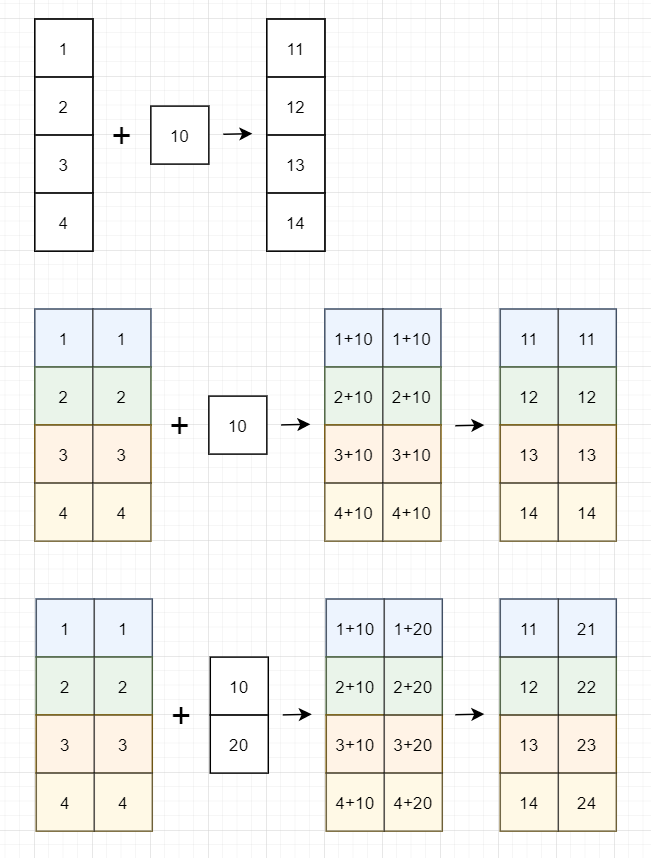
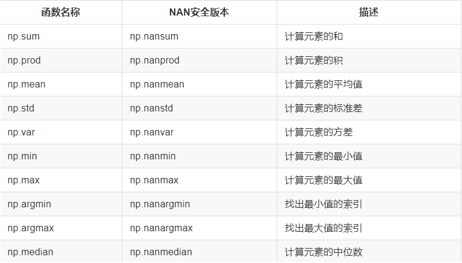

## Numpy库介绍


`NumPy`是一个功能强大的`Python`库，主要用于对多维数组执行计算。`NumPy`这个词来源于两个单词-- `Numerical`和`Python`。`NumPy`提供了大量的库函数和操作，可以帮助程序员轻松地进行数值计算。在数据分析和机器学习领域被广泛使用。他有以下几个特点：

1. Numpy内置了并行运算功能，当系统有多个核心时，做某种计算时，numpy会自动做并行计算。
2. Numpy底层使用C语言编写，内部解除了GIL（全局解释器锁），其对数组的操作速度不受Python解释器的限制，效率远高于纯Python代码。
3. 实用的线性代数、傅里叶变换和随机数生成函数。

总而言之，他是一个非常高效的用于处理数值型运算的包。

**安装：** 

通过 `pip install numpy` 即可安装，如果是 anaconda 环境，默认就安装好了

教程地址：

1. 官网：`https://docs.scipy.org/doc/numpy/user/quickstart.html`。
2. 中文文档：`https://www.numpy.org.cn/user_guide/quickstart_tutorial/index.html`。

### ndarray 介绍

```
NumPy provides an N-dimensional array type, the ndarray, 
which describes a collection of “items” of the same type.
```

NumPy提供了一个**N维数组类型ndarray**，它描述了**相同类型**的“items”的集合。


用 ndarray 进行存储：

```
import numpy as np

# 创建 ndarray
score = np.array([
    [80, 89, 86, 67, 79],
    [78, 97, 89, 67, 81],
    [90, 94, 78, 67, 74],
    [91, 91, 90, 67, 69],
    [76, 87, 75, 67, 86],
    [70, 79, 84, 67, 84],
    [94, 92, 93, 67, 64],
    [86, 85, 83, 67, 80]]
)

score
```

**提问:**

使用 Python 列表可以存储一维数组，通过列表的嵌套可以实现多维数组，那么为什么还需要使用 Numpy 的ndarray 呢？

#### 性能对比

Numpy 数组和 Python 列表性能对比：

在这里我们通过一段代码运行来体会到 ndarray 的好处

```python
import numpy as np
import time

# Python列表的方式
t1 = time.time()
a = []
for x in range(1000000):
    a.append(x**2)
t2 = time.time()
t = t2 - t1
print('列表执行时间：', t)
```

花费的时间大约是`0.32`左右。而如果使用`numpy`的数组来做，那速度就要快很多了：

```python
t3 = time.time()
b = np.arange(1000000) ** 2
t4 = time.time()
print('np 执行时间：', t4 - t3)
```

从中我们看到 ndarray 的计算速度要快很多，节约了时间。

**机器学习的最大特点就是大量的数据运算**，那么如果没有一个快速的解决方案，那可能现在 python 也在机器学习领域达不到好的效果。


**ndarray为什么可以这么快？**

### ndarray 的优势

#### 内存块风格

ndarray到底跟原生python列表有什么不同呢，请看一张图：


从图中我们可以看出ndarray在存储数据的时候，数据与数据的地址都是连续的，这样就给使得批量操作数组元素时速度更快。

这是因为ndarray中的所有元素的类型都是相同的，而Python列表中的元素类型是任意的，所以ndarray在存储元素时内存可以连续，而python原生list就只能通过寻址方式找到下一个元素，这虽然也导致了在通用性能方面Numpy的ndarray不及Python原生list，但在科学计算中，Numpy的ndarray就可以省掉很多循环语句，代码使用方面比Python原生list简单的多。

#### 矩阵运算

Numpy**支持常见的数组和矩阵操作**。对于同样的数值计算任务，使用Numpy比直接使用Python要简洁的多。



#### 多维数组

Numpy**使用ndarray对象来处理多维数组**，该对象是一个快速而灵活的大数据容器。


#### 总结

- numpy介绍【了解】
  - 一个开源的Python科学计算库
  - 计算起来要比python简洁高效
  - Numpy使用ndarray对象来处理多维数组
- ndarray介绍【了解】
  - NumPy提供了一个N维数组类型ndarray，它描述了相同类型的“items”的集合。
  - 生成numpy对象:np.array()
- ndarray的优势【掌握】
  - 内存块风格
    - list -- 分离式存储,存储内容多样化
    - ndarray -- 一体式存储,存储类型必须一样
  - ndarray支持并行化运算（向量化运算）
  - ndarray底层是用C语言写的,效率更高,释放了GIL

### ndarray  的属性

数组属性反映了数组本身固有的信息。

|     属性名字      |          属性解释          |
| :---------------: | :------------------------: |
| **ndarray.shape** |       数组维度的元组       |
|   ndarray.ndim    |          数组维数          |
|   ndarray.size    |      数组中的元素数量      |
| ndarray.itemsize  | 一个数组元素的长度（字节） |
| **ndarray.dtype** |       数组元素的类型       |

#### ndarray 的形状

```
score.shape
```


就是数组有多少维度，每个维度有多少个元组。

(一维元素个数，二维元素个数，三维元素个数.....)

#### ndarray的类型

```
type(score.dtype)
```

dtype是numpy.dtype类型，先看看对于数组来说都有哪些类型

|     名称      |                       描述                        | 简写  |
| :-----------: | :-----------------------------------------------: | :---: |
|    np.bool    |      用一个字节存储的布尔类型（True或False）      |  'b'  |
|    np.int8    |             一个字节大小，-128 至 127             |  'i'  |
|   np.int16    |               整数，-32768 至 32767               | 'i2'  |
|   np.int32    |              整数，-2^31 至 2^32 -1               | 'i4'  |
|   np.int64    |              整数，-2^63 至 2^63 - 1              | 'i8'  |
|   np.uint8    |               无符号整数，0 至 255                |  'u'  |
|   np.uint16   |              无符号整数，0 至 65535               | 'u2'  |
|   np.uint32   |             无符号整数，0 至 2^32 - 1             | 'u4'  |
|   np.uint64   |             无符号整数，0 至 2^64 - 1             | 'u8'  |
|  np.float16   | 半精度浮点数：16位，正负号1位，指数5位，精度10位  | 'f2'  |
|  np.float32   | 单精度浮点数：32位，正负号1位，指数8位，精度23位  | 'f4'  |
|  np.float64   | 双精度浮点数：64位，正负号1位，指数11位，精度52位 | 'f8'  |
| np.complex64  |     复数，分别用两个32位浮点数表示实部和虚部      | 'c8'  |
| np.complex128 |     复数，分别用两个64位浮点数表示实部和虚部      | 'c16' |
|  np.object_   |                    python对象                     |  'O'  |
|  np.string_   |                      字符串                       |  'S'  |
|  np.unicode_  |                    unicode类型                    |  'U'  |

**创建数组的时候指定类型**

```
>>> a = np.array([[1, 2, 3],[4, 5, 6]], dtype=np.float32)
>>> a.dtype
dtype('float32')

>>> arr = np.array(['python', 'tensorflow', 'scikit-learn', 'numpy'], dtype=np.string_)
>>> arr
array([b'python', b'tensorflow', b'scikit-learn', b'numpy'], dtype='|S12')
```

### 基本操作

#### 生成数组的方法

- **np.ones(shape, dtype)**
- np.ones_like(a, dtype)
- **np.zeros(shape, dtype)**
- np.zeros_like(a, dtype)

生成指定形状的列表数据

```
>>> ones = np.ones([4, 8])
>>> ones
array([[1., 1., 1., 1., 1., 1., 1., 1.],
       [1., 1., 1., 1., 1., 1., 1., 1.],
       [1., 1., 1., 1., 1., 1., 1., 1.],
       [1., 1., 1., 1., 1., 1., 1., 1.]])
```

生成指定维度的空白数据

```
>>> np.zeros_like(ones)
array([[0., 0., 0., 0., 0., 0., 0., 0.],
       [0., 0., 0., 0., 0., 0., 0., 0.],
       [0., 0., 0., 0., 0., 0., 0., 0.],
       [0., 0., 0., 0., 0., 0., 0., 0.]])


```

#### 从现有数组生成

**生成方式**

- **np.array(object, dtype)**
- **np.asarray(a, dtype)** 

```python
arr = np.array([[1, 2, 3], [4, 5, 6]])

# 从现有的数组当中创建
arr1 = np.array(arr)

# 相当于索引的形式，并没有真正的创建一个新的
arr2 = np.asarray(arr1)
```

#### 生成固定范围的数组

##### 等差数组 — 指定数量

np.linspace (start, stop, num, endpoint)

参数:

- start:序列的起始值
- stop:序列的终止值
- num:要生成的等间隔样例数量，默认为50
- endpoint:序列中是否包含stop值，默认为ture

```python
>>> # 生成等间隔的数组
>>> np.linspace(0, 100, 11)
array([  0.,  10.,  20.,  30.,  40.,  50.,  60.,  70.,  80.,  90., 100.])

```

##### 等差数组 — 指定步长

np.arange(start,stop, step, dtype)

参数

- step:步长,默认值为1

```python
>>> np.arange(10, 50, 2)
array([10, 12, 14, 16, 18, 20, 22, 24, 26, 28, 30, 32, 34, 36, 38, 40, 42,
       44, 46, 48])


```

##### 等比数列

参数:

- num:要生成的等比数列数量，默认为50

```python
>>> # 生成10^x
>>> np.logspace(0, 2, 5)
array([  1.           3.16227766  10.          31.6227766  100.        ])

```


### 随机数组模块

> np.random 模块

#### 正态分布

##### a. 什么是正态分布

正态分布是一种概率分布。正态分布是具有两个参数μ和σ的连续型随机变量的分布，第一参数μ是服从正态分布的随机变量的均值，第二个参数σ是此随机变量的标准差，所以正态分布记作**N(μ，σ )**。


##### b. 正态分布的应用

生活、生产与科学实验中很多随机变量的概率分布都可以近似地用正态分布来描述。

##### c. 正态分布特点

**μ决定了其位置，其标准差σ**决定了分布的幅度。当μ = 0,σ = 1时的正态分布是标准正态分布。

标准差如何来？

- ###### 方差

是在概率论和统计方差衡量一组数据时离散程度的度量


其中M为平均值，n为数据总个数，σ 为标准差，σ^2^ 可以理解一个整体为方差


- ###### **标准差与方差的意义**

可以理解成数据的一个离散程度的衡量


##### 正态分布创建

+ np.random.randn(d0, d1, …, dn)

  功能：从标准正态分布中返回一个或多个样本值

+ **np.random.normal(loc=0.0, scale=1.0, size=None)**

  loc：float   此概率分布的均值（对应着整个分布的中心centre）

  scale：float   此概率分布的标准差（对应于分布的宽度，scale越大越矮胖，scale越小，越瘦高）

  size：int or tuple of ints   输出的shape，默认为None，只输出一个值

+ np.random.standard_normal(*size=None*)

  返回指定形状的标准正态分布的数组。

**举例1：生成均值为1.75，标准差为1的正态分布数据，100000000个**

```
# 生成均值为1.75，标准差为1的正态分布数据
x1 = np.random.normal(1.75, 1, 100000)
```

绘制图像

```
import matplotlib.pyplot as plt

# 1.创建画布
plt.figure(figsize=(20, 8), dpi=100)

# 2.绘制图像
plt.hist(x1, 1000)

# 3.显示图像
plt.show()

```


#### 均匀分布

+ np.random.rand(*d0*, *d1*, *...*, *dn*)
  + 返回**[0.0，1.0)**内的一组均匀分布的数。
+ **np.random.uniform(low=0.0, high=1.0, size=None)**
  + 功能：从一个均匀分布[low,high)中随机采样，注意定义域是左闭右开，即包含low，不包含high.
  + 参数介绍:
    + low: 采样下界，float类型，默认值为0；
    + high: 采样上界，float类型，默认值为1；
    + size: 输出样本数目，为int或元组(tuple)类型，例如，size=(m,n,k), 则输出m*n*k个样本，缺省时输出1个值。
  + 返回值：ndarray类型，其形状和参数size中描述一致。
+ np.random.randint(*low*, *high=None*, *size=None*, *dtype='l'*)
  + 从一个均匀分布中随机采样，生成一个整数或N维整数数组
  + 取数范围：若high不为None时，取[low,high)之间随机整数，否则取值[0,low)之间随机整数。

```python
# 生成均匀分布的随机数
x2 = np.random.uniform(-1, 1, 100000000)
```

画布查看分布状况：

```python
import matplotlib.pyplot as plt

# 生成均匀分布的随机数
x2 = np.random.uniform(-1, 1, 100000000)

# 画图看分布状况
# 1）创建画布
plt.figure(figsize=(10, 10), dpi=100)

# 2）绘制直方图
plt.hist(x=x2, bins=1000)  # x代表要使用的数据，bins表示要划分区间数

# 3）显示图像
plt.show()

```


## 数组的操作

可以通过一些函数，非常方便的操作数组的形状。

### 修改数组维度

+ ndarray.reshape(shape, order)
  + 返回一个具有相同数据域，但shape不一样的**视图**
  + 行、列不进行互换

#### reshape 和 resize 方法：

两个方法都是用来修改数组形状的，但是有一些不同。

1. `reshape`是将数组转换成指定的形状，然后返回转换后的结果，对于原数组的形状是不会发生改变的。调用方式：

   ```python
   # reshape 不会影响原数组本身
   a1 = np.random.randint(0, 10, size=(3, 4))
   print('a1:\n', a1)
   a2 = a1.reshape((2, 6))
   print('a2:\n', a2)
   ```
   
2. `resize`是将数组转换成指定的形状，会直接修改数组本身。并不会返回任何值。调用方式：

   ```python
   # resize 不会影响原数组本身
   a3 = np.random.randint(0, 10, size=(3, 4))
   print('a3:\n', a3)
   a4 = a3.resize((2, 6))  # a1本身发生了改变
   print('a4:\n', a4)
   print('a3:\n', a3)
   ```

#### flatten 和 ravel 方法：

两个方法都是将多维数组转换为一维数组，但是有以下不同：

1. `flatten`是将数组转换为一维数组后，然后将这个拷贝返回回去，所以后续对这个返回值进行修改不会影响之前的数组。
2. `ravel`是将数组转换为一维数组后，将这个视图（可以理解为引用）返回回去，所以后续对这个返回值进行修改会影响之前的数组。
   比如以下代码：

```python
x = np.array([[1, 2], [3, 4]])
x.flatten()[1] = 100 # 此时的x[0]的位置元素还是1
x.ravel()[1] = 100 # 此时x[0]的位置元素是100

```

#### ndarray.T

- 数组的转置
- 将数组的行、列进行互换


### 数组操作

#### 索引、切片

一维、二维、三维的数组如何索引？

- 直接进行索引,切片
- 对象[:, :] -- 先行后列

```
a1 = np.arange(0, 10)
a1
```

二维数组索引方式：

```
# 二维数组切片
a2 = np.arange(0, 10).reshape(2, 5)
print('a2:\n', a2)

# 对象[:, :] -- 先行后列
print('a2[:, 2:]:\n', a2[:, 2:])

```

三维数组索引方式：

```python
# 三维
a1 = np.array([[[1, 2, 3], [4, 5, 6]], [[12, 3, 34], [5, 6, 7]]])
# 返回结果
array([[[1,  2,  3],
        [4,  5,  6]],

       [[12,  3, 34],
        [5,  6,  7]]])
# 索引、切片
>>> a1[0, 0, 1]   # 输出: 2

```

举例：

+ 获取第一个股票的前3个交易日的收盘价格
+ 获取日期，最高价，最低价，收盘价

```python
import numpy as np

arr_stock = np.loadtxt("stock_day.csv", dtype=np.str, delimiter=',', skiprows=1)

# print(arr_stock)
# 获取第一个股票的前3个交易日的收盘价格

print(arr_stock[:3, :])

# 日期，最高价，收盘价，最低价
print(arr_stock[:3, :4])


```

#### 数组的切割(了解)

通过`hsplit`和`vsplit`以及`array_split`可以将一个数组进行切割。

1. `hsplit`：按照水平方向进行切割。用于指定分割成几列，可以使用数字来代表分成几部分，也可以使用数组来代表分割的地方。示例代码如下：

   ```python
   import numpy as np
   
   a1 = np.arange(16).reshape(4, 4)
   
   """水平切割"""
   print('a1:\n', a1)
   # horizontally 水平
   h_sub_a1, h_sub_a2 = np.hsplit(a1, 2)  # 分割成两部分
   print('sub_a1:\n', h_sub_a1)
   print('sub_a2:\n', h_sub_a2)
   
   """
   a1:
    [[ 0  1  2  3]
    [ 4  5  6  7]
    [ 8  9 10 11]
    [12 13 14 15]]
   h_sub_a1:
    [[ 0  1]
    [ 4  5]
    [ 8  9]
    [12 13]]
   h_sub_a2:
    [[ 2  3]
    [ 6  7]
    [10 11]
    [14 15]]
   """
   
   # 代表在下标为1的地方切一刀，下标为2的地方切一刀，分成三部分
   h_sub_a1, h_sub_a2, h_sub_a3 = np.hsplit(a1, [1, 2])
   print('sub_a1:\n', h_sub_a1)
   print('sub_a2:\n', h_sub_a2)
   print('sub_a3:\n', h_sub_a3)
   
   """
   h_sub_a1:
    [[ 0]
    [ 4]
    [ 8]
    [12]]
   h_sub_a2:
    [[ 1]
    [ 5]
    [ 9]
    [13]]
   h_sub_a3:
    [[ 2  3]
    [ 6  7]
    [10 11]
    [14 15]]
   """
   
   ```

2. `vsplit`：按照垂直方向进行切割。用于指定分割成几行，可以使用数字来代表分成几部分，也可以使用数组来代表分割的地方。示例代码如下：

   ```python
   # vertically 垂直
   v_sub_a1, v_sub_a2 = np.vsplit(a1, 2)  # 代表按照行总共分成2个数组
   print('v_sub_a1:\n', v_sub_a1)
   print('v_sub_a2:\n', v_sub_a2)
   
   """
   a1:
    [[ 0  1  2  3]
    [ 4  5  6  7]
    [ 8  9 10 11]
    [12 13 14 15]]
   v_sub_a1:
    [[0 1 2 3]
    [4 5 6 7]]
   v_sub_a2:
    [[ 8  9 10 11]
    [12 13 14 15]]
   """
   
   # 代表在下标为1的地方切一刀，下标为2的地方切一刀，分成三部分
   v_sub_a1, v_sub_a2, v_sub_a3 = np.hsplit(a1, [1, 2])
   print('v_sub_a1:\n', v_sub_a1)
   print('v_sub_a2:\n', v_sub_a2)
   print('v_sub_a3:\n', v_sub_a3)
   """
   v_sub_a1:
    [[ 0]
    [ 4]
    [ 8]
    [12]]
   v_sub_a2:
    [[ 1]
    [ 5]
    [ 9]
    [13]]
   v_sub_a3:
    [[ 2  3]
    [ 6  7]
    [10 11]
    [14 15]]
   """
   ```
   
3. `split/array_split(array,indicate_or_seciont,axis)`：用于指定切割方式，在切割的时候需要指定是按照行还是按照列，`axis=1`代表按照列，`axis=0`代表按照行。示例代码如下：

   ```python
   np.array_split(x,2,axis=0) # 按照垂直方向切割成2部分
   >>> [array([[0., 1., 2., 3.],
        [4., 5., 6., 7.]]), array([[ 8.,  9., 10., 11.],
        [12., 13., 14., 15.]])]
   
   ```


#### 数据的拼接

如果有多个数组想要组合在一起，也可以通过其中的一些函数来实现。

1. `vstack`：将数组按垂直方向进行叠加。数组的列数必须相同才能叠加。示例代码如下：

   ```python
   import numpy as np
   
   a1 = np.arange(0, 10).reshape(2, 5)
   a2 = np.arange(10, 20).reshape(2, 5)
   print('a1:\n', a1)
   print('a2:\n', a2)
   
   v_a3 = np.vstack([a1, a2])
   print('v_a3:\n', v_a3)
   
   """
   a1:
    [[0 1 2 3 4]
    [5 6 7 8 9]]
   a2:
    [[10 11 12 13 14]
    [15 16 17 18 19]]
   v_a3:
    [[ 0  1  2  3  4]
    [ 5  6  7  8  9]
    [10 11 12 13 14]
    [15 16 17 18 19]]
   """
   
   ```

2. `hstack`：将数组按水平方向进行叠加。数组的行必须相同才能叠加。示例代码如下：

   ```python
   h_a3 = np.hstack([a1, a2])
   print('h_a3:\n', h_a3)
   
   """
   h_a3:
    [[ 0  1  2  3  4 10 11 12 13 14]
    [ 5  6  7  8  9 15 16 17 18 19]]
   """
   ```
   


### 数组广播（重点）

数组运算

```python
arr = np.array([1, 2, 3])
arr + 1
arr / 2

```

```python
# 可以对比python列表的运算，看出区别
a = [1, 2, 3]
a * 3

```

数组在进行矢量化运算时，**要求数组的形状是相等的**。当形状不相等的数组执行算术运算的时候，就会出现广播机制，该机制会对数组进行扩展，使数组的shape属性值一样，这样，就可以进行矢量化运算了。下面通过一个例子进行说明：


```python
arr1 = np.array([[0], [1], [2], [3]])
arr1.shape
# (4, 1)


arr2 = np.array([1, 2, 3])
arr2.shape
# (3,)

arr1+arr2
# 结果是：
array([[1, 2, 3],
       [2, 3, 4],
       [3, 4, 5],
       [4, 5, 6]])

```

上述代码中，数组arr1是4行1列，arr2是1行3列。这两个数组要进行相加，按照广播机制会对数组arr1和arr2都进行扩展，使得数组arr1和arr2都变成4行3列。

下面通过一张图来描述广播机制扩展数组的过程：


广播机制实现了时两个或两个以上数组的运算，即使这些数组的shape不是完全相同的，只需要满足如下任意一个条件即可。

- 1.数组的某一维度等长。
- 2.其中一个数组的某一维度为1 。

广播机制需要**扩展维度小的数组**，使得它与维度最大的数组的shape值相同，以便使用元素级函数或者运算符进行运算。


**思考：下面两个ndarray是否能够进行运算？** 

```python
arr1 = np.array([[1, 2, 3, 2, 1, 4], [5, 6, 1, 2, 3, 1]])
arr2 = np.array([[1], [3]])
```


### 通用函数

#### 一元函数

| 函数名                    | 描述                                                         |
| ------------------------- | ------------------------------------------------------------ |
| abs、fabs                 | 逐个元素地计算整数、浮点数或复数地绝对值                     |
| sqrt                      | 计算每个元素的平方根(与arr ** 0.5相等)                       |
| square                    | 计算每个元素地平方(与arr ** 2相等)                           |
| exp                       | 计算每个元素的自然指数值e^x次方                              |
| log、log10、log2、log1p   | 分别对应(自然指数(e为底)、对数10为底、对数2为底、log(1+x))   |
| sign                      | 计算每个元素的符号值：1(正数)、0(0)、-1(负数)                |
| ceil                      | 计算每个元素的最高整数值(即大于等于给定数值的最小整数)       |
| floor                     | 计算每个元素的最小整数值(即小于等于给定整数的最大整数)       |
| rint                      | 将元素保留到整数位，并保持dtype                              |
| modf                      | 分别将数组的小数部分与整数部分按数组形式返回                 |
| isnan                     | 返回数组元素是否是一个NaN(非数值)，形式为布尔值数组          |
| isfinite、isinf           | 分别返回数组中的元素是否有限(非inf、非NaN)、是否无限的，形式为布尔值数组 |
| cos、cish、sin、          | 常规三角函数及双曲三角函数                                   |
| sinh、tan、tanh           |                                                              |
| arccos、arccosh、arcsin、 | 反三角函数                                                   |
| arcsinh、arctan、arctanh  |                                                              |
| logical_not               | 对数组元素按位取反（~）                                      |

#### 二元通用函数

| 函数名                       | 描述                                                         |
| ---------------------------- | ------------------------------------------------------------ |
| add                          | 将数组的对应元素相加                                         |
| subtract                     | 在第二个数组中，将第一个数组中包含的元素去除                 |
| multiply                     | 将数组的对应元素相乘                                         |
| divide,floor_divide          | 除或整除(放弃余数)                                           |
| power                        | 将第二个数组的元素作为第一个数组对应元素的幂次方             |
| maximum                      | 逐个元素计算最大值，fmax忽略NaN                              |
| minimum                      | 逐个元素计算最小值，fmin忽略NaN                              |
| mod                          | 按元素的求模计算(即求除法的余数)                             |
| copysign                     | 将第一个数组的符号值改为第二个数组的符号值                   |
| greater,greater_equal,less， | 进行逐个元素的比较，返回布尔值数组（与数学操作符>,>=,<,<=,==,!=x效果一致） |
| less_equal,equal,not_equal   | （接上）                                                     |
| logical_and,logical_or       | 进行逐个元素的逻辑操作(与逻辑操作符&、丨、^效果一致)         |
| logical_xor                  |                                                              |

#### 聚合函数



#### 布尔数组函数

| 函数名 | 描述                     |
| ------ | ------------------------ |
| any    | 验证任意一个数据是否为真 |
| all    | 验证所有元素为真         |

**更多：** 

<https://docs.scipy.org/doc/numpy/reference/index.html>


### 附录

#### 文件操作

保存文件

```python
arr2 = np.random.randint(1, 10, size=(5, 4))
# 指定分隔符保存
np.savetxt('a.csv', arr2, fmt='%d', delimiter=',')

```

读取文件

```python
arr3 = np.loadtxt('a.csv', dtype=np.int, delimiter=',')
arr3

```

#### Axis理解

之前的课程中，为了方便大家理解，我们说`axis=0`代表的是行，`axis=1`代表的是列。但其实不是这么简单理解的。这里我们专门用一节来解释一下这个`axis`轴的概念。

简单来说， **最外面的括号代表着 axis=0，依次往里的括号对应的 axis 的计数就依次加 1**。什么意思呢？下面再来解释一下。


最外面的括号就是`axis=0`，里面两个子括号`axis=1`。 **操作方式：如果指定轴进行相关的操作，那么他会使用轴下的每个直接子元素的第0个，第1个，第2个...分别进行相关的操作。**

现在我们用刚刚理解的方式来做几个操作。比如现在有一个二维的数组：

```python
x = np.array([[0,1],[2,3]])

```

1. 求`x`数组在`axis=0`和`axis=1`两种情况下的和：

   ```python
    >>> x.sum(axis=0)
    array([2, 4])
   
   ```

   为什么得到的是[2,4]呢，原因是我们按照`axis=0`的方式进行相加，那么就会把**最外面轴下的所有直接子元素中的第0个位置进行相加，第1个位置进行相加...依此类推**，得到的就是`0+2`以及`2+3`，然后进行相加，得到的结果就是`[2,4]`。

   ```python
    >>> x.sum(axis=1)
    array([1, 5])
   ```
   
   因为我们按照`axis=1`的方式进行相加，那么就会把**轴为1里面的元素拿出来进行求和**，得到的就是`0,1`，进行相加为`1`，以及`2,3`进行相加为`5`，所以最终结果就是`[1,5]`了。
   
2. 用`np.max`求`axis=0`和`axis=1`两种情况下的最大值：

   ```python
   >>> np.random.seed(100)
   >>> x = np.random.randint(0,10,size=(3,5))
   >>> x.max(axis=0)
   array([8, 8, 3, 7, 8])
   
   ```

   因为我们是按照`axis=0`进行求最大值，那么就会在最外面轴里面找直接子元素，然后将每个子元素的第0个值放在一起求最大值，将第1个值放在一起求最大值，以此类推。而如果`axis=1`，那么就是拿到每个直接子元素，然后求每个子元素中的最大值：

   ```python
   >>> x.max(axis=1)
   array([8, 5, 8])
   
   ```

3. 用`np.delete`在`axis=0`和`axis=1`两种情况下删除元素：

   ```python
    >>> np.delete(x,0,axis=0)
    array([[2, 3]])
   
   ```

   `np.delete`是个例外。我们按照`axis=0`的方式进行删除，那么他会首先找到最外面的括号下的直接子元素中的第0个，然后删掉，剩下最后一行的数据。

   ```python
    >>> np.delete(x,0,axis=1)
    array([[1],
           [3]])
   
   ```

   同理，如果我们按照`axis=1`进行删除，那么会把第一列的数据删掉。

#### 三维以上数组


 按照之前的理论，如果以上数组按照`axis=0`的方式进行相加，得到的结果如下：


 如果是按照`axis=1`的方式进行相加，得到的结果如下： 


#### NAN和INF值处理

首先我们要知道这两个英文单词代表的什么意思：

1. `NAN`：`Not A number`，不是一个数字的意思，但是他是属于浮点类型的，所以想要进行数据操作的时候需要注意他的类型。
2. `INF`：`Infinity`，代表的是无穷大的意思，也是属于浮点类型。`np.inf`表示正无穷大，`-np.inf`表示负无穷大，一般在出现除数为0的时候为无穷大。比如`2/0`。

NAN一些特点：

1. NAN和NAN不相等。比如`np.NAN != np.NAN`这个条件是成立的。
2. NAN和任何值做运算，结果都是NAN。

有些时候，特别是从文件中读取数据的时候，经常会出现一些缺失值。缺失值的出现会影响数据的处理。因此我们在做数据分析之前，先要对缺失值进行一些处理。处理的方式有多种，需要根据实际情况来做。一般有两种处理方式：删除缺失值，用其他值进行填充。

删除缺失值：

有时候，我们想要将数组中的`NAN`删掉，那么我们可以换一种思路，就是只提取不为`NAN`的值。示例代码如下：

```python
# 1. 删除所有NAN的值，变成一维数组
arr2 = np.random.randint(0, 10, size=(3, 5)).astype(np.float)
# 将第(0,1)和(1,2)两个值设置为NAN
arr2[[0, 1], [1, 2]] = np.nan
print('arr2:\n', arr2)
# 此时的data会没有nan，并且变成一个1维数组
arr3 = arr2[~np.isnan(arr2)]
print('arr3:\n', arr3)

# 2. 删除NAN所在的行


# 获取哪些行有NAN
lines = np.where(np.isnan(arr2))[0]
print('lines:', lines)
# 使用delete方法删除指定的行,axis=0表示删除行，lines表示删除的行号
arr4 = np.delete(arr2, lines, axis=0)
print('arr4:\n', arr4)

```

用其他值进行替代：

有些时候我们不想直接删掉，比如有一个成绩表，分别是数学和英语，但是因为某个人在某个科目上没有成绩，那么此时就会出现NAN的情况，这时候就不能直接删掉了，就可以使用某些值进行替代。假如有以下表格：

| 数学 | 英语 |
| ---- | ---- |
| 59   | 89   |
| 90   | 32   |
| 78   | 45   |
| 34   | NAN  |
| NAN  | 56   |
| 23   | 56   |

如果想要求每门成绩的总分，以及每门成绩的平均分，那么就可以采用某些值替代。比如求总分，那么就可以把NAN替换成0，如果想要求平均分，那么就可以把NAN替换成其他值的平均值。示例代码如下：

```python
import numpy as np

scores = np.loadtxt("nan_scores.csv", skiprows=1, delimiter=",", encoding="utf-8", dtype=np.str)

scores[scores == ""] = np.NAN
scores = scores.astype(nfloat)
# 1. 求出学生成绩的总分
scores1 = scores.copy()
print(scores1.sum(axis=1))

# 2. 求出每门成绩的平均分
scores2 = scores.copy()
for x in range(scores2.shape[1]):
    score = scores2[:, x]
    print('score:', score)
    non_nan_score = score[score == score]
    print('non_nan_score:', non_nan_score)
    score[score != score] = non_nan_score.mean()
print(scores2.mean(axis=0))


```

