## 窗口管理与布局

官方用的GUI工具包——Tkinter（IDLE就是用这个开发的）。

Tkinter 是 Python 的标准 GUI 库，它实际是建立在 Tk 技术上的。在大多数 Unix 平台以及 Windows 系统上都可用。

作为 python 特定的 GUI 界面，是一个图像的窗口，tkinter 是 python 自带的，可以编辑的GUI界面，我们可以用GUI 实现很多直观的功能，比如想开发一个计算器，如果只是一个键盘输入，输出的黑色窗口，是没用用户体验的。所有开发一个图像化的小窗口，就是必要的。

对于稍有 GUI 编程经验的人来说，Python 的 Tkinter 界面库是非常简单的。python 的 GUI 库非常多，选择Tkinter，一是最为简单，二是自带库，不需下载安装，随时使用，三则是从需求出发，Python 作为一种脚本语言，或者说一种胶水语言，一般不会用它来开发复杂的桌面应用，它并不具备这方面的优势，使用 Python，可以把它作为一个灵活的工具，而不是作为主要开发语言，那么在工作中，需要制作一个小工具，肯定是需要有界面的，不仅自己用，也能分享别人使用，在这种需求下，Tkinter 是足够胜任的 ！

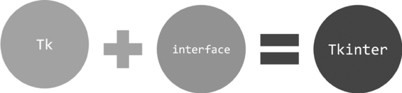


Tkinter是Python默认的GUI库，像IDLE就是用Tkinter设计出来的，因此直接导入Tkinter模块就可以了：

```
import tkinter
```

###  Tkinter之初体验 

接下来从最简单的例子入手：

```python
import tkinter as tk

# 创建一个主窗口,用于容纳整个GUI程序
root = tk.Tk()
# 设置主窗口对象的标题栏
root.title("First Demo")
# 设置窗口大小
root.geometry('500x300+100+100')
# 添加一个Label组件,Label组件是GUI程序中最常用的组件之一。
# Label组件可以显示文本、图标或者图片
# 在这里我们让它显示指定文本
label = tk.Label(root, text="我的第一个tkinter窗口!")
# 然后调用Label组件的pack()方法,用于自动调节组件自身的尺寸
label.pack()
# 注意,这时候窗口还是不会显示的…
# 除非执行下面这条代码!
root.mainloop()
```

执行程序，如图所示。

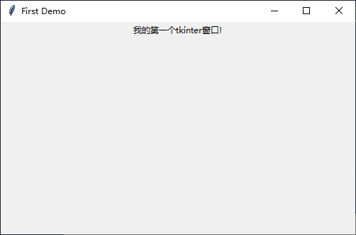


loop因为是循环的意思，root.mainloop就会让root不断的刷新，如果没有mainloop,就是一个静态的root,传入进去的值就不会有循环，mainloop就相当于一个很大的while循环，有个while，每点击一次就会更新一次，所以我们必须要有循环。
所有的窗口文件都必须有类似的mainloop函数，mainloop是窗口文件的关键的关键。

意思是一旦进入了主事件循环，就由Tkinter掌管一切了。现在不理解没关系，在后面的学习中你会有深刻的体会。GUI程序的开发与以往的开发经验会有截然不同的感受。


通常如果要写一个比较大的程序，那么应该先把代码给封装起来。在面向对象的编程语言中，就是封装成类。看下面进阶版的例子：

```python
import tkinter as tk


def create_button(root):
    label = tk.Label(root, text="我的第一个tkinter窗口!")
    label.pack()
    return root


root = tk.Tk()
root.geometry('500x300+100+100')
root = create_button(root)

root.mainloop()
```

程序跑起来后出现一个“打招呼”按钮，单击它就能从IDLE接收到回馈信息，如图15-3所示。

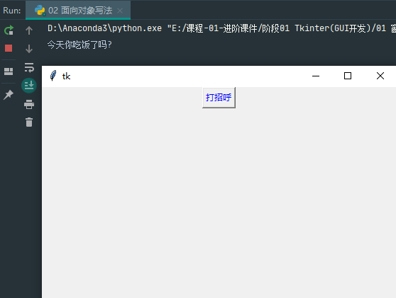


###  窗口的管理与设置

不知道大家是否注意到了，上述举例的简单demo程序存在窗口显示混乱的情况，这样的一个界面显然是不符合我们要求的。所以我们首先要开始学习如何使用tkinter去控制我们的窗口

####  基本属性设置

#####  1.添加标题

```python
# 设置窗口标题
root.title("title")
```

#####  2.添加图标

```python
#  设置图标，以OneDrive图标为例，必须是以 .ico 为后缀的图标文件，放于同目录下。
root.iconbitmap("OneDrive.ico")
```

#####  3.设置背景

```python
#  设置背景色，可以用英文名，也可以用十六进制表示的颜色。
root["background"] = "#00ffff"
```

完整代码

```python
#  导入模块，取别名
import tkinter as tk
#  实例化一个窗体对象
root = tk.Tk()
#  设置窗口的大小长宽为300x300出现的位置距离窗口左上角+150+150
root.geometry("300x300+150+150")
#  设置窗口标题
root.title("title")
#  设置图标，以OneDrive图标为例，必须是以 .ico 为后缀的图标文件，放于同目录下。
root.iconbitmap("OneDrive.ico")
#  设置背景色，可以用英文名，也可以用十六进制表示的颜色。
root["background"] = "#00ffff"
#  进入消息循环，显示窗口
root.mainloop()
```

效果演示

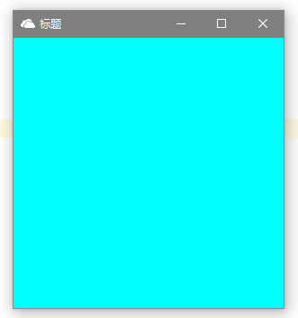

####  外形设置

#####  1.设置透明度

```python
#  透明度的值:0~1 也可以是小数点，0：全透明；1：全不透明
root.attributes("-alpha", 0.6)
```

#####  2.设置工具栏样式

```python
#  True 只有退出按钮，也没有图标；False 正常的窗体样式
root.attributes("-toolwindow", True)
```

效果演示

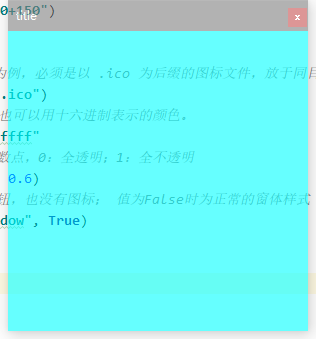

#####  3.设置全屏

```python
#  True 全屏；False 正常显示
root.attributes("-fullscreen", True)
```

#####  4.窗口置顶

```python
#  True 所有窗口中处于最顶层；False 正常显示 两个同时被置顶的窗口为同级(能互相遮盖)，但他们都能同时遮盖住没有被设置为置顶的窗口。
root.attributes("-topmost", True)
```

#####  5.设置成脱离工具栏

```python
#  True 没有工具栏按钮；False 正常显示
root.overrideredirect(True)
```

完整代码

```python
#  导入模块，取别名
import tkinter as tk
#  实例化一个窗体对象
root = tk.Tk()
#  设置窗口的大小长宽为300x300出现的位置距离窗口左上角+150+150
root.geometry("300x300+150+150")
#  设置窗口标题
root.title("title")
#  设置图标，以OneDrive图标为例，必须是以 .ico 为后缀的图标文件，放于同目录下。
root.iconbitmap("OneDrive.ico")
#  设置背景色，可以用英文名，也可以用十六进制表示的颜色。
root["background"] = "#00ffff"
#  True 全屏；False 正常显示
root.attributes("-fullscreen", True)
#  True 所有窗口中处于最顶层；False 正常显示 两个同时被置顶的窗口为同级(能互相遮盖)，但他们都能同时遮盖住没有被设置为置顶的窗口。
root.attributes("-topmost", True)
#  True 没有工具栏按钮；False 正常显示
root.overrideredirect(True)
#  进入消息循环，显示窗口
root.mainloop()
```

####  窗体的方法

#####  1.获取屏幕大小

```python
screenheight = root.winfo_screenheight()
screenwidth = root.winfo_screenwidth()
```

完整代码

```python
#  导入模块，取别名
import tkinter as tk
#  实例化一个窗体对象
root = tk.Tk()
#  获取屏幕大小
screenheight = root.winfo_screenheight()
screenwidth = root.winfo_screenwidth()
print("屏幕高度：", screenheight)
print("屏幕宽度：", screenwidth)
rootwidth = 300
roothight = 300
#  设置窗口在屏幕居中
root.geometry("%dx%d+%d+%d" % (rootwidth, roothight, (screenwidth-rootwidth)/2, (screenheight-roothight)/2))
#  进入消息循环，显示窗口
root.mainloop()
```

演示效果

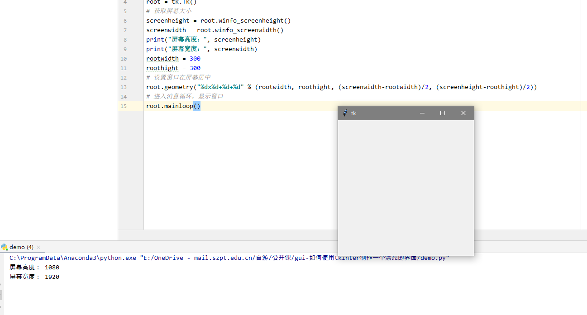

#####  2.获取窗体位置

```python
root_x = root.winfo_x()
root_y = root.winfo_y()
```

#####  3.获取窗体大小

```python
root_height = root.winfo_height()
root_width = root.winfo_width()
```

完整代码

```python
#  导入模块，取别名
import tkinter as tk
#  实例化一个窗体对象
root = tk.Tk()
#  设置窗体高宽和位置
root.geometry("600x500+150+150")
#  更新窗体
root.update()
#  获取窗体位置
root_x = root.winfo_x()
root_y = root.winfo_y()
#  获取窗体大小
root_height = root.winfo_height()
root_width = root.winfo_width()
#  输出窗体位置和窗体高宽
print(root_x)
print(root_y)
print(root_width)
print(root_y)
#  进入消息循环，显示窗口
root.mainloop()
```

演示效果

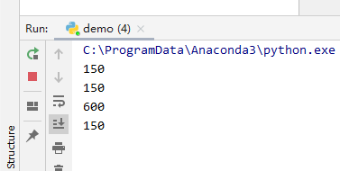


###  布局管理器 

所有的Tkinter组件都包含专用的几何管理方法，这些方法是用来组织和管理整个父配件区中子配件的布局的。Tkinter提供了截然不同的三种几何管理类：pack、grid和place。

**pack：**是按添加顺序排列组件。

**grid：**是按行／列形式排列组件。

**place：**允许程序员指定组件的大小和位置。

####  pack 

pack几何管理采用块的方式组织配件，在快速生成界面设计中广泛采用，若干组件简单的布局，采用pack的代码量最少。pack几何管理程序根据组件创建生成的顺序将组件添加到父组件中去。通过设置相同的锚点（anchor）可以将一组配件紧挨一个地方放置，如果不指定任何选项，默认在父窗体中自顶向下添加组件。

pack方法提供了下列option选项，选项可以直接赋值或以字典变量加以修改：

| 名称         | 描述                                                         | 取值范围                                                     |
| ------------ | ------------------------------------------------------------ | ------------------------------------------------------------ |
| expand       | 当值为“yes”时，side选项无效。组件显示在父配件中心位置；若fill选项为”both”,则填充父组件的剩余空间。 | “yes”, 自然数, “no”, 0 （默认值为“no”或0）                   |
| fill         | 填充x(y)方向上的空间，当属性side=”top”或”bottom”时，填充x方向；当属性side=”left”或”right”时，填充”y”方向；当expand选项为”yes”时，填充父组件的剩余空间。 | “x”, “y”, “both”(默认值为待选)                               |
| ipadx, ipady | 组件内部在x(y)方向上填充的空间大小，默认单位为像素，可选单位为c（厘米）、m（毫米）、i（英寸）、p（打印机的点，即1/27英寸），用法为在值后加以上一个后缀既可。 | 非负浮点数（默认值为0.0）                                    |
| padx, pady   | 组件外部在x(y)方向上填充的空间大小，默认单位为像素，可选单位为c（厘米）、m（毫米）、i（英寸）、p（打印机的点，即1/27英寸），用法为在值后加以上一个后缀既可。 | 非负浮点数（默认值为0.0）                                    |
| side         | 定义停靠在父组件的哪一边上。                                 | “top”, “bottom”, “left”, “right”（默认为”top”）              |
| before       | 将本组件于所选组建对象之前pack，类似于先创建本组件再创建选定组件。 | 已经pack后的组件对象                                         |
| after        | 将本组件于所选组建对象之后pack，类似于先创建选定组件再本组件。 | 已经pack后的组件对象                                         |
| in_          | 将本组件作为所选组建对象的子组件，类似于指定本组件的master为选定组件。 | 已经pack后的组件对象                                         |
| anchor       | 对齐方式，左对齐”w”，右对齐”e”，顶对齐”n”，底对齐”s”         | “n”, “s”, “w”, “e”, “nw”, “sw”, “se”, “ne”, “center”(默认为” center”) |

**注：**以上选项中可以看出expand、fill和side是相互影响的。

Tkinter模块提供了一系列大写值，其等价于字符型小写值，即**Tkinter.YES = = “yes”**。

##### 设置控件方位

可以通过修改 pack() 方法的side参数，side 参数可以设置 LEFT、RIGHT、TOP 和 TOTTOM 四个方位，默认的设置是 side=tkinter.TOP。

例如可以修改为左对齐

```python
say_hello.pack(side=tk.LEFT)
```

如果你不想按钮挨着“墙角”，可以通过设置 pack() 方法的 padx 和 pady 参数自定义按钮的偏移位置：

```python
say_hello.pack(side=tk.LEFT, padx=10, pady=10)
```

按钮既然可以设置前景色，那一定也能设置背景色吧？没错，bg参数就是background背景色的缩写：

```python
say_hello = tk.Button(frame, text='打招呼', bg="black", fg='blue', command=self.eat)
```

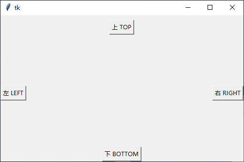

##### 多组件依次排列

**多组件布局（从左往右）**：默认布局是从上往下。

我们常常会遇到的一个情况是将一个组件放到一个容器组件中，并填充整个父组件。下面生成一个Listbox组件并将它填充到root窗口中：

```python
import tkinter as tk

root = tk.Tk()
root.geometry("500x300+100+100")

# 多组件依次排列
tk.Label(root, text="Red", bg="red", fg="white").pack()
tk.Label(root, text="Green", bg="green", fg="black").pack()
tk.Label(root, text="Blue", bg="blue", fg="white").pack()


tk.mainloop()
```

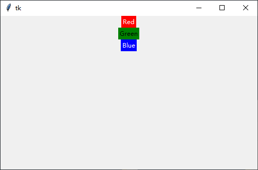

##### fill 填充内容

fill选项是告诉窗口管理器该组件将填充整个分配给它的空间，BOTH表示同时横向和纵向扩展，X表示横向，Y表示纵向；expand选项是告诉窗口管理器将父组件的额外空间也填满。

默认情况下，pack是将添加的组件依次纵向排列：

```python
# fill 组件里面的内容进行填充
tk.Label(root, text="Red", bg="red", fg="white").pack(anchor=tk.W, fill=tk.X)
tk.Label(root, text="Green", bg="green", fg="black").pack(anchor=tk.W, fill=tk.X)
tk.Label(root, text="Blue", bg="blue", fg="white").pack(anchor=tk.W, fill=tk.X)
```

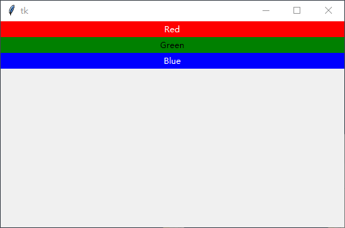

##### 横向排列

如果想要组件横向挨个儿排列，可以使用side选项：

```python
# side 组件与组件之间的对齐方式 会影响后续的布局内容
tk.Label(root, text="Red", bg="red", fg="white").pack(side=tk.LEFT)
tk.Label(root, text="Green", bg="green", fg="black").pack(side=tk.LEFT)
tk.Label(root, text="Blue", bg="blue", fg="white").pack(side=tk.LEFT)
```

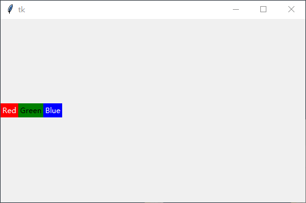

##### pack 布局方法

**pack类提供了下列函数：**

| 函数名             | 描述                                                         |
| ------------------ | ------------------------------------------------------------ |
| slaves()           | 以列表方式返回本组件的所有子组件对象。                       |
| propagate(boolean) | 设置为True表示父组件的几何大小由子组件决定（默认值），反之则无关。 |
| info()             | 返回pack提供的选项所对应得值。                               |
| forget()           | Unpack组件，将组件隐藏并且忽略原有设置，对象依旧存在，可以用pack(option, …)，将其显示。 |
| location(x, y)     | x, y为以像素为单位的点，函数返回此点是否在单元格中，在哪个单元格中。返回单元格行列坐标，(-1, -1)表示不在其中。 |
| size()             | 返回组件所包含的单元格，揭示组件大小。                       |

####  grid 

grid几何管理采用类似表格的结构组织配件，使用起来非常灵活，用其设计对话框和带有滚动条的窗体效果最好。grid采 用行列确定位置，行列交汇处为一个单元格。每一列中，列宽由这一列中最宽的单元格确定。每一行中，行高由这一行中最高的单元格决定。组件并不是充满整个单 元格的，你可以指定单元格中剩余空间的使用。你可以空出这些空间，也可以在水平或竖直或两个方向上填满这些空间。你可以连接若干个单元格为一个更大空间， 这一操作被称作跨越。创建的单元格必须相临。

使用grid()布局的通用公式为：WidgetObject.**grid**(*option*, …)

 **grid**方法提供了下列option选项，选项可以直接赋值或以字典变量加以修改：

| 名称         | 描述                                                         | 取值范围                                                     |
| ------------ | ------------------------------------------------------------ | ------------------------------------------------------------ |
| column       | 组件所置单元格的列号。                                       | 自然数（起始默认值为0，而后累加）                            |
| columnspan   | 从组件所置单元格算起在列方向上的跨度。                       | 自然数（起始默认值为0）                                      |
| ipadx, ipady | 组件内部在x(y)方向上填充的空间大小，默认单位为像素，可选单位为c（厘米）、m（毫米）、i（英寸）、p（打印机的点，即1/27英寸），用法为在值后加以上一个后缀既可。 | 非负浮点数（默认值为0.0）                                    |
| padx, pady   | 组件外部在x(y)方向上填充的空间大小，默认单位为像素，可选单位为c（厘米）、m（毫米）、i（英寸）、p（打印机的点，即1/27英寸），用法为在值后加以上一个后缀既可。 | 非负浮点数（默认值为0.0）                                    |
| row          | 组件所置单元格的行号。                                       | 自然数（起始默认值为0，而后累加）                            |
| rowspan      | 从组件所置单元格算起在行方向上的跨度。                       | 自然数（起始默认值为0）                                      |
| in_          | 将本组件作为所选组建对象的子组件，类似于指定本组件的master为选定组件。 | 已经pack后的组件对象                                         |
| sticky       | 组件紧靠所在单元格的某一边角。                               | “n”, “s”, “w”, “e”, “nw”, “sw”, “se”, “ne”, “center”(默认为” center”) |

典型例子：（默认引用为from Tkinter import *）

##### 表格布局：

使用grid排列组件，只需告诉它你想要将组件放置的位置（行／列，row选项指定行，cloumn选项指定列）。此外，你并不用提前指出网格（grid分布给组件的位置称为网格）的尺寸，因为管理器会自动计算。

```python
import tkinter as tk

root = tk.Tk()
root.geometry("500x300+100+100")

# column默认值是0
tk.Entry(root).grid(row=1, column=1)
tk.Entry(root).grid(row=1, column=2)
tk.Entry(root).grid(row=1, column=3)
tk.Entry(root).grid(row=2, column=1)
tk.Entry(root).grid(row=2, column=2)
tk.Entry(root).grid(row=2, column=3)

tk.mainloop()

```

登录表单

```python
import tkinter as tk

root = tk.Tk()
root.geometry("500x300+100+100")

# sticky 指定内容排列的方位
tk.Label(root, text="用户名").grid(row=1, column=1)
tk.Entry(root).grid(row=1, column=2)

tk.Label(root, text="密码").grid(row=2, column=1)
tk.Entry(root, show="*").grid(row=2, column=2)

tk.Button(root, text='提交').grid(row=3, column=2)

tk.mainloop()

```

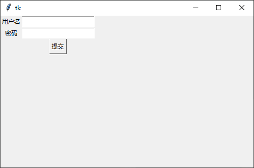

##### 组件内容的对其方式

默认情况下组件会居中显示在对应的网格里，你可以使用sticky选项来修改这一特性。该选项可以使用的值有E、W、S、N（EWSN分别表示东西南北，即上北下南左西右东）以及它们的组合。因此，可以通过sticky=W使得Label左对齐：

```python
"""设置表格布局组件内的布局方位 """
tk.Label(root, text="用户名", padx=10).grid(row=1, column=1, sticky=tk.E)
tk.Entry(root).grid(row=1, column=2)

tk.Label(root, text="密码", padx=10).grid(row=2, column=1, sticky=tk.E)
tk.Entry(root, show="*").grid(row=2, column=2)

tk.Button(root, text='提交').grid(row=3, column=2)
```

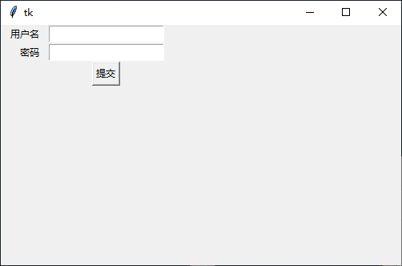


有时候可能需要用几个网格来放置一个组件，可以做到吗？当然可以，只需要指定rowspan和columnspan就可以实现跨行和跨列的功能：

##### 跨行和跨列布局

```python
import tkinter as tk

root = tk.Tk()

root.geometry("500x300+100+100")

# column默认值是0
tk.Label(root, text="用户名").grid(row=1, column=1, sticky=tk.E)
tk.Entry(root).grid(row=1, column=2)

tk.Label(root, text="密码").grid(row=2, column=1, sticky=tk.E)
tk.Entry(root, show="*").grid(row=2, column=2)

# 实现跨行需求
tk.Button(text="提交", width=20).grid(row=3, column=1, columnspan=2)
tk.mainloop()

```

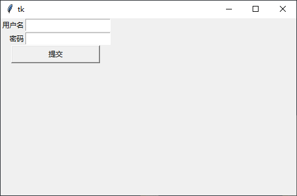

##### grid布局方法：

| 函数名             | 描述                                                         |
| ------------------ | ------------------------------------------------------------ |
| slaves()           | 以列表方式返回本组件的所有子组件对象。                       |
| propagate(boolean) | 设置为True表示父组件的几何大小由子组件决定（默认值），反之则无关。 |
| info()             | 返回pack提供的选项所对应得值。                               |
| forget()           | Unpack组件，将组件隐藏并且忽略原有设置，对象依旧存在，可以用pack(option, …)，将其显示。 |
| grid_remove ()     |                                                              |

#### place 

通常情况下不建议使用place布局管理器，因为对比起pack和grid，place要做更多的工作。不过纯在即合理，place在一些特殊的情况下可以发挥妙用。请看下面的例子。

使用place，可以将子组件显示在父组件的正中间：

```python
import tkinter as tk

root = tk.Tk()
root.geometry("500x300+100+100")

# relx 和 rely 选项指定的是相对于父组件的位置
# 范围是 00～1.0，因此 0.5 表示位于正中间。
tk.Button(root, text="绝对布局-正中心").place(relx=0.5, rely=0.5, anchor=tk.CENTER)

tk.mainloop()

```

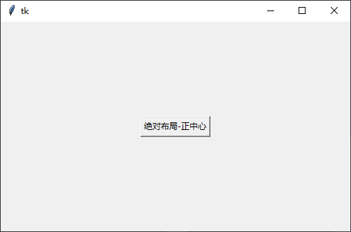

在某种情况下，或许你希望一个组件可以覆盖另一个组件，那么place又可以派上用场了。下面例子演示用Button覆盖Label组件：

```python
import tkinter as tk

root = tk.Tk()
root.geometry("500x300+100+100")

photo = tk.PhotoImage(file="../../assets/logo.png")
tk.Label(root, image=photo).pack()

# 绝对布局的组件可以在其他组件之上
tk.Label(root, text="覆盖组件").place(relx=0.5, rely=0.2, anchor=tk.CENTER)

tk.mainloop()

```

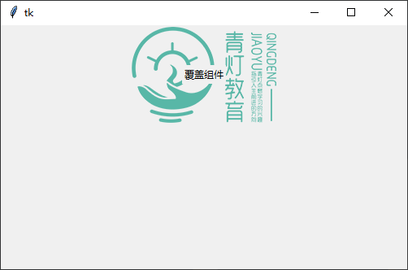

利用 place 覆盖组件

不难看出，relx和rely选项指定的是相对于父组件的位置，范围是00～1.0，因此0.5表示位于正中间。那么relwidth和relheight选项则是指定相对于父组件的尺寸：

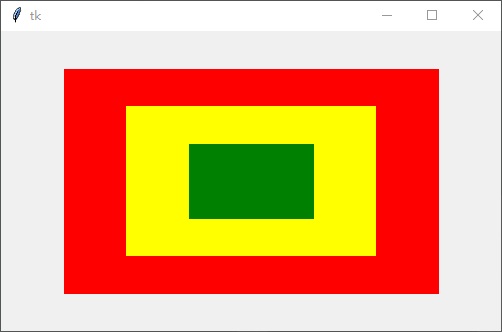

相对位置和相对尺寸

```python
import tkinter as tk

root = tk.Tk()
root.geometry("500x300+100+100")
tk.Label(root, bg="red").place(relx=0.5,
                               rely=0.5,
                               relheight=0.75,
                               relwidth=0.75,
                               anchor=tk.CENTER)
tk.Label(root, bg="yellow").place(relx=0.5,
                                  rely=0.5,
                                  relheight=0.5,
                                  relwidth=0.5,
                                  anchor=tk.CENTER)
tk.Label(root, bg="green").place(relx=0.5,
                                 rely=0.5,
                                 relheight=0.25,
                                 relwidth=0.25,
                                 anchor=tk.CENTER)

tk.mainloop()

```

对于上面的代码，无论你如何拉伸改变窗口，三个Label的尺寸均会跟着同步。


## 常用组件

tkinter 的各类组件

那么到这里，我相信大家对 tkinter 的简单使用就有一个大致的了解了。但是呢，人不可能一步登天。一个功能美观多样的app界面一定是由非常多的控件一点一点组成的，想要使用 tkinter 做出一个美观漂亮的ui界面我们还有很多路要走。那么我们以Lable开始，学习对 tkinter 各类控件的使用

###  Label组件 

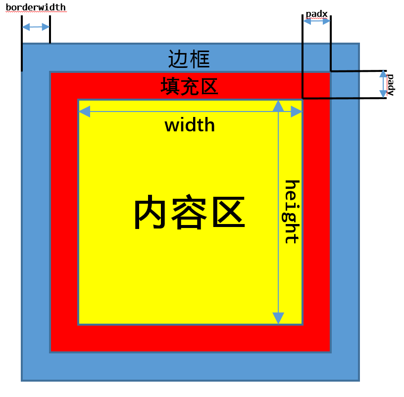

Label组件是用于在界面上输出文本内容的标签，在tkinter的ui界面编写中往往是使用得最多的一种，它的使用方式也多种多样下面我们来讲解lable的使用。

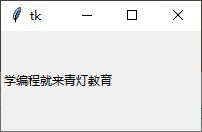

```python
import tkinter as tk

#  导入tkinter模块的所有内容
root = tk.Tk()
root.geometry("200x100+150+150")

#  创建一个文本Label对象
textLabel = tk.Label(root, text="学编程就来青灯教育")
textLabel.pack(side=tk.LEFT)

root.mainloop()
```

####  基本用法与可选属性

#####  (1).基本用法

基本用法：Label(根对象, [属性列表])

根对象：在那个窗体显示，例如主窗体。

属性列表：是可选的属性=属性值组成。

#####  (2).可选属性

| 属性              | 说明                                 |
| ----------------- | ------------------------------------ |
| text              | 标签显示的文本                       |
| font              | 设置文本的字体和大小                 |
| fg(foreground)    | 字体的颜色，                         |
| bg (background)   | 标签的背景色                         |
| width             | 标签的宽度（一个中文的字体宽为单位） |
| height            | 标签的高度（一个中文的字体高为单位） |
| padx              | 文字到边框的距离，水平方向           |
| pady              | 文字到边框的距离，垂直方向           |
| bd（borderwidth） | 边框的宽度                           |
| relief            | 边框的样式                           |
| justify           | 文本对齐方式                         |
| image             | 图片                                 |
| compound          | 图片与文字的混搭                     |
| anchor            | 方位                                 |

####  可选属性的具体应用

#####  常用属性

+ text

  ```python
  #  用于显示文本内容
  text = "要显示的文本内容"
  ```

+ font

  ```python
  #  用于设置字体与字体大小 
  #  用法：font=("字体名"，大小)
  font=("宋体"，24)
  ```

+ fg 与 bg

  ```python
  #  fg 前景色，即字体的颜色，bg 背景颜色 可用英文名，也可以用十六进制表示的颜色。
  fg="red", fg="#00ffff"
  ```

+ width 与 height

  ```python
  #  width height 标签的宽度与高度，都是以系统默认的中文的一个字体宽高为单位
  width=20, height=5
  ```

  

```python
import tkinter as tk

# 导入tkinter模块的所有内容
root = tk.Tk()
root.geometry("400x400+150+150")

# 创建一个文本Label对象
textLabel = tk.Label(root,
                     text="学 Python 就来青灯教育",   # 设置文字属性
                     font=("宋体", 24),             # 设置字体
                     fg="red",                     # 前景色
                     bg="#00ffff",                 # 背景色
                     width=30,                     # 宽度
                     height=5)                     # 高度
textLabel.pack(side=tk.LEFT)

root.mainloop()

```

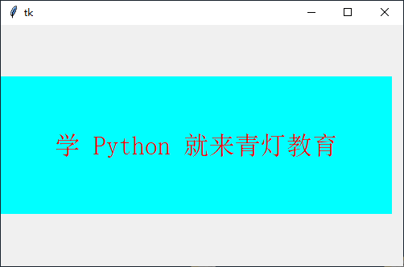

##### 背景/前景/宽高

代码：

```python
import tkinter as tk

#  背景色与前景色
root = tk.Tk()
label_1 = tk.Label(root, text='fg="red" bg="#00ffff""', fg="red", bg="#00ffff")
label_1.pack()

#  字体与字体的大小
label_2 = tk.Label(root, text='font=("宋体", 24)', font=("宋体", 24))
label_2.pack()

#  宽度与高度
label_3 = tk.Label(root, text='宽10 高3', bg="yellow", width=10, height=3)
label_3.pack()
label_4 = tk.Label(root, text='宽20 高1', bg="yellow", width=20, height=1)
label_4.pack()

root.mainloop()
```

演示效果：

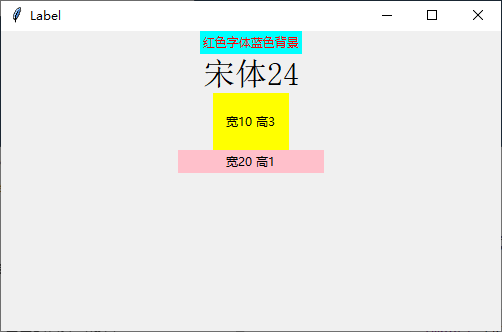

#####  边距/对齐方式

边距：padx与pady

```python
#  文字到边框的距离 padx 与 pady 水平与竖直方向,单位是像素，默认是1像素
padx=2, pady = 1 
```

文本对齐方式：justify

```python
#  可取 "left" ,"right", "center" ,默认是"center"居中对齐，Label 里的文本支持 转移字符 \n \t 等
justify="left" 
```


案例代码：

```python
import tkinter as tk

root = tk.Tk()
#  边距
label_5 = tk.Label(root, text='padx pady 默认', bg="blue")
label_5.pack()
label_6 = tk.Label(root, text='padx=0, pady=0', bg="blue", padx=0, pady=0)
label_6.pack()
label_7 = tk.Label(root, text='padx=10, pady=10', bg="blue", padx=10, pady=10)
label_7.pack()

#  对齐方式
label_8 = tk.Label(root, text="学python来青灯教育\n对齐方式")
label_8.pack()
label_9 = tk.Label(root, text="学python来青灯教育\n对齐方式", justify="left")
label_9.pack()
label_9 = tk.Label(root, text="学python来青灯教育\n对齐方式", justify="right")
label_9.pack()

root.mainloop()
```

效果演示：

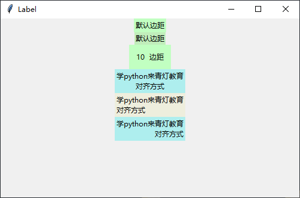

#####  lable添加图片

仅图片

```python
#  导入图片
img1 = tk.PhotoImage(file="文件路径/01.png")
#  在标签里放入图片
label_image1 = tk.Label(root, image=img1)
#  注：目前支持 .png 与 .gif 格式， 还不支持 .jpg格式
```

代码：

```python
#  导入模块，取别名
import tkinter as tk
#  实例化一个窗体对象
root = tk.Tk()
#  导入图片
img1 = tk.PhotoImage(file="image1.png")
#  在标签里放入图片
label_image1 = tk.Label(root, image=img1)
label_image1.pack()
#  进入消息循环，显示窗口
root.mainloop()
```

演示效果

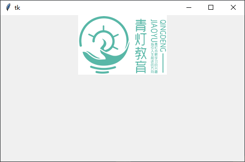

**图片与文字混合**

```python
使用text正常添加文字并使用compound设置对齐，对齐方式有：'left', "right", "center"
compound="left"
```

代码：

```python
#  导入模块，取别名
import tkinter as tk
#  实例化一个窗体对象
root = tk.Tk()
#  导入图片
img1 = tk.PhotoImage(file="image2.png")
#  在标签里放入图片
label_image1 = tk.Label(root, text="学python来青灯教育", image=img1, compound="left")
label_image1.pack()

label_image2 = tk.Label(root, text="学python来青灯教育", image=img1, compound="right")
label_image2.pack()

label_image3 = tk.Label(root, text="学python来青灯教育", image=img1, compound="center", fg="red")
label_image3.pack()
#  进入消息循环，显示窗口
root.mainloop()
```

演示效果：

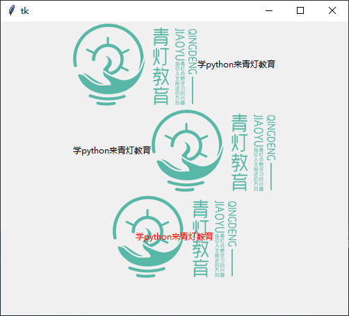


#####  设置文字在标签框内的方位

```python
#  可选的参数有："e","w","s","n","ne","se","nw","sw",就是东西南北八个方向
anchor="n"
```

代码：

```python
import tkinter as tk

root = tk.Tk()

label_1 = tk.Label(root, text="方位是 N", bg="green", width=10, height=3, anchor="n")
label_1.pack()

label_2 = tk.Label(root, text="方位是 NE", bg="blue", width=10, height=3, anchor="ne")
label_2.pack()

label_3 = tk.Label(root, text="方位是 SW", bg="red", width=10, height=3, anchor=tk.SW)
label_3.pack()

label_4 = tk.Label(root, text="方位是 W", bg="yellow", width=10, height=3, anchor=tk.W)
label_4.pack()

root.mainloop()
```

演示效果：

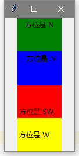

#####  边框的样式与宽度

```python
#  relief 表示边框样式，可选的参数有：flat（平的），sunken （沉没的, 凹下去的），raised （提高，凸出来的），ridge（脊，中键凸的）, 默认是flat.
relief="sunken"
```

代码：

```python
import tkinter as tk

root = tk.Tk()

#  默认 flat平的
label_1 = tk.Label(root, text='flat 平的', bd=8)
label_1.pack()

#  sunken 沉没的
label_2 = tk.Label(root, text='sunken 沉没的', relief="sunken", bd=5)
label_2.pack()

#  raised 提高
label_3 = tk.Label(root, text='raised 提高', relief="raised", bd=5)
label_3.pack()

#  ridge 脊
label_4 = tk.Label(root, text='ridge 脊', relief="ridge", bd=10)
label_4.pack()

root.mainloop()
```

演示效果：

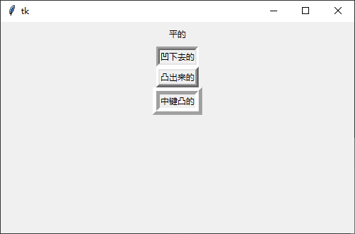


###  Button组件 

Button组件是用于实现一个按钮，它的绝大多数选项跟Label组件是一样的。不过Button组有一个Label组件实现不了的功能，那就是可以接收用户的信息。Button组件有一个command选项，用于指定一个函数或方法，当用户单击按钮的时候，Tkinter就会自动地去调用这个函数或方法了。

Button是一个标准的Tkinter的控件，用于实现各种按钮。按钮可以包含文本或图像，当Button的点击事件绑定某个函数(方法)时，按下Button会自动调用该函数或方法。

####  基本用法与可选属性

#####  基本用法

基本用法：Button(根对象, [属性列表]) 

根对象：在那个窗体显示，例如主窗体。 

属性列表：是可选的属性=属性值组成。 

#####  可选属性

| 属性              | 说明                                 |
| ----------------- | ------------------------------------ |
| text              | 标签显示的文本                       |
| font              | 设置文本的字体和大小                 |
| fg(foreground)    | 字体的颜色，                         |
| bg (background)   | 标签的背景色                         |
| width             | 标签的宽度（一个中文的字体宽为单位） |
| height            | 标签的高度（一个中文的字体高为单位） |
| cursor            | 鼠标的样式                           |
| command           | 绑定事件                             |
| padx              | 文字到边框的距离，水平方向           |
| pady              | 文字到边框的距离，垂直方向           |
| bd（borderwidth） | 边框的宽度                           |
| relief            | 边框的样式                           |
| justify           | 文本对齐方式                         |
| image             | 图片                                 |
| compound          | 图片与文字的混搭                     |
| anchor            | 方位                                 |

####  可选属性的具体应用

#####  常用属性

常用属性 text, font, foreground, background, width, height 使用方式与Lable组件完全一致使用方式可以参考上文，不重复赘述。

代码：

```python
import tkinter as tk

root = tk.Tk()
root.geometry("500x300+100+100")

# 普通按钮
button1 = tk.Button(root, text="Button1")
button1.pack()

# 背景与前景色
button2 = tk.Button(root, text="Button2", bg="#00ffff", fg="red")
button2.pack()

# 宽度与高度
button3 = tk.Button(root, text="Button3", width=10, height=2)
button3.pack()

# 边距
button4 = tk.Button(root, text="Button4", padx=10, pady=10)
button4.pack()

root.mainloop()
```

效果演示：

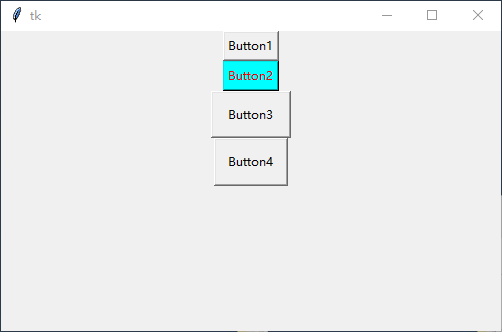

#####  图片按钮

使用方式、特性与Lable一致

```python
import tkinter as tk

root = tk.Tk()
root.geometry("500x300+100+100")
img2 = tk.PhotoImage(file="../../assets/logo.png")

button1 = tk.Button(root, text="Button1", image=img2)
button1.pack()

button2 = tk.Button(root, text="Button2", image=img2, compound="left")
button2.pack()

button3 = tk.Button(root, text="Button3", image=img2, compound="right")
button3.pack()

button4 = tk.Button(root, text="Button4", foreground="red", image=img2, compound="center")
button4.pack()

root.mainloop()

```

演示效果：

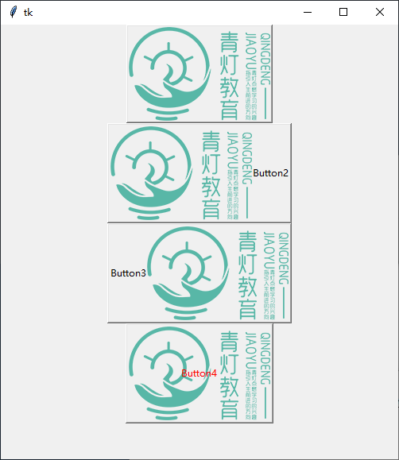

#####  边距与对齐方式

边距：padx，pady 与文本对齐方式：justify使用方式与Lable一致

代码：

```python
import tkinter as tk

root = tk.Tk()
#  边距
button1 = tk.Button(root, text='padx pady 默认')
button1.pack()

button2 = tk.Button(root, text="padx=0, pady=0", padx=0, pady=0)
button2.pack()

button3 = tk.Button(root, text="padx=10, pady=10", padx=10, pady=10)
button3.pack()

#  对齐方式
button4 = tk.Button(root, text="学python来青灯教育\n有小姐姐哦")
button4.pack()

button4 = tk.Button(root, text="学python来青灯教育\n有小姐姐哦", justify="left")
button4.pack()

button4 = tk.Button(root, text="学python来青灯教育\n有小姐姐哦", justify="right")
button4.pack()

root.mainloop()
```

演示效果

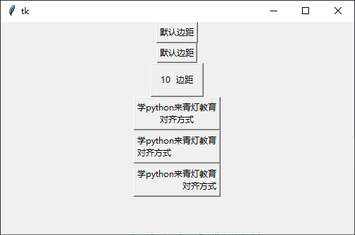

#####  鼠标样式

```python
#  pencil：笔型
#  circle：圆形
#  hand1：手型1
#  hand2：手型2
cursor="鼠标的属性值"
```

```python
import tkinter as tk

root = tk.Tk()
root.geometry("500x300+100+100")
# 笔型
button1 = tk.Button(root, text="笔型", cursor="pencil")
button1.pack()

# 圆形
button2 = tk.Button(root, text="圆形", cursor="circle")
button2.pack()

# 手型1
button3 = tk.Button(root, text="手型1", cursor="hand1")
button3.pack()

# 手型2
button4 = tk.Button(root, text="手型2", cursor="hand2")
button4.pack()

root.mainloop()

```

演示效果

需要把鼠标放Button上自行查看，会有不同显示

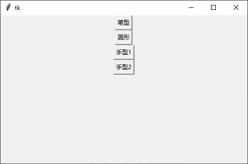

#####  边框样式与宽度

```python
#  flat 无边框
#  groove 中间凹
#  ridge 中间凸
#  raised 往中间凸
#  solid 往中间凹
#  sunken 不可以
relief= "边框样式值"
```

```python
import tkinter as tk

root = tk.Tk()
root.geometry("500x300+100+100")
# flat 无边框
button1 = tk.Button(root, text="flat", relief="flat", bd=8)
button1.pack()

# groove 中间凹
button2 = tk.Button(root, text="groove", relief="groove", bd=5)
button2.pack()

# ridge 中间凸
button3 = tk.Button(root, text="raised", relief="ridge", bd=6)
button3.pack()

# raised 往中间凸
button4 = tk.Button(root, text="ridge", relief="raised", bd=30)
button4.pack()

# solid 往中间凹
button5 = tk.Button(root, text="solid", relief="solid", bd=10)
button5.pack()

# sunken 不可以
button6 = tk.Button(root, text="sunken", relief="sunken", bd=10)
button6.pack()

root.mainloop()
```

演示效果：

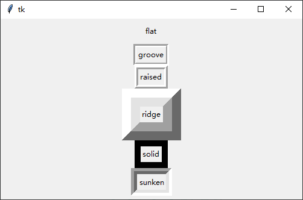

#####  文字对齐方式

与Lable一致

```python
import tkinter as tk

root = tk.Tk()
root.geometry("500x300+100+100")
button1 = tk.Button(root, text="e", width=10, height=3, anchor=tk.E)
button1.pack()

button2 = tk.Button(root, text="w", width=10, height=3, anchor=tk.W)
button2.pack()

button3 = tk.Button(root, text="s", width=10, height=3, anchor=tk.S)
button3.pack()

button4 = tk.Button(root, text="n", width=10, height=3, anchor=tk.N)
button4.pack()

root.mainloop()
```

演示效果：

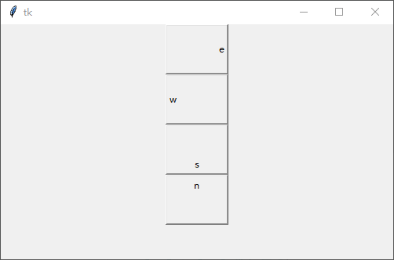


####  案例:计算器

制作一个简单的计算器程序要求所有功能按钮能正常使用，界面效果美观，效果如下:

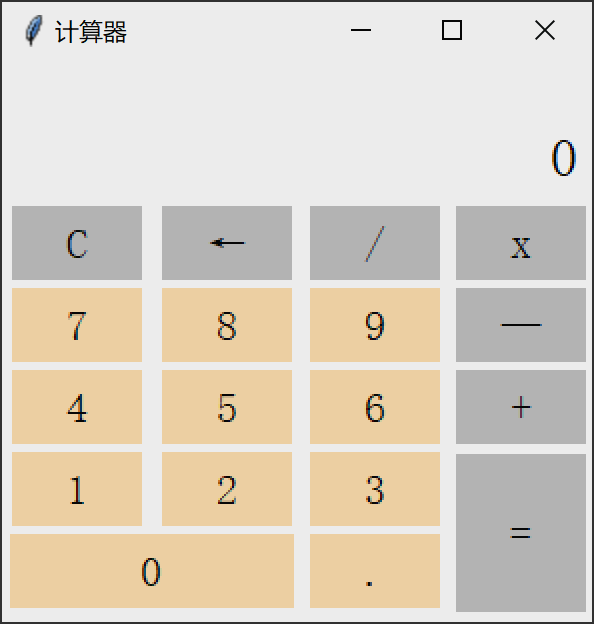

代码：

```python
#  导入模块，取别名
import tkinter as tk
#  实例化一个窗体对象
root = tk.Tk()
#  设置窗口的大小长宽为300x300出现的位置距离窗口左上角+150+150
root.geometry("295x280+150+150")
root.title('计算器')
root.attributes("-alpha", 0.9)
root["background"] = "#ffffff"
lists = []
result_num = tk.StringVar()
result_num.set(0)


def num(i):
    lists.append(i)
    result_num.set(''.join(lists))


def operator(i):
    if len(lists) > 0:
        if lists[-1] in ['+', '-', '*', '/']:
            lists[-1] = i
        else:
            lists.append(i)
        result_num.set(''.join(lists))


def equal():
    a = ''.join(lists)
    end_num = eval(a)
    result_num.set(end_num)
    lists.clear()
    lists.append(str(end_num))


def clear():
    lists.clear()
    result_num.set(0)


def back():
    del lists[-1]
    result_num.set(lists)


lable1 = tk.Label(root, textvariable=result_num, width=20, height=2, font=('宋体', 20), justify='left', background='#ffffff', anchor='se')
lable1.grid(padx=4, pady=4, row=0, column=0, columnspan=4)

button_clear = tk.Button(root, text='C', width=5, font=('宋体', 16), relief='flat', background='#C0C0C0', command=lambda: clear())
button_clear.grid(padx=4, pady=4, row=1, column=0)
button_back = tk.Button(root, text='←', width=5, font=('宋体', 16), relief='flat', background='#C0C0C0', command=lambda: back())
button_back.grid(padx=4, row=1, column=1)
button_division = tk.Button(root, text='/', width=5, font=('宋体', 16), relief='flat', background='#C0C0C0', command=lambda: operator('/'))
button_division.grid(padx=4, row=1, column=2)
button_multiplication = tk.Button(root, text='x', width=5, font=('宋体', 16), relief='flat', background='#C0C0C0', command=lambda: operator('*'))
button_multiplication.grid(padx=4, row=1, column=3)

button_seven = tk.Button(root, text='7', width=5, font=('宋体', 16), relief='flat', background='#FFDEAD', command=lambda: num('7'))
button_seven.grid(padx=4, row=2, column=0)
button_eight = tk.Button(root, text='8', width=5, font=('宋体', 16), relief='flat', background='#FFDEAD', command=lambda: num('8'))
button_eight.grid(padx=4, row=2, column=1)
button_nine = tk.Button(root, text='9', width=5, font=('宋体', 16), relief='flat', background='#FFDEAD', command=lambda: num('9'))
button_nine.grid(padx=4, row=2, column=2)
button_subtraction = tk.Button(root, text='—', width=5, font=('宋体', 16), relief='flat', background='#C0C0C0', command=lambda: operator('-'))
button_subtraction.grid(padx=4, row=2, column=3)

button_four = tk.Button(root, text='4', width=5, font=('宋体', 16), relief='flat', background='#FFDEAD', command=lambda: num('4'))
button_four.grid(padx=4, pady=4, row=3, column=0)
button_five = tk.Button(root, text='5', width=5, font=('宋体', 16), relief='flat', background='#FFDEAD', command=lambda: num('5'))
button_five.grid(padx=4, row=3, column=1)
button_six = tk.Button(root, text='6', width=5, font=('宋体', 16), relief='flat', background='#FFDEAD', command=lambda: num('6'))
button_six.grid(padx=4, row=3, column=2)
button_addition = tk.Button(root, text='+', width=5, font=('宋体', 16), relief='flat', background='#C0C0C0', command=lambda: operator('+'))
button_addition.grid(padx=4, row=3, column=3)

button_one = tk.Button(root, text='1', width=5, font=('宋体', 16), relief='flat', background='#FFDEAD', command=lambda: num('1'))
button_one.grid(padx=4, row=4, column=0)
button_two = tk.Button(root, text='2', width=5, font=('宋体', 16), relief='flat', background='#FFDEAD', command=lambda: num('2'))
button_two.grid(padx=4, row=4, column=1)
button_three = tk.Button(root, text='3', width=5, font=('宋体', 16), relief='flat', background='#FFDEAD', command=lambda: num('3'))
button_three.grid(padx=4, row=4, column=2)
button_equal = tk.Button(root, text='=', width=5, height=3, font=('宋体', 16), relief='flat', background='#C0C0C0', command=lambda: equal())
button_equal.grid(padx=4, row=4, rowspan=5, column=3)

button_zero = tk.Button(root, text='0', width=12, font=('宋体', 16), relief='flat', background='#FFDEAD', command=lambda: num('0'))
button_zero.grid(padx=4, pady=4, row=5, column=0, columnspan=2)
button_decimal = tk.Button(root, text='.', width=5, font=('宋体', 16), relief='flat', background='#FFDEAD', command=lambda: num('.'))
button_decimal.grid(padx=4, row=5, column=2)
#  进入消息循环，显示窗口
root.mainloop()

```

###  Checkbutton组件 

复选框：可以同时多选的一组框，其只有两种状态，选中与未选中。

####  基本用法与可选属性

#####  基本用法

基本用法：Checkbutton(根对象, [属性列表])

根对象：在那个窗体显示，例如主窗体。

属性列表：是可选的属性=属性值组成。

#####  可选属性

| 属性              | 说明                                    |
| ----------------- | --------------------------------------- |
| text              | 标签显示的文本                          |
| font              | 设置文本的字体和大小                    |
| fg(foreground)    | 字体的颜色，                            |
| bg (background)   | 标签的背景色                            |
| width             | 标签的宽度（一个中文的字体宽为单位）    |
| height            | 标签的高度（一个中文的字体高为单位）    |
| cursor            | 鼠标的样式                              |
| padx              | 文字到边框的距离，水平方向              |
| pady              | 文字到边框的距离，垂直方向              |
| bd（borderwidth） | 边框的宽度                              |
| relief            | 边框的样式                              |
| justify           | 文本对齐方式                            |
| image             | 图片                                    |
| compound          | 图片与文字的混搭                        |
| anchor            | 方位                                    |
| variable          | 控制变量                                |
| state             | 组件的状态，正常：normal 禁用：disabled |
| selectcolor       | 选中框内的颜色                          |

#####  专有方法

| 方法        | 作用         |
| ----------- | ------------ |
| .select（） | 设置为选中   |
| .delect（） | 设置为未选中 |
| .toggle（） | 切换选中状态 |

##### 简单案例

```python
import tkinter as tk

root = tk.Tk()
root.geometry("500x300+100+100")

# 需要一个Tkinter变量,用于表示该按钮是否被选中
v = tk.IntVar()
c = tk.Checkbutton(root, text="测试一下", variable=v)
c.pack()

# 将 Label 设置为可变变量
label = tk.Label(textvariable=v)
label.pack()

root.mainloop()

```

当单击选项时，Label显示的变量相应地发生了改变

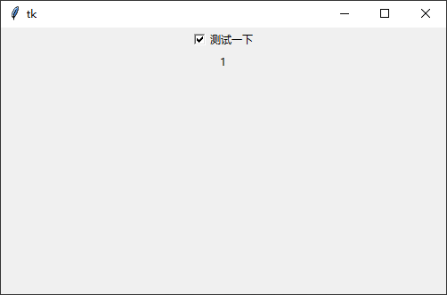

##### 简单复选框案例

有了前面的基础，下面写一个古代四大美女的程序：

```python
import tkinter as tk

root = tk.Tk()
root.geometry("500x300+100+100")
girls = ['西施', '王昭君', '貂蝉', '杨玉环']

# 创建可变变量容器
v = [tk.IntVar(), tk.IntVar(), tk.IntVar(), tk.IntVar()]

# # 提前选择内容
# v[3].set(1)

for index in range(4):
    c = tk.Checkbutton(root, text=girls[index], variable=v[index])
    c.pack(anchor='w')


def get_value():
    # 默认打印的是文字对象
    # print(v)
    print([i.get() for i in v])


button = tk.Button(text='获取参数', command=get_value)
button.pack()

root.mainloop()

```

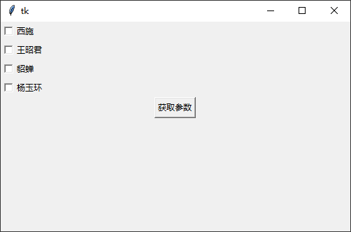


###  Radiobutton组件 

Radiobutton组件跟Checkbutton组件的用法基本一致，唯一不同的是Radiobutton实现的是“单选”的效果。要实现这种互斥的效果，同一组内的所有Radiobutton只能共享一个variable选项，并且需要设置不同的value选项值：

```python
import tkinter as tk

root = tk.Tk()
root.geometry("500x300+100+100")

v = tk.IntVar()

# value 是点击之后设置的值
one = tk.StringVar()
one.set("One")

# Radiobutton 共用一个 variable 是选中之后获取的值
tk.Radiobutton(root, textvariable=one, variable=v, value=1).pack(anchor=tk.W)
tk.Radiobutton(root, text="Two", variable=v, value=2).pack(anchor=tk.W)
tk.Radiobutton(root, text="Three", variable=v, value=3).pack(anchor=tk.W)


def get_value():
    print(v.get())


button = tk.Button(text='获取参数', command=get_value)
button.pack()

root.mainloop()

```

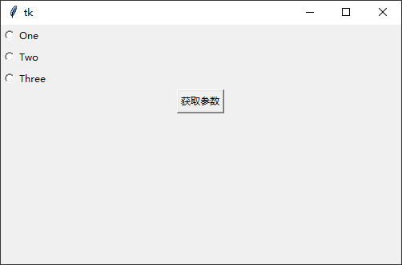

#####  循环案例

```python
import tkinter as tk

root = tk.Tk()
root.geometry("500x300+100+100")
langs = [
    ('python', 1),
    ('perl', 2),
    ('ruby', 3),
    ('lua', 4),
]

v = tk.IntVar()
v.set(1)

tk.Label(root, text='你喜欢哪一门语言？').pack()

for lang, no in langs:
    b = tk.Radiobutton(root, text=lang, variable=v, value=no)
    b.pack(anchor=tk.W)

tk.Button(root, text='提交', command=lambda: print(v.get())).pack()
root.mainloop()

```

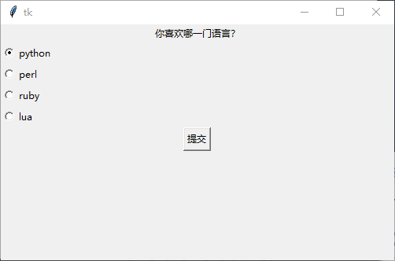

在此，如果你不喜欢前面这个小圈圈，还可以改成按钮的形式：

```python
#  将indicatoron设置为False即可去掉前面的小圆圈
b = .Radiobutton(root, text=lang, variable=v, value=no, indicatoron=False)
```

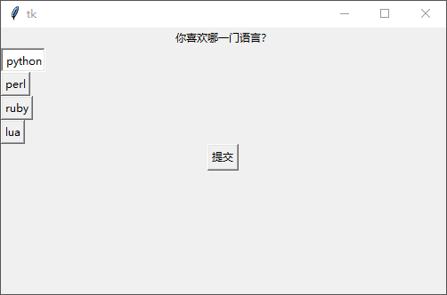

###  Entry组件 

Entry组件就是平时所说的输入框。输入框是跟程序打交道的一个途径，例如程序要求你输入账号密码，那么它就需要提供两个输入框给你，用于接收密码的输入框还会用星号将实际输入的内容隐藏起来。

语法格式如下：

```
w = Entry( master, option, ... )
```

- master: 按钮的父容器。
- options: 可选项，即该按钮的可设置的属性。这些选项可以用键 = 值的形式设置，并以逗号分隔。

|       序号        |                        可选项 & 描述                         |
| :---------------: | :----------------------------------------------------------: |
|        bg         |                        输入框背景颜色                        |
|        bd         |                 边框的大小，默认为 2 个像素                  |
|      cursor       |       光标的形状设定，如arrow, circle, cross, plus 等        |
|       font        |                           文本字体                           |
|  exportselection  | 默认情况下，你如果在输入框中选中文本，默认会复制到粘贴板，如果要忽略这个功能刻工艺设置 exportselection=0。 |
|        fg         |     文字颜色。值为颜色或为颜色代码，如：'red','#ff0000'      |
|  highlightcolor   |          文本框高亮边框颜色，当文本框获取焦点时显示          |
|      justify      | 显示多行文本的时候,设置不同行之间的对齐方式，可选项包括LEFT, RIGHT, CENTER |
|      relief       | 边框样式，设置控件3D效果，可选的有：FLAT、SUNKEN、RAISED、GROOVE、RIDGE。默认为 FLAT。 |
| selectbackground  |                      选中文字的背景颜色                      |
| selectborderwidth |                    选中文字的背景边框宽度                    |
| selectforeground  |                        选中文字的颜色                        |
|       show        | 指定文本框内容显示为字符，值随意，满足字符即可。如密码可以将值设为 show="*" |
|       state       | 默认为 state=NORMAL, 文框状态，分为只读和可写，值为：normal/disabled |
|   textvariable    |              文本框的值，是一个StringVar()对象               |
|       width       |                          文本框宽度                          |
|  xscrollcommand   | 设置水平方向滚动条，一般在用户输入的文本框内容宽度大于文本框显示的宽度时使用。 |

下表为文本框组件常用的方法：

|             序号              |                         方法 & 描述                          |
| :---------------------------: | :----------------------------------------------------------: |
|  delete ( first, last=None )  | 删除文本框里直接位置值不然<br>text.delete(10)  删除索引值为10的值 <br/>text.delete(10, 20)   删除索引值从10到20之前的值<br/> text.delete(0, END)  # 删除所有值 |
|             get()             |                        获取文件框的值                        |
|       icursor ( index )       |      将光标移动到指定索引位置，只有当文框获取焦点后成立      |
|        index ( index )        |                       返回指定的索引值                       |
|      insert (index, s )       |         向文本框中插入值，index：插入位置，s：插入值         |
|    select_adjust ( index )    |              选中指定索引和光标所在位置之前的值              |
|        select_clear()         |                          清空文本框                          |
|     select_from ( index )     |           设置光标的位置，通过索引值 index 来设置            |
|       select_present()        |           如果有选中，返回 true，否则返回 false。            |
|  select_range ( start, end )  | 选中指定索引位置的值，start(包含) 为开始位置，end(不包含) 为结束位置start必须比end小 |
|      select_to ( index )      |                  选中指定索引与光标之间的值                  |
|        xview ( index )        |           该方法在文本框链接到水平滚动条上很有用。           |
| xview_scroll ( number, what ) | 用于水平滚动文本框。 what 参数可以是 UNITS, 按字符宽度滚动，或者可以是 PAGES, 按文本框组件块滚动。 number 参数，正数为由左到右滚动，负数为由右到左滚动。 |

学了前面好几个Tkinter的组件之后应该不难发现——其实很多方法和选项它们之间都是通用的。

例如在输入框中用代码添加和删除内容，同样也是使用insert()和delete()方法：

```python
import tkinter as tk

root = tk.Tk()
root.geometry("500x300+100+100")
e = tk.Entry(root)
e.pack(padx=20, pady=20)

# insert 插入文本
e.insert(0, "默认文本…")
# # get 获取内容
# print(e.get())
# # delete 删除内容
# e.delete(0, tk.END)

root.mainloop()

```

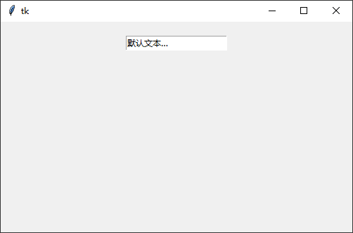

获取输入框里边的内容，可以使用Entry组件的get()方法。当然也可以将一个Tkinter的变量（通常是StringVar）挂钩到textvariable选项，然后通过变量的get()方法获取。

在下面的例子中，添加一个按钮，当单击按钮的时候，获取输入框的内容并打印出来，然后清空输入框。


####  案例：登录页面

如果想设计一个密码输入框，即使用星号（\*）代替用户输入的内容，只需要设置show选项即可：

```python
import tkinter as tk

root = tk.Tk()
root.geometry("500x300+100+100")


def show():
    print('用户名: ', e1.get())
    print('密  码: ', e2.get())
    e1.delete(0, tk.END)
    e2.delete(0, tk.END)


tk.Label(root, text='用户名: ').grid(row=0)
tk.Label(root, text='密  码: ').grid(row=1)

e1 = tk.Entry(root)
e2 = tk.Entry(root, show="*")
e1.grid(row=0, column=1, padx=10, pady=5)
e2.grid(row=1, column=1, padx=10, pady=5)

tk.Button(root, text='登录', width=10, command=show).grid(row=3, column=0, sticky=tk.W, padx=10, pady=5)
tk.Button(root, text='退出', width=10, command=root.quit).grid(row=3, column=1, sticky=tk.W, padx=10, pady=5)

root.mainloop()

```

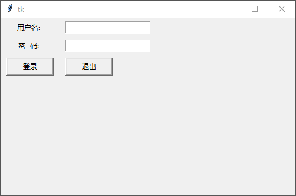

####  案例：验证登录

另外，Entry组件还支持验证输入内容的合法性。例如输入框要求输入的是数字，用户输入了字母那就属于“非法”。实现该功能，需要通过设置validate、validatecommand和invalidcommand三个选项。

首先启用验证的“开关”是validate选项，该选项可以设置的值


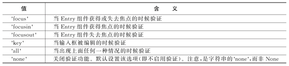

其次是为validatecommand选项指定一个验证函数，该函数只能返回True或False表示验证的结果。一般情况下验证函数只需要知道输入框的内容即可，可以通过Entry组件的get()方法获得该字符串。

在下面的例子中，在第一个输入框中输入内容之后并通过Tab键将焦点转移到第二个输入框的时候，验证功能被成功触发：

```python
import tkinter as tk

root = tk.Tk()
root.geometry("500x300+100+100")


def show():
    print('用户名: ', e1.get())
    print('密  码: ', e2.get())
    e1.delete(0, tk.END)
    e2.delete(0, tk.END)


# 自定义验证函数
def verify_test():
    if e1.get() == '青灯教育-正心':
        print('验证成功')
        return True
    else:
        print('验证失败')
        e1.delete(0, tk.END)
        return False


tk.Label(root, text='用户名: ').grid(row=0)
tk.Label(root, text='密  码: ').grid(row=1)

e1 = tk.Entry(root, validate='focusout', validatecommand=verify_test)
e2 = tk.Entry(root, show="*")

e1.grid(row=0, column=1, padx=10, pady=5)
e2.grid(row=1, column=1, padx=10, pady=5)

tk.Button(root, text='登录', width=10, command=show).grid(row=3, column=0, sticky=tk.W, padx=10, pady=5)
tk.Button(root, text='退出', width=10, command=root.quit).grid(row=3, column=1, sticky=tk.W, padx=10, pady=5)
root.mainloop()

```

最后，invalidcommand选项指定的函数只有在validatecommand的返回值为False的时候才被调用。

在下面的例子中，在第一个输入框中输入内容，并通过Tab键将焦点转移到第二个输入框，validatecommand指定的验证函数被触发并返回False，接着invalidcommand被触发：

```python
def verify_test():
    if e1.get() == '青灯教育-正心':
        print('验证成功')
        return True
    else:
        print('验证失败')
        e1.delete(0, tk.END)
        return False
```

随便输入内容之后按tab键，就会显示验证失败

输入正确的内容就会显示验证成功

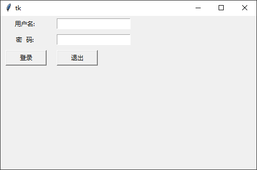


####  验证函数

其实，Tkinter还有个“隐藏技能”——Tkinter为验证函数提供一些额外的选项。

Tkinter为验证函数提供一些额外的选项

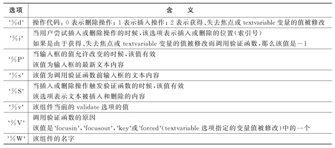

为了使用这些选项，你可以这样写：

validatecommand = (f, s1, s2, ...)

其中，f是验证函数名，s1、s2、s3是额外的选项，这些选项会作为参数依次传给f函数。在此之前，需要调用register()方法将验证函数包装起来

下面实现一个简单的计算器：

```python
import tkinter as tk

root = tk.Tk()
frame = tk.Frame(root)
frame.pack(padx=10, pady=10)

v1 = tk.IntVar()
v2 = tk.IntVar()
v3 = tk.IntVar()


def verify_test(content: str):
    if content.isdigit():
        return True
    else:
        return False


test_cmd = root.register(verify_test)

e1 = tk.Entry(frame, textvariable=v1, width=10, validate='key', validatecommand=(test_cmd, '%P'))
e1.grid(row=0, column=0)
tk.Label(frame, text="+").grid(row=0, column=1)

e2 = tk.Entry(frame, textvariable=v2, width=10, validate='key', validatecommand=(test_cmd, '%P'))
e2.grid(row=0, column=2)
tk.Label(frame, text="=").grid(row=0, column=3)

e3 = tk.Entry(frame, textvariable=v3, width=10, validate='key', validatecommand=(test_cmd, '%P'))
e3.grid(row=0, column=4)


def calc():
    result = v1.get() + v2.get()
    v3.set(result)


tk.Button(frame, text='计算结果', width=10, command=calc).grid(row=1, column=2, sticky=tk.W, padx=10, pady=5)

root.mainloop()

```

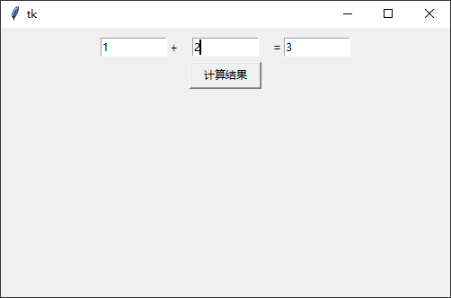


###  Menu组件 

几乎每个应用程序都可以看到菜单，而常见的菜单有“文件”、“编辑”、“帮助”，打开“文件”之后，它会下拉出若干菜单项，例如“新建”、“打开”、“保存”、“退出”等

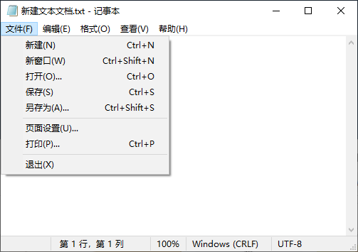

Tkinter提供了一个Menu组件，用于实现顶级菜单、下拉菜单和弹出菜单。由于该组件是底层代码实现和优化，所以不建议你自行通过按钮和其他组件来实现菜单功能。

创建一个顶级菜单，需要先创建一个菜单实例，然后使用add()方法将命令和其他子菜单添加进去：

```python
import tkinter as tk

root = tk.Tk()
root.geometry("500x300+100+100")


def callback():
    print("新建文件")


# 创建一个顶级菜单
menubar = tk.Menu(root)
menubar.add_command(label="新建", command=callback)
menubar.add_command(label="退出", command=root.quit)

# 显示菜单
root.config(menu=menubar)
root.mainloop()
```

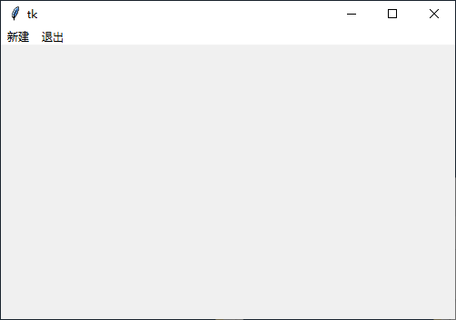

#### 二级菜单组件

创建一个下拉菜单（或者其他子菜单），方法也是大同小异，最主要的区别是它们最后需要添加到主菜单上（而不是窗口上）：

```python
import tkinter as tk

root = tk.Tk()
root.geometry("500x300+100+100")


def callback():
    print("新建文件")


# 创建一个顶级菜单
menubar = tk.Menu(root)

# 创建一个下拉菜单"文件",然后将它添加到顶级菜单中
# tearoff=False 关闭分割线
filemenu = tk.Menu(menubar)
# 添加命令
filemenu.add_command(label="打开", command=callback)
filemenu.add_command(label="保存", command=callback)
filemenu.add_command(label="退出", command=root.quit)
menubar.add_cascade(label="文件", menu=filemenu)

# 创建另一个下拉菜单"编辑",然后将它添加到顶级菜单中
editmenu = tk.Menu(menubar)
editmenu.add_command(label="剪切", command=callback)
editmenu.add_command(label="拷贝", command=callback)
editmenu.add_command(label="粘贴", command=callback)
menubar.add_cascade(label="编辑", menu=editmenu)

# 显示菜单
root.config(menu=menubar)
root.mainloop()

```

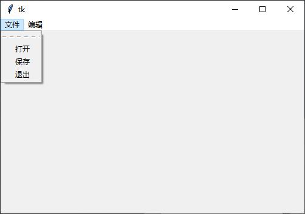


#### 菜单分割线

大家发现在创建一个Menu组件的时候都把一个叫tearoff的选项设置为False。那么这个翻译为“撕开”的选项有什么用呢？Tkinter要我们撕开什么呢？好了，大家不要想歪了，试试便知——把tearoff改为True之后，“文件”菜单增加了一行小横杠

```python
import tkinter as tk

root = tk.Tk()
root.geometry("500x300+100+100")


def callback():
    print("~被调用了~")


# 创建一个顶级菜单
menubar = tk.Menu(root)

# 创建一个下拉菜单"文件",然后将它添加到顶级菜单中
filemenu = tk.Menu(menubar, tearoff=False)
filemenu.add_command(label="打开", command=callback)
filemenu.add_command(label="保存", command=callback)
filemenu.add_separator()
filemenu.add_command(label="退出", command=root.quit)
menubar.add_cascade(label="文件", menu=filemenu)

# 创建radiobutton关联变量
editVar = tk.IntVar()
editVar.set(1)
# 创建另一个下拉菜单"编辑",然后将它添加到顶级菜单中
editmenu = tk.Menu(menubar, tearoff=False)
editmenu.add_command(label="剪切", command=callback)
editmenu.add_command(label="拷贝", command=callback)
editmenu.add_command(label="粘贴", command=callback)
menubar.add_cascade(label="编辑", menu=editmenu)
# 显示菜单
root.config(menu=menubar)
root.mainloop()

```

单击一下，噢，原来Tkinter让我们打开的是菜单，

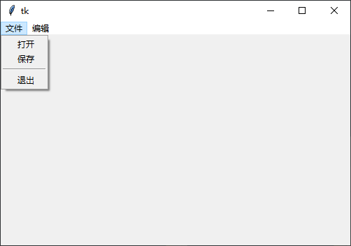


最后，这个菜单不仅可以添加常见的命令菜单项，还可以添加单选按钮或多选按钮，那么用法就跟Checkbutton组件和Radiobutton组件类似啦。

```python
import tkinter as tk

root = tk.Tk()
root.geometry("500x300+100+100")


def callback():
    print("~被调用了~")


# 创建一个顶级菜单
menubar = tk.Menu(root)

# 创建checkbutton关联变量
openVar = tk.IntVar()
saveVar = tk.IntVar()
exitVar = tk.IntVar()

# 创建一个下拉菜单"文件",然后将它添加到顶级菜单中
filemenu = tk.Menu(menubar, tearoff=False)
filemenu.add_checkbutton(label="打开", command=callback, variable=openVar)
filemenu.add_checkbutton(label="保存", command=callback, variable=saveVar)
filemenu.add_separator()
filemenu.add_checkbutton(label="退出", command=root.quit, variable=exitVar)
menubar.add_cascade(label="文件", menu=filemenu)

# 创建radiobutton关联变量
editVar = tk.IntVar()
editVar.set(1)

# 创建另一个下拉菜单"编辑",然后将它添加到顶级菜单中
editmenu = tk.Menu(menubar, tearoff=False)
editmenu.add_radiobutton(label="剪切", command=callback, variable=editVar, value=1)
editmenu.add_radiobutton(label="拷贝", command=callback, variable=editVar, value=2)
editmenu.add_radiobutton(label="粘贴", command=callback, variable=editVar, value=3)
menubar.add_cascade(label="编辑", menu=editmenu)

# 显示菜单
root.config(menu=menubar)
root.mainloop()

```

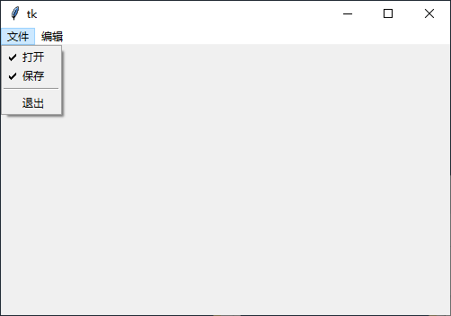


## 可变变量

### StringVar

我们在使用界面编程的时候，有些时候是需要跟踪变量的值的变化，以保证值的变更随时可以显示在界面上。由于python无法做到这一点，所以使用了 tcl 的相应的对象，也就是 StringVar、BooleanVar、DoubleVar、IntVar 所需要起到的作用 

StringVar对象主要有两个方法：

+ get() 用于返回StringVar变量的值
+ set() 用于向StringVar设置变量的值

#### lable设置可变化的文字内容

```python
#  定义变量
v = tk.StringVar()
#  设置变量内容
v.set('23333')
#  在lable中引用
textvariable=v
```

**实时时钟显示** 

代码：

```python
import datetime
import tkinter as tk
import time

root = tk.Tk()
root.geometry("500x300+100+100")

# 定义变量
time_str_var = tk.StringVar()

# 在标签里添加可变的文本
label_1 = tk.Label(root, textvariable=time_str_var,  font=("宋体", 24), fg="#ffffff", bg="#00ffff")
label_1.pack()

while True:
    # set 修改 可变变量的值
    time_str_var.set("%s" % str(datetime.datetime.now())[:-7])
    label_1.update()
    time.sleep(1)

# root.mainloop()

```

演示效果

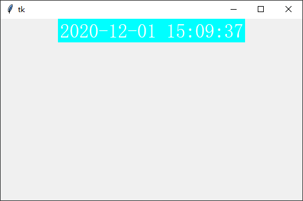

 

## 点击事件

当组件的点击事件（command）绑定某个函数(方法)时，按下组件时会自动调用该函数或方法。

```python
import tkinter as tk

root = tk.Tk()
root.geometry("500x300+100+100")


# 定义功能函数
def button_command():
    print("你点击了按钮")


# 绑定事件
btn = tk.Button(root, text="确定", command=button_command)
btn.pack()


root.mainloop()
```


### 绑定点击事件的几种方式

```python
import tkinter as tk

root = tk.Tk()
root.geometry("500x300+100+100")


# 定义功能函数
def button_command():
    print("你点击了按钮")


# # 绑定事件
# btn = tk.Button(root, text="确定", command=button_command)
# btn.pack()

# # 使用 config 配置方法配置参数
# btn = tk.Button(root, text="确定")
# btn.pack()
# btn.config(command=button_command)

# 使用对象的属性配置参数
btn = tk.Button(root, text="确定")
btn.pack()
btn['command'] = button_command

root.mainloop()

```

#### 带参数的事件绑定

```python
import tkinter as tk

root = tk.Tk()


# 定义功能函数
def sum(a, b):
    print("%d + %d = %d" % (a, b, a + b))


def func():
    sum(1, 1)


# 绑定事件
# btn = tk.Button(root, text="确定", command=lambda: sum(1, 1))
btn = tk.Button(root, text="确定", command=func)

btn.pack()
root.geometry("300x300+200+200")

root.mainloop()

```


## 布局组件

### Frame组件 

Frame（框架）组件是在屏幕上的一个矩形区域。Frame 主要是作为其他组件的框架基础，或为其他组件提供间距填充。

Frame 组件主要用于在复杂的布局中将其他组件分组，也用于填充间距和作为实现高级组件的基类。

| 选项                | 含义                                                         |
| ------------------- | ------------------------------------------------------------ |
| background          | 1. 设置 Frame 组件的背景颜色<br/>2. 默认值由系统指定<br/>3. 为了防止更新，可以将颜色值设置为空字符串 |
| bg                  | 跟 background 一样                                           |
| borderwidth         | 1. 指定 Frame 的边框宽度<br/>2. 默认值是 0                   |
| bd                  | 跟 borderwidth 一样                                          |
| class_              | 默认值是 Frame                                               |
| colormap            | 1. 有些显示器只支持 256 色（有些可能更少），这种显示器通常提供一个颜色映射来指定要使用要使用的 256 种颜色<br/>2. 该选项允许你指定用于该组件以及其子组件的颜色映射<br/>3. 默认情况下，Frame 使用与其父组件相同的颜色映射<br/>4. 使用此选项，你可以使用其他窗口的颜色映射代替（两窗口必须位于同个屏幕并且具有相同的视觉特性）<br/>5. 你也可以直接使用 "new" 为 Frame 组件分配一个新的颜色映射<br/>6. 一旦创建 Frame 组件实例，你就无法修改这个选项的值 |
| container           | 1. 该选项如果为 True，意味着该窗口将被用作容器，一些其它应用程序将被嵌入 <br/>2. 默认值是 False |
| cursor              | 1. 指定当鼠标在 Frame 上飘过的时候的鼠标样式<br/>2. 默认值由系统指定 |
| height              | 1. 设置 Frame 的高度<br/>2. 默认值是 0                       |
| highlightbackground | 1. 指定当 Frame 获得焦点的时候高亮边框的颜色<br/>2. 默认值由系统指定 |
| highlightthickness  | 1. 指定高亮边框的宽度<br/>2. 默认值是 0（不带高亮边框）      |
| padx                | 水平方向上的边距                                             |
| pady                | 垂直方向上的边距                                             |
| relief              | 1. 指定边框样式<br/>2. 默认值是 "flat"<br/>3. 另外你还可以设置 "sunken"，"raised"，"groove" 或 "ridge"<br/>4. 注意，如果你要设置边框样式，记得设置 borderwidth 或 bd 选项不为 0，才能看到边框 |
| takefocus           | 1. 指定该组件是否接受输入焦点（用户可以通过 tab 键将焦点转移上来）<br/>2. 默认值是 False |
| visual              | 1. 为新窗口指定视觉信息<br/>2. 该选项没有默认值              |
| width               | 1. 设置 Frame 的宽度<br/>2. 默认值是 0                       |


**案例** 

```python
import tkinter as tk

root = tk.Tk()
root.geometry("500x300+100+100")

left_frame = tk.Frame(root, width=250)
left_frame.pack(side=tk.LEFT)

tk.Label(left_frame, bg='red', width=10, height=2).pack(fill=tk.X)
tk.Label(left_frame, bg='blue', width=10, height=2).pack(fill=tk.X)
tk.Label(left_frame, bg='yellow', width=10, height=2).pack(fill=tk.X)

right_frame = tk.Frame(root)
right_frame.pack(side=tk.RIGHT)
tk.Label(right_frame, bg='red', width=2, height=10).pack(side=tk.LEFT)
tk.Label(right_frame, bg='blue', width=2, height=10).pack(side=tk.LEFT)
tk.Label(right_frame, bg='yellow', width=2, height=10).pack(side=tk.LEFT)

root.mainloop()

```


###  LabelFrame组件 

LabelFrame组件是Frame框架的进化版，从形态上来说，也就是添加了Label的Frame，但有了它，Checkbutton和Radiobutton的组件分组就变得简单了：

```python
import tkinter as tk

root = tk.Tk()
root.geometry("500x300+100+100")
group = tk.LabelFrame(root, text='最好的脚本语言是?', padx=5, pady=5)
group.pack(side=tk.LEFT, padx=10, pady=10)

langs = [
    ('python', 1),
    ('perl', 2),
    ('ruby', 3),
    ('lua', 4),
]

v = tk.IntVar()
v.set(1)

for lang, no in langs:
    b = tk.Radiobutton(group, text=lang, variable=v, value=no)
    b.pack(anchor=tk.W)

info_frame = tk.Frame(root)
info_frame.pack(side=tk.RIGHT)

tk.Label(info_frame, text="数据日志").pack()
text_area = tk.Text(info_frame, height=20, width=100)
text_area.pack(side=tk.LEFT)

root.mainloop()

```


## 标准对话框 

Tkinter提供了三种标准对话框模块，分别是：

messagebox。

filedialog。

colorchooser。

这三个模块原来是独立的，分别是tkMessageBox、tkFileDialog和tkColorChooser，需要导入才能使用。在Python3之后，这些模块全部被收归到tkinter模块的麾下。


####  messagebox

##### 信息提示框

```python
import tkinter as tk
from tkinter import messagebox

root = tk.Tk()
root.geometry('500x300')

tk.Button(root, text='信息提示', command=lambda: messagebox.showinfo(title='温馨提示', message='你的代码语法不符合规范')).pack()
tk.Button(root, text='警告', command=lambda: messagebox.showerror(title='警告', message='你的代码可能有问题')).pack()
tk.Button(root, text='错误', command=lambda: messagebox.showerror(title='错误', message='你的代码报错了')).pack()

root.mainloop()

```


##### 消息对话框


```python
import tkinter as tk
from tkinter import messagebox

root = tk.Tk()
root.geometry('500x300')


tk.Button(root, text="是或否", command=lambda: print(messagebox.askyesno(message='是否确认 ?'))).pack()
tk.Button(root, text="确认与取消", command=lambda: print(messagebox.askokcancel(title='选择', message='确认选择 ?'))).pack()
tk.Button(root, text="重试/取消", command=lambda: print(messagebox.askretrycancel(title='重试', message='重试 ?'))).pack()
tk.Button(root, text="是/否/取消",command=lambda: print(messagebox.askyesnocancel(title='询问', message='是/否/取消 ?'))).pack()

tk.mainloop()

```

下图列举使用messagebox可以创建的所有标准对话框样式。

**参数**

所有的这些函数都有相同的参数：

title 参数毋庸置疑是设置标题栏的文本。

message 参数是设置对话框的主要文本内容，可以用 '\\n' 来实现换行。

options 参数可以设置的选项和含义如下表所示。


**返回值**

askokcancel()，askretrycancel()和askyesno()返回布尔类型的值：

返回 True 表示用户单击了“确定”或“是”按钮。

返回 False 表示用户单击了“取消”或“否”按钮。

askquestion() 返回＂yes＂或＂no＂字符串表示用户单击了“是”或“否”按钮。

showerror()，showinfo() 和 showwarning() 返回＂ok＂表示用户单击了“是”按钮。

####  filedialog

文件对话框，当应用程序需要使用打开文件或保存文件的功能时，文件对话框显得尤为重要。实现起来就是这样：

```python
import tkinter as tk
from tkinter import filedialog

root = tk.Tk()
root.geometry('500x300')

tk.Button(root, text="获取文件名", command=lambda: print(filedialog.askopenfilename())).pack()
tk.Button(root, text="获取文件名（指定路径）", command=lambda: print(filedialog.askopenfilename(initialdir='C:\\'))).pack()
tk.Button(root, text="获取文件名（多个）", command=lambda: print(filedialog.askopenfilenames())).pack()
tk.Button(root, text="获取文件名（指定类型）",
          command=lambda: print(filedialog.askopenfilenames(filetypes=[('Python', '.py'), ('Python', '.pyc')]))).pack()


def read_file():
    # 有缺陷，会调用系统默认的编码格式
    file = filedialog.askopenfile(mode='rb')
    print(file.read())


tk.Button(root, text="指定文件类读取文件", command=read_file).pack()

root.mainloop()

```


filedialog模块提供了两个函数：`askopenfilename(**option)`和 `asksaveasfilename(**option)` ，分别用于打开文件和保存文件。

**参数**

两个函数可供设置的选项是一样的，下表列举了可用的选项及含义。


**返回值**

如果用户选择了一个文件，那么返回值是该文件的完整路径。

如果用户单击了取消按钮，那么返回值是空字符串。

```python
import tkinter as tk
from tkinter import filedialog

root = tk.Tk()
root.geometry('500x300')


def save_file():
    # 有缺陷，会调用系统默认的编码格式
    save_filename = filedialog.asksaveasfilename()
    print(save_filename)


tk.Button(root, text="获取保存的文件名", command=save_file).pack()

root.mainloop()

```


####  colorchooser

**参数**


`askcolor(color, **option)` 函数的color参数用于指定初始化的颜色，默认是浅灰色；option参数可以指定的选项及含义如下表所示

颜色选择对话框提供一个让用户选择颜色的界面，请看下面的例子：

```
import tkinter as tk
from tkinter import colorchooser

root = tk.Tk()
root.geometry('500x300')


def callback():
    filename = colorchooser.askcolor(color='red', title='选择喜欢的颜色')
    print(filename)


tk.Button(root, text="选择颜色", command=callback).pack()
root.mainloop()

```


**返回值**

如果用户选择一个颜色并单击“确定”按钮后，返回值是一个二元组，第1个元素是选择的RGB颜色值，第2个元素是对应的十六进制颜色值。

如果用户单击“取消”按钮，那么返回值是（None，None）。

## 事件处理与案例

###  事件绑定 

一个Tkinter应用程序大部分时间花费在事件循环中（通过mainloop()方法进入）。事件可以有各种来源，包括用户触发的鼠标、键盘操作和窗口管理器触发的重绘事件（在多数情况下是由用户间接引起的）。

Tkinter提供一个强大的机制可以让你自由地处理事件，对于每个组件来说，可以通过bind()方法将函数或方法绑定到具体的事件上。当被触发的事件满足该组件绑定的事件时，Tkinter就会带着事件描述去调用handler()方法。

下面有几个例子，请随意感受下：

```python
import tkinter as tk

root = tk.Tk()


def callback(event):
    print('点击位置', event.x, event.y)


frame = tk.Frame(root, width=200, height=200)
frame.bind("<Button-1>", callback)
frame.pack()

root.mainloop()

```


在上面这个例子中，使用Frame组件的bind()方法将鼠标单击事件（&lt;Button-1&gt;）和自定义的callback()方法绑定起来。那么运行后的结果是——当你单击鼠标左键的时候，IDLE会相应地将鼠标的位置显示出来。

只有当组件获得焦点的时候才能接收键盘事件（Key），下面的例子中用focus\_set()获得焦点，你可以设置Frame的takefocus选项为True，然后使用Tab将焦点转移上来。

```python
import tkinter as tk

root = tk.Tk()


def callback(event):
    print('敲击位置', repr(event.char))


frame = tk.Frame(root, width=200, height=200)
frame.bind("<Key>", callback)
frame.focus_set()
frame.pack()

root.mainloop()
```


最后一个例子展示捕获鼠标在组件上的运动轨迹，这里需要关注的是&lt;Motion&gt;事件：

```python
import tkinter as tk

root = tk.Tk()


def callback(event):
    print('当前位置', event.x, event.y)


frame = tk.Frame(root, width=200, height=200)
frame.bind("<Motion>", callback)
frame.pack()

tk.mainloop()
```


###  事件序列 

Tkinter使用一种称为事件序列的机制来允许用户定义事件，用户需使用bind()方法将具体的事件序列与自定义的方法绑定。事件序列是以字符串的形式表示的，可以表示一个或多个相关联的事件（如果是多个事件，那么对应的方法只有在满足所有事件的前提下才会被调用）。

事件序列使用以下语法描述：

```
<modifier-type-detail>
```

事件序列是包含在尖括号（&lt;...&gt;）中。

type部分的内容是最重要的，它通常用于描述普通的事件类型，例如鼠标单击或键盘按键单击（详见表15-5）。

modifier部分的内容是可选的，它通常用于描述组合键，例如Ctrl+C、Shift+鼠标左键单击（详见表15-6）。

detail部分的内容是可选的，它通常用于描述具体的按键，例如Button-1表示鼠标左键。比如：

（1）&lt;Button-1&gt;表示用户单击鼠标左键。

（2）&lt;KeyPress-H&gt;表示用户按下H键。

（3）&lt;Control-Shift-KeyPress-H&gt;表示用户同时按下Ctrl+Shift+H键。

####  type 

列举了type部分常用的关键词及含义。


####  modifier 

列举了modifier部分常用的关键词及含义。


###  Event对象 

**事件类型**

**事件类型**
`<Button-1>`：鼠标点击，1代表左键，2代表中键，3代表右键。

`<B1-Motion>`：鼠标拖动。

`<ButtonRelease-1>`：鼠标点击释放。

`<Double-Button-1>`：双击鼠标。

`<Enter>`、`<Leave>`：鼠标进入、离开控件。

`<Key>`：键盘点击。

`<KeyPress-A> ` ：键盘点击某个按键。A可以替换称对应的按键名称。

`<Control-A>`：Ctrl+A。同理，Control可以替换称Alt、Shift等。

`<Control-Shift-H>`：三个按键事件。

`<KeyRelease-A>`：键盘释放。

`<Configure>`：当控件的位置或大小改变时触发。

`<Activate>`、`<Deactivate>`：控件激活。

`<Destroy>`：控件被销毁。

`<FocusIn>`、`<FocusOut>`：控件获得焦点。

`<Visibility>`：控件可见。

`<Shift_L>`     左shift按键响应

`<Shift_R> `    右shift按键响应

`<F2>`       F2按键相应，F3,F4.....

`<Return>`      回车按键相应

`<BackSpace>`   退格删除键相应

**事件对象**：event。

```
type = event.type # 事件类型  
widget = event.widget # 触发事件的控件  
x, y = event.x, event.y # 触发位置  
char = event.char # 键盘事件内容  
num = event.num # 鼠标事件内容  
width, height = event.width, event.height # 控件新大小
```

当Tkinter去回调预先定义的函数时，将带着Event对象（作为参数）去调用

Event对象的属性及含义

| 属 性          | 含 义                                              |
| -------------- | -------------------------------------------------- |
| widget         | 产生该事件的组件                                   |
| x，y           | 当前的鼠标位置坐标（相对于窗口左上角，像素为单位） |
| x_root, y_root | 当前的鼠标位置坐标（相对于屏幕左上角，像素为单位） |
| char           | 按键对位的字符（键盘专属事件）                     |
| keysym         | 名，见下方 Key names（键盘专属事件）               |
| keycode        | 按键名，见下方 Key names（键盘专属事件）           |
| num            | 按键数字（鼠标专属事件）                           |
| width, height  | 组件的新尺寸（Configure 事件专属）                 |
| type           | 该事件类型                                         |

当事件为&lt;Key&gt;、&lt;KeyPress&gt;、&lt;KeyRelease&gt;的时候，detail可以通过设定具体的按键名（keysym）来筛选。例如&lt;Key-H&gt;表示按下键盘上的大写字母H时候触发事件，&lt;Key-Tab&gt;表示按下键盘上的Tab按键的时候触发事件。

下面列举了键盘所有特殊按键的keysym和keycode（其中的按键码是对应美国标准101键盘的Latin-1字符集，键盘标准不同对应的按键码不同，但按键名是一样的）。

**获取键码值**

```python
# encoding: utf-8

from tkinter import *


# 处理鼠标事件，me为控件传递过来的鼠标事件对象
def processMouseEvent(me):
    print("me=", type(me))  # me= <class>

    print("位于屏幕", me.x_root, me.y_root)
    print("位于窗口", me.x, me.y)
    print("位于窗口", me.num)


# 处理鼠标事件，ke为控件传递过来的键盘事件对象
def processKeyboardEvent(ke):
    print("ke.keysym", ke.keysym)  # 按键别名
    print("ke.char", ke.char)  # 按键对应的字符
    print("ke.keycode", ke.keycode)  # 按键的唯一代码，用于判断按下的是哪个键</class></key></button-1>


window = Tk()
window.title("鼠标键盘事件")

# 打包一个白色画布到窗口
canvas = Canvas(window, width=200, height=200, bg="white")
canvas.focus_set()  # 让画布获得焦点,对于键盘
canvas.pack()

# 绑定鼠标左键事件，交由processMouseEvent函数去处理，事件对象会作为参数传递给该函数
canvas.bind(sequence="<Button-1>", func=processMouseEvent)

# 绑定鼠标键盘事件，交由processKeyboardEvent函数去处理，事件对象会作为参数传递给该函数
canvas.bind(sequence="<Key>", func=processKeyboardEvent)

# 消息循环
window.mainloop()

```

## @其他组件

###  Text组件 

截至目前，我们已经学了不少组件：绘制单行文本使用Label组件，多行选项使用Listbox组件，输入框使用Entry组件，按钮使用Button组件，还有Radiobutton和Checkbutton组件用于提供单选或多选的情况。多个组件可以用Frame组件先搭建一个框架，这样组织起来会更加有条不紊。最后还学习了两个会滚动的组件：Scrollbar和Scale。Scrollbar组件用于实现滚动条，而Scale则是让用户在一个范围内选择一个确定的值。

Text（文本）组件用于显示和处理多行文本。在Tkinter的所有组件中，Text组件显得异常强大和灵活，它适用于处理多种任务。虽然该组件的主要目的是显示多行文本，但它常常也被用于作为简单的文本编辑器和网页浏览器使用。

当创建一个Text组件的时候，它里面是没有内容的。为了给其插入内容，可以使用insert()方法以及INSERT或END索引号：

```python
import tkinter as tk

root = tk.Tk()
root.geometry("500x300+100+100")

text = tk.Text(root, width=30, height=5)
text.pack()
# INSERT索引表示插入光标当前的位置
text.insert(tk.INSERT, "hello ")
text.insert(tk.END, "world !")
root.mainloop()

```


####  Indexes用法 

Indexes（索引）是用来指向Text组件中文本的位置，跟Python的序列索引一样，Text组件索引也是对应实际字符之间的位置。

Tkinter提供一系列不同的索引类型：

+ ＂line.column＂（行／列）。

+ ＂line.end＂（某一行的末尾）。

+ INSERT。

+ END


#####  line.column

用行号和列号组成的字符串是常用的索引方式，它们将索引位置的行号和列号以字符串的形式表示出来（中间以＂.＂分隔，例如＂1.0＂）。需要注意的是，行号以1开始，列号则以0开始。还可以使用以下语法构建索引：

```
'% d. % d' % (line, column)
```

指定超出现有文本的最后一行的行号，或超出一行中列数的列号都不会引发错误。对于这样的指定，Tkinter解释为已有内容的末尾的下一个位置。

需要注意的是，使用“行／列”的索引方式看起来像是浮点值。其实在需要指定索引的时候使用浮点值代替也是可以的：

```python
import tkinter as tk

root = tk.Tk()
root.geometry("500x300+100+100")

text = tk.Text(root, width=30, height=10)
text.pack()
text.insert(tk.INSERT, "hello world ! \n")


def show():
    print(text.get(1.6, 1.11))      # 获取第一行,第六个到第是一个字符
    print(text.get(1.6, '1.end'))   # 获取第一行第六个字符后面的所有字符


b1 = tk.Button(root, text='点我点我', command=show)
b1.pack()
root.mainloop()

```

行号加上字符串 ".end" 的格式表示为该行最后一个字符的位置  


#### 插入与删除

```python
import tkinter as tk

root = tk.Tk()
root.geometry("500x300+100+100")
text = tk.Text(root, width=30, height=10)

text.pack()
text.insert(tk.INSERT, "hello world ! \n")

b1 = tk.Button(root, text='获取数据', )
b1.pack()
b2 = tk.Button(root, text='插入数据', )
b2.pack()
b3 = tk.Button(root, text='删除数据', )
b3.pack()

b4 = tk.Button(root, text='获取光标位置', )
b4.pack()


def get_text():
    print(text.get(0.0, tk.END))


def insert_text():
    print(text.insert(tk.END, 'hello world !'))


def delete_text():
    print(text.delete(1.0, '1.end'))


def text_cursor():
    print(tk.INSERT)


b1.config(command=get_text)
b2.config(command=insert_text)
b3.config(command=delete_text)
b4.config(command=text_cursor)

root.mainloop()

```

###  Toplevel组件 

Toplevel（顶级窗口）组件类似于Frame组件，但Toplevel组件是一个独立的顶级窗口，这种窗口通常拥有标题栏、边框等部件。Toplevel组件通常用在显示额外的窗口、对话框和其他弹出窗口中。

在下面的例子中，在root窗口添加一个按钮用于创建一个顶级窗口，点一下出现一个：

```python
import tkinter as tk

root = tk.Tk()
root.geometry('500x300')


def create():
    top = tk.Toplevel()
    top.title("顶级窗口")
    top.geometry('200x200')
    msg = tk.Message(top, text="这里是顶级窗口")
    msg.pack()


tk.Button(root, text="创建顶级窗口", command=create).pack()
root.mainloop()

```


想要几个就点几下


最后，Tkinter提供这一系列方法用于与窗口管理器进行交互。它们可以被Tk（根窗口）进行调用，同样也适用于Toplevel（顶级窗口）。

这里有必要讲一下的是attributes()这个方法，它用于设置和获取窗口属性，如果只给出选项名，将返回当前窗口该选项的值。注意：以下选项不支持关键字参数，需要在选项前添加横杠（-）并用字符串的方式表示，用逗号（，）隔开选项和值。

###  Scrollbar组件 

虽然滚动条是作为一个独立的组件存在，不过平时它都是几乎与其他组件配合使用的。下面例子演示如何使用垂直滚动条。

为了在某个组件上安装垂直滚动条，需要做两件事：

（1）设置该组件的yscrollbarcommand选项为Scrollbar组件的set()方法；

（2）设置Scrollbar组件的command选项为该组件的yview()方法。

```python
import tkinter as tk

root = tk.Tk()
root.geometry('500x300')

# 创建滚动窗口并布局到页面上
sb = tk.Scrollbar(root)
sb.pack(side=tk.RIGHT, fill=tk.Y)

# 设置 Text 文本框
lb = tk.Text(root, yscrollcommand=sb.set)
lb.pack(side=tk.LEFT, fill=tk.BOTH)

# 插入数据
for i in range(1000):
    lb.insert(tk.END, str(i) + '\n')

# 将滚动栏绑定到文本框组件上
sb.config(command=lb.yview)

root.mainloop()

```

分析：事实上这是一个互联互通的过程。当用户操作滚动条进行滚动的时候，滚动条响应滚动并同时通过Listbox组件的yview()方法滚动列表框里的内容；同样，当列表框中可视范围发生改变的时候，Listbox组件通过调用Scrollbar组件的set()方法设置滚动条的最新位置。


###  OptionMenu组件 

OptionMenu（选项菜单）事实上是下拉菜单的改版，它的发明弥补了Listbox组件无法实现下拉列表框的遗憾。创建一个选择菜单非常简单，只需要它一个Tkinter变量（用于记录用户选择了什么）以及若干选项即可：

```python
import tkinter as tk

root = tk.Tk()
root.geometry('500x300')


variable = tk.StringVar()
variable.set("选项一")

w = tk.OptionMenu(root, variable, "选项一", "选项二", "选项三")
w.pack()


root.mainloop()

```


要获得用户选择的内容，使用Tkinter变量的get()方法即可：

```python
import tkinter as tk

root = tk.Tk()
root.geometry('500x300')

variable = tk.StringVar()
variable.set("选项一")

w = tk.OptionMenu(root, variable, "选项一", "选项二", "选项三")
w.pack()


def callback():
    print(variable.get())


tk.Button(root, text="点我", command=callback).pack()
root.mainloop()

```

最后演示如何将很多选项快速添加到选项菜单中：

```python
import tkinter as tk

options = [
    '新建',
    '删除',
    '撤销',
    '反撤销'
]

root = tk.Tk()
root.geometry('500x300')

variable = tk.StringVar()
variable.set("选项一")

w = tk.OptionMenu(root, variable, *options)
w.pack()


def callback():
    print(variable.get())


tk.Button(root, text="点我", command=callback).pack()
root.mainloop()

```


###  Listbox组件 

Listbox为列表框控件，它可以包含一个或多个文本项(text item)，可以设置为单选或多选。使用方式为Listbox(root,option...)。

常用的参数列表如下：


 一些常用的函数：


如果需要提供选项给用户选择，单选可以用Radiobutton组件，多选则可以用Checkbutton组件。但如果提供的选项非常多，例如选择你所在的城市，通过Radiobutton和Checkbutton组件来实现直接导致的结果就是：用户界面不够存放那么多按钮！

这时候就可以考虑使用Listbox组件，Listbox是以列表的形式显示出来，并支持滚动条操作，所以对于在需要提供大量选项的情况下会更适用一些。

当创建一个Listbox组件的时候，它是空的（里边什么都没有）。所以，首先要做的第一件事就是添加一行或多行文本进去。使用insert()方法添加文本，该方法有两个参数：第一个参数是插入的索引号，第二个参数是插入的字符串。索引号通常是项目的序号（第一项的序号是0）。


当然对于多个项目，应该使用循环：

```python
import tkinter as tk

root = tk.Tk()
root.geometry('500x300')

lb = tk.Listbox(root)
lb.pack()

#  创建一个空列表
for item in ['鸡蛋', '鸭蛋', '鹅蛋', '狗蛋']:
    lb.insert(tk.END, item)
    # the_lb.delete(tk.END, item)

#  删除数据
button = tk.Button(root, text='删除', command=lambda x=lb: x.delete(tk.ACTIVE))
button.pack()

#  添加数据
button = tk.Button(root, text='添加', command=lambda x=lb: x.insert(tk.END, '数据'))
button.pack()

root.mainloop()

```


使用delete()方法删除列表中的项目，最常用的操作是删除列表中的所有项目：

```python
the_lb.delete(tk.END, item)
```

当然也可以删除指定的项目，下边添加一个独立按钮来删除ACTIVE状态的项目：

\# 跟END 一样,这个ACTIVE是一个特殊的索引号,表示当前被选的项目)

```python
button = Button(root, text='删除', command=lambda x=the_lb: x.delete(ACTIVE))
button.pack()
```

最后，这个Listbox组件根据selectmode选项提供了四种不同的选择模式：SINGLE（单选）、BROWSE（也是单选，但拖动鼠标或通过方向键可以直接改变选项）、MULTIPLE（多选）和EXTENDED（也是多选，但需要同时按住Shift键或Ctrl键或拖动光标实现）。默认的选择模式是BROWSE。


###  Canvas组件 

虽然我们能用Tkinter设计不少东西了，但我知道肯定还是有不少读者感觉对界面编程的“掌控”还不够。说白了，就是还没法随心所欲地去绘制我们想要的界面。

Canvas组件，是一个可以让你任性的组件，一个可以让你随心所欲地绘制界面的组件。Canvas是一个通用的组件，它通常用于显示和编辑图形。可以用它来绘制直线、圆形、多边形，甚至是绘制其他组件。

在Canvas组件上绘制对象，可以用create\_xxx()的方法（xxx表示对象类型，例如直线line、矩形rectangle和文本text等）：

```python
import tkinter as tk

root = tk.Tk()
root.geometry('500x300')
w = tk.Canvas(root)
w.pack(fill=tk.BOTH, expand=True)
#  画一条黄色的横线 (0,150), (500, 150)
w.create_line(0, 150, 500, 150, fill="yellow")
#  画一条红色的竖线(虚线) (250, 0), (250, 300)
w.create_line(250, 0, 250, 300, fill="red", dash=(4, 4))
root.mainloop()

```


注意，添加到Canvas上的对象会一直保留着。如果你希望修改它们，你可以使用coords()、itemconfig()和move()方法来移动画布上的对象，或者使用delete()方法来删除：

```python
import tkinter as tk

root = tk.Tk()
root.geometry('500x300')
w = tk.Canvas(root)
w.pack(fill=tk.BOTH, expand=True)

line1 = w.create_line(0, 150, 500, 150, fill="yellow")
line2 = w.create_line(250, 0, 250, 300, fill="red", dash=(4, 4))

# 创建一个矩形
rect1 = w.create_rectangle(100, 75, 300, 225, fill="blue")

# 修改线条的位置
w.coords(line1, 0, 75, 200, 75)

# 填充矩形的颜色
w.itemconfig(rect1, fill="red")

# 删除一条线
w.delete(line2)

tk.Button(root, text="删除全部", command=(lambda x=tk.ALL: w.delete(x))).pack()
root.mainloop()

```


还可以在Canvas上显示文本，使用的是create\_text()方法：

```python
import tkinter as tk

root = tk.Tk()
w = tk.Canvas(root, width=200, height=100)
w.pack()

w.create_line(0, 0, 200, 100, fill="green", width=3)
w.create_line(200, 0, 0, 100, fill="green", width=3)
w.create_rectangle(40, 20, 160, 80, fill="green")
w.create_rectangle(65, 35, 135, 65, fill="yellow")
w.create_text(100, 50, text="hello")

tk.Button(root, text="删除全部", command=(lambda x=tk.ALL: w.delete(x))).pack()

root.mainloop()

```


使用create\_oval()方法绘制椭圆形（或圆形），参数是指定一个限定矩形（Tkinter会自动在这个矩形内绘制一个椭圆）

而绘制圆形就是把限定矩形设置为正方形即可：

```python
import tkinter as tk

width = 500
height = 300
root = tk.Tk()
root.geometry('{}x{}'.format(width, height))
w = tk.Canvas(root)
w.pack(fill=tk.BOTH, expand=True)

w.create_rectangle(width * 0.2, height * 0.2, width * 0.8, height * 0.8, dash=(4, 4), fill="green")
w.create_oval(width * 0.2, height * 0.2, width * 0.8, height * 0.8, fill="pink")
w.create_text(width * 0.5, height * 0.5, text="hello")

tk.Button(root, text="删除全部", command=(lambda x=tk.ALL: w.delete(x))).pack()

root.mainloop()

```


如果想要绘制多边形，可以使用create\_polygon()方法。好，现在带大家来画一个五角星。首先，要先确定五个角的坐标。那么高中数学不是体育老师教的鱼油们应该看得懂这张图（看不懂也没关系哈，知道结果就行，因为现在的目标是用Tkinter画五角星，而不是学三角函数）


```python
import tkinter as tk
import math

width = 500
height = 300
root = tk.Tk()
root.geometry('{}x{}'.format(width, height))
w = tk.Canvas(root)
w.pack(fill=tk.BOTH, expand=True)

center_x = width / 2
center_y = height / 2
r = 100

points = [
    # 左上点
    center_x - int(r * math.sin(2 * math.pi / 5)),
    center_y - int(r * math.cos(2 * math.pi / 5)),
    # 右上点
    center_x + int(r * math.sin(2 * math.pi / 5)),
    center_y - int(r * math.cos(2 * math.pi / 5)),
    # 左下点
    center_x - int(r * math.sin(math.pi / 5)),
    center_y + int(r * math.cos(math.pi / 5)),
    # 顶点
    center_x,
    center_y - r,
    # 右下点
    center_x + int(r * math.sin(math.pi / 5)),
    center_y + int(r * math.cos(math.pi / 5))
]
w.create_polygon(points, outline='green', fill='yellow')

root.mainloop()

```


接着设计一个像Windows画图工具那样的面板，让用户可以在上面随心所欲地绘画，如图15-60所示。

其实实现原理也很简单，就是获取用户拖动鼠标的坐标，然后每个坐标对应绘制一个点上去就可以了。在这里，不得不承认有点遗憾让人的是Tkinter并没有提供画“点”的方法。

但是程序是死的，程序员是活的！可以通过绘制一个超小的椭圆形来表示一个“点”。在下面的例子中，通过响应“鼠标左键按住拖动”事件（&lt;B1-Motion&gt;），在鼠标拖动的同时获取鼠标的实时位置（x，y），并绘制一个超小的椭圆来代表一个“点”：

```python
import tkinter as tk
import math

root = tk.Tk()

w = tk.Canvas(root, width=200, height=100, background='#ffffff')
w.pack()


def paint(event):
    x1, y1 = (event.x - 1), (event.y - 1)
    x2, y2 = (event.x + 1), (event.y + 1)
    w.create_oval(x1, y1, x2, y2, fill='blue')

w.bind('<B1-Motion>', paint)

tk.Label(root, text='按住鼠标并移动,开始绘制理想的蓝图').pack()
root.mainloop()
```


关于画布对象还有些概念，我们觉得必须了解，这里给大家做个总结：

**绘制内容**

arc（弧形、弦或扇形）。

bitmap（内建的位图文件或XBM格式的文件）。

image（BitmapImage或PhotoImage的实例对象）。

line（线）。

oval（圆或椭圆形）。

polygon（多边形）。

rectangle（矩形）。

text（文本）。

window（组件）。

其中，弦、扇形、椭圆形、圆形、多边形和矩形这些“封闭式”图形都是由轮廓线和填充颜色组成的，通过outline和fill选项设置它们的颜色，还可以设置为透明（传入空字符串表示透明）。

**坐标系**

由于画布可能比窗口大（带有滚动条的Canvas组件），因此Canvas组件可以选择使用两种坐标系：

窗口坐标系——以窗口的左上角作为坐标原点。

画布坐标系——以画布的左上角作为坐标原点。

**画布对象显示的顺序**

Canvas组件中创建的画布对象都会被列入显示列表中，越接近背景的画布对象位于显示列表的越下方。显示列表决定当两个画布对象重叠的时候是如何覆盖的（默认情况下新创建的会覆盖旧的画布对象的重叠部分，即位于显示列表上方的画布对象将覆盖下方那个）。当然，显示列表中的画布对象可以被重新排序。

###  Spinbox组件 

Spinbox组件（Tk8.4新增）是Entry组件的变体，用于从一些固定的值中选取一个。Spinbox组件跟Entry组件用法非常相似，主要区别是使用Spinbox组件，可以通过范围或者元组指定允许用户输入的内容。

```python
import tkinter as tk

root = tk.Tk()
root.geometry('500x300')

# 可以通过范围或者元组指定允许用户输入的内容
w = tk.Spinbox(root, from_=0, to=10)
w.pack()

# 还可以通过元组指定允许输入的值
w2 = tk.Spinbox(root, from_=0, to=10, values=("张三", "李四", "王五", "赵六"))
w2.pack()

root.mainloop()

```

###  PanedWindow组件 

PanedWindow组件（Tk8.4新增）是一个空间管理组件。跟Frame组件类似，都是为组件提供一个框架，不过PanedWindow允许让用户调整应用程序的空间划分。

创建一个两窗格的PanedWindow组件非常简单：

```python
import tkinter as tk
root = tk.Tk()
root.geometry('500x300')

paned = tk.PanedWindow(orient=tk.VERTICAL)
paned.pack(fill=tk.BOTH, expand=True)

# 上方面板
top_paned = tk.Label(paned, text="上方面板")
paned.add(top_paned)

# 下方面板
bottom_paned = tk.Label(paned, text="下方面板")
paned.add(bottom_paned)

root.mainloop()

```


创建一个三窗格的PanedWindow组件则需要一点小技巧：

```python
import tkinter as tk

root = tk.Tk()
root.geometry('500x300')

# 主面板 默认左右布局
main_paned = tk.PanedWindow()
main_paned.pack(fill=tk.BOTH, expand=True)

#  左边面板
left_paned = tk.Label(main_paned, text="左边面板")
main_paned.add(left_paned)

#  右边面板
right_paned = tk.PanedWindow(orient=tk.VERTICAL)
main_paned.add(right_paned)
#  右上面板
right_top_paned = tk.Label(right_paned, text="右上面板")
right_paned.add(right_top_paned)
#  右下面板
right_bottom_paned = tk.Label(right_paned, text="右下面板")
right_paned.add(right_bottom_paned)
root.mainloop()

```


这里不同窗格事实上是有一条“分割线”（sash）隔开，虽然你看不到，但你却可以感受到它的存在。不妨把鼠标缓慢移动到大概的位置，当鼠标指针改变的时候后拖动鼠标……也可以把“分割线”显式地显示出来，并且可以为它附上一个“手柄”（handle）：

```python
import tkinter as tk

root = tk.Tk()
root.geometry('500x300')

# 主面板 默认左右布局
main_paned = tk.PanedWindow(showhandle=True)  # showhandle 显示分割拖动选项
main_paned.pack(fill=tk.BOTH, expand=True)

#  左边面板
left_paned = tk.Label(main_paned, text="左边面板")
main_paned.add(left_paned)

#  右边面板
right_paned = tk.PanedWindow(orient=tk.VERTICAL, showhandle=True, sashrelief=tk.SUNKEN)  # sashrelief 设置分割线的样式
main_paned.add(right_paned)
#  右上面板
right_top_paned = tk.Label(right_paned, text="右上面板")
right_paned.add(right_top_paned)
#  右下面板
right_bottom_paned = tk.Label(right_paned, text="右下面板")
right_paned.add(right_bottom_paned)
root.mainloop()

```


###  Message组件 

Message（消息）组件是Label组件的变体，用于显示多行文本消息。Message组件能够自动换行，并调整文本的尺寸使其适应给定的尺寸。

```python
import tkinter as tk

root = tk.Tk()
root.geometry('500x300')
w1 = tk.Message(root, text="这是一则消息", width=100)
w1.pack()

info = "Python由荷兰数学和计算机科学研究学会的Guido van Rossum 于1990 年代初设计，作为一门叫做ABC语言的替代品。 "
w2 = tk.Message(root,
                text=info,
                width=100)
w2.pack()
root.mainloop()

```


###  Scale组件 

Scale组件跟Scrollbar滚动条组件很相似——都可以滚、都有滑块、都是条形……但它们的使用范围可不尽相同。Scale组件主要是通过滑块来表示某个范围内的一个数字，可以通过修改选项设置范围以及分辨率（精度）。

当希望用户输入某个范围内的一个数值，使用Scale组件可以很好地代替Entry组件。创建一个指定范围的Scale组件其实非常容易，只需要指定它的from和to两个选项即可。但由于from本身是Python的关键字，所以为了区分需要在后边紧跟一个下划线，如from\_。

```python
import tkinter as tk

root = tk.Tk()
root.geometry('500x300')

# 刻度条 1
s1 = tk.Scale(root, from_=0, to=42)
s1.pack()

# 刻度条 2
s2 = tk.Scale(root, from_=0, to=200, orient=tk.HORIZONTAL)
s2.pack()


def show():
    print(s1.get(), s2.get())


tk.Button(root, text='获取位置', command=show).pack()

root.mainloop()

```


使用get()方法可以获取当前滑块的位置

**单位刻度条**

可以通过resolution选项控制分辨率（步长），通过tickinterval选项设置刻度：

```python
import tkinter as tk

root = tk.Tk()
root.geometry('500x300')
s1 = tk.Scale(root, from_=0, to=42, tickinterval=5, length=200, resolution=5, orient=tk.VERTICAL)
s1.pack()
s2 = tk.Scale(root, from_=0, to=200, length=600, tickinterval=10, orient=tk.HORIZONTAL)
s2.pack()

root.mainloop()

```


###  Menubutton组件 

Menubutton组件是一个与Menu组件相关联的按钮，它可以放在窗口中的任意位置，并且在被按下时弹出下拉菜单。这个组件是有一定的历史意义的，在Tkinter的早期版本，使用Menubutton组件来实现顶级菜单，但现在直接用Menu组件就可以实现了。因此，现在该组件适用于你希望菜单按钮出现在其他位置的时候。

创建一个Menubutton组件，并创建一个Menu组件与之相关联：

```python
import tkinter as tk

root = tk.Tk()
root.geometry('500x300')


def callback():
    print("~被调用了~")


menu_bar = tk.Menubutton(root, text="点我", relief=tk.RAISED)
menu_bar.pack()
file_menu = tk.Menu(menu_bar, tearoff=False)
file_menu.add_checkbutton(label="打开", command=callback, selectcolor="yellow")
file_menu.add_command(label="保存", command=callback)
file_menu.add_separator()
file_menu.add_command(label="退出", command=root.quit)
menu_bar.config(menu=file_menu)
root.mainloop()

```


## @ttk组件

### Combobox 下拉选项框

该ttk.Combobox控件结合了文本字段值的弹出的下拉列表。此小部件是Entry的子类。

除了从Widget继承的方法：Widget.cget()， Widget.configure()，Widget.identify()，Widget.instate() 和Widget.state()，以及继承自Entry： Entry.bbox()的以下方法，Entry.delete()，Entry.icursor()， Entry.index()，Entry.inset()，Entry.selection()， Entry.xview()，它有一些其他方法，在ttk.Combobox中描述 。

此小部件接受以下特定选项：

| 选项            | 描述                                                         |
| --------------- | ------------------------------------------------------------ |
| exportselection | 布尔值。如果设置，则窗口小部件选择链接到窗口管理器选择（例如，可以通过调用Misc.selection_get返回）。 |
| justify         | 指定文本在窗口小部件中的对齐方式。“left”，“center”或“right”之一。 |
| height          | 以行为单位指定弹出列表框的高度。                             |
| postcommand     | 在显示值之前立即调用的脚本（可能已在Misc.register中注册）。它可以指定要显示的值。 |
| state           | "normal”，“readnoly”或“disabled”之一。在“readonly”状态下，可能无法直接编辑该值，并且用户只能从下拉列表中选择值。在“normal”状态下，文本字段可直接编辑。在“disabled”状态下，不可能进行交互。 |
| textvariable    | 指定其值链接到窗口小部件值的名称。只要与该名称关联的值发生更改，窗口小部件值就会更新，反之亦然。请参阅tkinter.StringVar。 |
| values          | 指定要在下拉列表框中显示的值列表                             |
| width           | 指定一个整数值，指示输入窗口的所需宽度，以小部件字体的平均大小字符表示。 |

#### ttk.Combobox

如果指定了newindex，则将组合框值设置为元素位置newindex。否则，返回当前值的索引，如果当前值不在值列表中，则返回-1。

+ get()
  返回组合框的当前值。
+ set(value)
  将组合框的值设置为value。

```python
import tkinter as tk
from tkinter import ttk

root = tk.Tk()
root.geometry('500x300')
number_int_var = tk.StringVar()

# 创建一个下拉列表
numberChosen = ttk.Combobox(root, textvariable=number_int_var)

# 设置下拉列表的值
numberChosen['values'] = (1, 2, 4, 42, 100)

# 设置其在界面中出现的位置  column代表列   row 代表行
numberChosen.pack()

# 设置下拉列表默认显示的值，0为 numberChosen['values'] 的下标值
numberChosen.current(0)


def func():
    print(number_int_var.get())


tk.Button(root, text='打印选中内容', command=func).pack()

root.mainloop()

```


### TreeView介绍

TreeView组件是一个树状结构和表格的结合体。第一列是树状结构，后几列是列表。每一行表示一个item，树的item可以分级，每个item有子item，名称对应text标签。每一行的值用values元组里的值表示。


item有5个标签，分别是：text，image，values，open，tags。

参数说明

1、TreeView参数：

| 参数           | 作用                                                         |
| -------------- | ------------------------------------------------------------ |
| columns        | 值是一个列表。列表里每个元素代表一个列标识符的名称。列表的长度为列的长度。 |
| displaycolumns | 列表，这里的元素是列表符，表示的是哪些列可以显示以及顺序，或者用‘#all’表示全部显示 |
| height         | 表示要显示几行数据（注意：这个部件的宽度是根据列的多少自动定义的） |
| padding        | 填充，是个最多4个元素的列表                                  |
| selectmode     | 定义如何去选择一行。"extended"是可选多行（用Ctrl+鼠标）， “browse” 是只能选一行， “none"是不能改变选择，默认是"extended” |
| show           | 表示这个部件显示哪种功能，“tree”表示仅显示第一列（单树模式），“headings”表示显示除一列的其他列（单列表模式），默认是"tree headings"，显示所有列。注意，‘#0’（第一列）是永远存在的 |

2、item参数：

| 选项   | 描述                                                         |
| ------ | ------------------------------------------------------------ |
| text   | 树状结构这边的名称。                                         |
| image  | 树状结构这边的名称的左边加个图。                             |
| values | 列表结构这边每一行的值，values未赋值的列会为空值，超过列的长度会被截断。 |
| open   | 布尔值，代表子item的显示打开或关闭                           |
| tags   | 与item关联的标记                                             |

 3、tag参数

| 选项       | 描述   |
| ---------- | ------ |
| foreground | 前景色 |
| background | 背景色 |
| font       | 字体   |
| image      | 图     |

#### TreeView可选事件和方法

<< TreeviewSelect>>，代表选择变化是发生；
<< TreeviewOpen>>，item的open=True时发生
<< TreeviewClose>>，item的open=False时发生

<span style='color:red'>提示：</span> 可用 Treeview.focus() 和 Treeview.selection() 可获取 item 或 items.

**方法列表：** 

+ bbox(item, column=None)
  返回一个item的范围（x,y,width, height）,如果column指定了一个列，则返回一个元素范围，如果item不可视，则返回空值。

+ get_children(item=None)
  返回一个item的所有子item，这个子item是一个列表形式，如果item没指定，则返回根目录的item

+ set_children(item, *newchildren)
  设置一个item的新子item。这里设置了之后实际是全部替换

+ column(column, option=None, **kw)
  给各列设置属性，或返回属性。
  第一个column是列标识符
  第二个option，如果不设置则返回所有属性的字典，如果设置则返回那个属性的值。
  kw里的option有5个
  id：只读属性，返回列名。
  anchor：文字在cell里的对齐方式，标准的tk的anchor属性
  minwidth: 值，单位是像素，列的最小宽度
  stretch: 布尔值，表示列的宽度是否随整个部件的改动而变化。
  width：列宽，单位是像素。
  提示：如果要设置树状结构那列，用column=“#0”

+ delete(*items)
  删除item及其子item

+ detach(*items)
  断开item及其子item，这里的断开只是不显示，以后还可以链接起来。

+ exists(item)
  返回True，如果item在树里。

+ focus(item=None)
  如果不指定item，则返回当前获得焦点的item，如果指定item，则让该item获得焦点。若无则返回空值。

+ heading(column, option=None, **kw)
  查询或修改指定列的标题选项
  第一个column是列标识符
  第二个option，如果不设置则返回所有属性的字典，如果设置则返回那个属性的值。
  kw里的option有4个
  text：列头名
  image: 列头名右的图像
  anchor：文字在heading里的对齐方式，标准的tk的anchor属性
  command:点击列头的回调函数

+ insert(parent, index, iid=None, **kw)
  创建新item并返回新创建item的项标识符。
  parent：用item ID表示父item，或者‘’表示根item
  index：数值int，或‘end’，表示item插入的位置
  iid：item标识符，可自动生成
  kw：看上面的Item Options介绍。

+ item(item, option=None, **kw)
  查询或修改指定item的选项

+ selection(selop=None, items=None)
  如果没指定selop则返回所有选中的items，列表形式，若selop指定了selection methods，则相应act。

+ set(item, column=None, value=None)
  指定item，如果不设定column和value，则返回他们的字典，如果设定了column，则返回该column的value，如果value也设定了，则作相应更改。

案例：显示数据

```python
import tkinter as tk
from tkinter import ttk

# 准备数据
students = [
    {"name": "李四", "chinese": 50, "math": 40, "english": 30, "total": 120},
    {"name": "王五", "chinese": 100, "math": 100, "english": 100, "total": 300}
]

root = tk.Tk()
root.geometry('500x300')

# 提前准备列标签名字与中文显示内容
columns = ("name", "chinese", "math", "english")
columns_value = ('姓名', '语文', '数学', '英语')

# 使用ttk创建一个树状图
tree_view = ttk.Treeview(root, height=18, show="headings", columns=columns)

# 设置列名
tree_view.column('name', width=80, anchor='center')
tree_view.column('chinese', width=80, anchor='center')
tree_view.column('math', width=80, anchor='center')
tree_view.column('english', width=80, anchor='center')

# 给列名设置显示的名字
tree_view.heading('name', text='姓名')
tree_view.heading('chinese', text='语文')
tree_view.heading('math', text='数学')
tree_view.heading('english', text='英语')

tree_view.pack(side=tk.LEFT, fill=tk.BOTH, expand=True)

# 往树状图中插入数据
for index, stu in enumerate(students):
    tree_view.insert('', index + 1, values=(stu['name'], str(stu['chinese']), str(stu['math']), str(stu['english'])))

# 进入消息循环
root.mainloop()

```

#### 给标题添加排序事件

```python
import tkinter as tk
from tkinter import ttk

students = [
    {"name": "李四", "chinese": 50, "math": 40, "english": 30, "total": 120},
    {"name": "王五", "chinese": 100, "math": 100, "english": 100, "total": 300}
]

root = tk.Tk()
root.geometry('500x300')
columns = ("name", "chinese", "math", "english")
columns_value = ('姓名', '语文', '数学', '英语')
# 表格
tree_view = ttk.Treeview(root, height=18, show="headings", columns=columns)

tree_view.column('name', width=80, anchor='center')
tree_view.column('chinese', width=80, anchor='center')
tree_view.column('math', width=80, anchor='center')
tree_view.column('english', width=80, anchor='center')
tree_view.heading('name', text='姓名')
tree_view.heading('chinese', text='语文')
tree_view.heading('math', text='数学')
tree_view.heading('english', text='英语')

tree_view.pack(side=tk.LEFT, fill=tk.BOTH, expand=True)

for index, stu in enumerate(students):
    tree_view.insert('', index + 1, values=(stu['name'], str(stu['chinese']), str(stu['math']), str(stu['english'])))


def tree_view_sort_column(tv, col, reverse):
    """
    tv: treeviewe 组件
    col: column 列对象
    reverse： 是否逆序
    """
    # Tree view、列名、排列方式
    # 使用列表推导式获取搜有的 tree view 字元素
    rows = [(tv.set(k, col), k) for k in tv.get_children('')]
    print('get_children -> k: ', tv.get_children(''))
    print('rows', rows)
    # 获取对象的
    # 排序方式
    rows.sort(reverse=reverse)
    # 根据排序后索引移动
    for index, (val, k) in enumerate(rows):
        tv.move(k, '', index)

    # 给当前元素重新绑定事件，使之成为再点倒序的标题
    tv.heading(col, command=lambda: tree_view_sort_column(tv, col, not reverse))


for col in columns:
    # 给所有列添加事件
    tree_view.heading(col, command=lambda _col=col: tree_view_sort_column(tree_view, _col, False))

# 进入消息循环
root.mainloop()

```

#### 数据节点添加事件

```python
import tkinter as tk
from tkinter import ttk

students = [{"name": "李四", "chinese": 50, "math": 40, "english": 30, "total": 120},
            {"name": "王五", "chinese": 100, "math": 100, "english": 100, "total": 300}]

root = tk.Tk()
root.geometry('500x300+100+100')
columns = ("name", "chinese", "math", "english")
columns_value = ('姓名', '语文', '数学', '英语')
# 表格
tree_view = ttk.Treeview(root, show="headings", columns=columns)

tree_view.column('name', width=80, anchor='center')
tree_view.column('chinese', width=80, anchor='center')
tree_view.column('math', width=80, anchor='center')
tree_view.column('english', width=80, anchor='center')
tree_view.heading('name', text='姓名')
tree_view.heading('chinese', text='语文')
tree_view.heading('math', text='数学')
tree_view.heading('english', text='英语')

tree_view.pack(fill=tk.BOTH, expand=True)

for index, stu in enumerate(students):
    tree_view.insert('', index + 1, values=(stu['name'], str(stu['chinese']), str(stu['math']), str(stu['english'])))


# 单击 获取当前点击行的值
def tree_view_click(event):
    # 遍历选中的元素
    for item in tree_view.selection():
        # 获取选中元素的值
        item_text = tree_view.item(item, "values")
        # 打印选中元素的值
        print(item_text)


# 鼠标左键抬起 点击触发事件 可以重复触发
tree_view.bind('<ButtonRelease-1>', tree_view_click)


# 鼠标选中一行回调
def select_tree(event):
    print(event)
    for item in tree_view.selection():
        item_text = tree_view.item(item, "values")
        print(item_text)


# 选中行事件
tree_view.bind('<<TreeviewSelect>>', select_tree)


def del_select():
    for item in tree_view.selection():
        tree_view.delete(item)


del_btn = tk.Button(root, text='删除')
del_btn.pack()
del_btn.config(command=del_select)

# 进入消息循环
root.mainloop()

```

#### 树状结构展示数据


```python
import tkinter as tk
from tkinter import ttk

root = tk.Tk()

root.geometry("500x300")

# 定义列的名称,选中用什么方式展示数据
tree = ttk.Treeview(root, show="tree")

# ""表示父节点是根
country_1 = tree.insert("", 0, "中国", text="中国China", values=("1",))

# text表示显示出的文本，values是隐藏的值
city1 = tree.insert(country_1, 0, "广东", text="中国广东", values=("2",))
city2 = tree.insert(country_1, 1, "江苏", text="中国江苏", values=("3",))
country_2 = tree.insert("", 1, "美国", text="美国USA", values=("4",))
city3 = tree.insert(country_2, 0, "加州", text="美国加州", values=("5",))


# 鼠标选中一行回调
def select_tree(event):
    for item in tree.selection():
        item_text = tree.item(item, "text")
        print(item_text)
        item_text = tree.item(item, "values")
        print(item_text)


# 选中行
tree.bind('<<TreeviewSelect>>', select_tree)
tree.pack(expand=True, fill=tk.BOTH)

root.mainloop()

```

