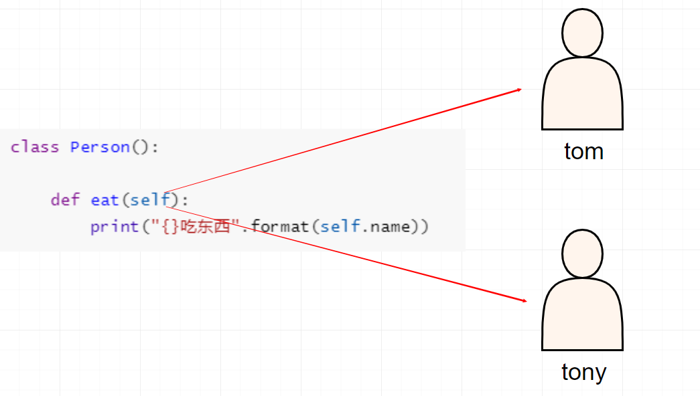
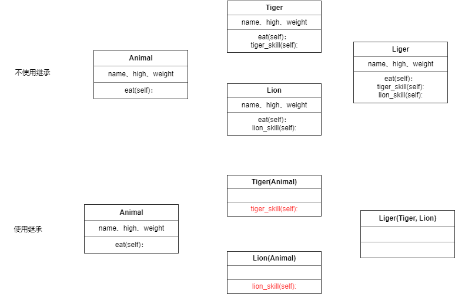

# 类与对象

类型（汉语词语），指包含由各特殊的事物或现象抽出来的共通点的抽象概念；

类（Class）是面向对象程序设计（OOP，Object-Oriented Programming）实现信息封装的基础。

## 面向对象

面向对象编程 —— `Object Oriented Programming` 简写 `OOP`

对象到底是什么，我们可以从两次层次来理解。

**(1) 对象是单个事物的抽象。**

一本书、一辆汽车、一个人都可以是对象，一个数据库、一张网页、一个与远程服务器的连接也可以是对象。当实物被抽象成对象，实物之间的关系就变成了对象之间的关系，从而就可以模拟现实情况，针对对象进行编程。

例如，一个“人”对象可以表示具有姓名，年龄，身高、体重等属性，具有吃饭，睡觉，呼吸和跑步等行为。

换句话说，面向对象编程是将现实世界的事物在程序中建立模型的关系方法，如汽车以及公司和员工，学生和教师等。OOP将现实世界的实体建模为软件对象，一些与之相关的数据，可以执行某些功能。

**(2) 对象是一个容器，封装了属性（property）和方法（method）。** 

属性是对象的状态，方法是对象的行为（完成某种任务）。比如，我们可以把动物抽象为animal对象，使用“属性”记录具体是那一种动物，使用“方法”表示动物的某种行为（奔跑、捕猎、休息等等）。

在实际开发中，对象是一个抽象的概念，可以将其简单理解为：**数据集或功能集**。

提示：每个对象都是基于一个引用类型创建的，这些类型可以是系统内置的原生类型，也可以是开发人员自定义的类型。

### 什么是面向对象

> 面向对象不是新的东西，它只是过程式代码的一种高度封装，目的在于提高代码的开发效率和可维护性。


面向对象编程（Object-oriented Programming，简称*OOP）*是一种[编程范例](http://en.wikipedia.org/wiki/Programming_paradigm)，它提供了一种结构化程序的方法，以便将属性和行为捆绑到单个对象中。

在面向对象程序开发思想中，每一个对象都是功能中心，具有明确分工，可以完成接受信息、处理数据、发出信息等任务。
因此，面向对象编程具有灵活、代码可复用、高度模块化等特点，容易维护和开发，比起由一系列函数或指令组成的传统的过程式编程（procedural programming），更适合多人合作的大型软件项目。

面向对象与面向过程： 

- 面向过程就是亲力亲为，事无巨细，面面俱到，步步紧跟，有条不紊
- 面向对象就是找一个对象，指挥得结果
- 面向对象将执行者转变成指挥者
- 面向对象不是面向过程的替代，而是面向过程的封装

面向对象的特性：

- 封装性 
- 继承性
- [多态性]抽象

扩展阅读：

- [维基百科 - 面向对象程序设计](https://zh.wikipedia.org/wiki/%E9%9D%A2%E5%90%91%E5%AF%B9%E8%B1%A1%E7%A8%8B%E5%BA%8F%E8%AE%BE%E8%AE%A1) 
- [知乎：如何用一句话说明什么是面向对象思想？](https://www.zhihu.com/question/19854505) 
- [知乎：什么是面向对象编程思想？](https://www.zhihu.com/question/31021366) 

### 面向对象的具体表现

在 Python 中，所有数据类型都可以视为对象，当然也可以自定义对象。
自定义的对象数据类型就是面向对象中的类（ Class ）的概念。

我们以一个例子来说明面向过程和面向对象在程序流程上的不同之处。

假设我们要处理学生的成绩表，为了表示一个学生的成绩，面向过程的程序可以用一个对象表示：

```python
std1 = { 'name': '小明', 'score': 98 }
std2 = { 'name': '小红', 'score': 81 }
```

而处理学生成绩可以通过函数实现，比如打印学生的成绩：

```python
def print_score(student):
    print('姓名：' + student['name'] + '  ' + '成绩：' + str(student['score']))
```

如果采用面向对象的程序设计思想，我们首选思考的不是程序的执行流程，
而是 `Student` 这种数据类型应该被视为一个对象，这个对象拥有 `name` 和 `score` 这两个属性（Property）。
如果要打印一个学生的成绩，首先必须创建出这个学生对应的对象，然后，给对象发一个 `print_socre` 消息，让对象自己把自己的数据打印出来。

抽象数据行为模板（Class）：

```python
class Student(object):
    def __init__(self, name, score):
        self.name = name
        self.score = score

    def print_score(self):
        print('姓名：' + self.name + '  ' + '成绩：' + str(self.score))


```

根据模板创建具体实例对象（Instance）：

```python
std1 = Student('小明', 98)
std2 = Student('小红', 81)
```

实例对象具有自己的具体行为（给对象发消息）：

```python
std1.print_socre() #  => 姓名：Michael  成绩：98
std2.print_socre() #  => 姓名：Bob  成绩 81
```

面向对象的设计思想是从自然界中来的，因为在自然界中，类（Class）和实例（Instance）的概念是很自然的。
Class 是一种抽象概念，比如我们定义的 Class——Student ，是指学生这个概念，
而实例（Instance）则是一个个具体的 Student ，比如， Michael 和 Bob 是两个具体的 Student 。

所以，面向对象的设计思想是：

- 抽象出 Class(构造函数)
- 根据 Class(构造函数) 创建 Instance
- 指挥 Instance 得结果

面向对象的抽象程度又比函数要高，因为一个 Class 既包含数据，又包含操作数据的方法。

## Python的类

Python中可用的原始数据结构（如数字，字符串和列表）旨在分别表示简单的事物，例如进行简单的数学运算，动物的名称和你喜欢的颜色。

如果你想代表更复杂的东西怎么办？

例如对于动物，我们可以创建一个`Animal()` 类来跟踪动物的属性，如名称和年龄。

重要的是要注意一个类只提供结构 ——它是应该如何定义某个东西的模板，但它实际上并不提供任何真实的内容。该 `Animal()` 可以指定姓名和年龄是必要的界定动物，但它实际上并不会说出什么特定动物的姓名或年龄。

### 类和对象的概念

`类` 和 `对象` 是面向对象编程的两个核心概念

`类` 是对一群具有相同 `特征` 或者 `行为` 的事物的一个统称，是抽象的。

- `特征` 被称为 `属性` 
- `行为` 被称为 `方法` 

### 类和对象的关系

- `类` 是模板，`对象` 是根据 `类` 这个模板创建出来的，应该先有类，再有对象
- `类` 只有一个，而 `对象` 可以有很多个
  - `不同的对象` 之间 `属性` 可能会各不相同
  - `类` 中定义了什么 `属性和方法`，`对象` 中就有什么属性和方法


# 创建对象

## Init方法

### 隐式的基类——object

每个Python类的定义都会隐式继承自 `object` 类，它的定义非常简单，几乎什么行为都不包括。我们可以创建一个`object` 实例，但很多事情无法完成，因为很多特殊方法的调用程序都会抛出异常。

对于任何自定义类，都会隐式继承`object` 。以下是一个类定义的示例（隐式继承了`object` 类）。

```python
class Person:
    pass
```

下面是对自定义类进行交互的代码。

```python
>>> X.__class__
<class 'type'>
>>> X.__class__.__base__
<class 'object'>
```

可以看到类定义就是对`type` 类的一个对象的类型声明，基类为`object` 。

相应地，派生自`object` 类中的对象方法也将继承各自相应的默认实现。在某些情况下，基类中一些特殊方法的默认行为也正是我们想要的。对于一些特殊情况，就需要重写这些方法。

> 注意：`类名` 的 命名规则 要符合 `大驼峰命名法` 

### 初始化方法

`__init__()` 方法的重要性体现在两点。首先，初始化既是对象生命周期的开始，也是非常重要的一个步骤，每个对象都必须正确地执行了初始化才能够正常地工作。其次，`__init()__` 方法的参数可以多种形式来完成赋值。

通过实现`__init()__` 方法来初始化一个对象。每当创建一个对象，Python会先创建一个空对象，然后调用该对象的`__init()__` 函数。这个方法提供了对象内部变量以及其他一些一次性过程的初始化操作。

```python
class Person:

    def __init__(self):

        print("这是一个初始化方法")
        

# 使用类名()创建对象的时候，会自动调
tom = Person()
```


### 初始化属性

一个对象是一系列功能的集合，包括了方法和属性。`object` 类的默认行为包括设置、获取和删除属性。可以通过修改这些默认行为来决定对象中哪些属性是可用的。

默认情况下，创建任何类内部的属性都将支持以下4种操作。

- 创建新属性。
- 为已有属性赋值。
- 获取属性的值。
- 删除属性。

我们可以使用如下简单的代码来对这些操作进行测试，创建一个简单的泛型类并将其实例化。

- 在 `__init__` 方法内部使用 `self.属性名 = 属性的初始值` 就可以 定义属性
- 定义属性之后，再使用 `Cat` 类创建的对象，都会拥有该属性


例如在玩游戏时，我们创建人物对象一般会需要人物的明显与年龄等特这个，我们可以用代码来模拟整个创建过程

```python
"""
定义一个人（Person）类
    人在出生时就会有名字、身高、体重等属性

    人在刚出生是会哭、喝、吃等行为
"""


class Person(object):

    def __init__(self, name, age):
        """初始化方法"""
        self.name = name
        self.age = age

    def hello(self):
        print('我的名字是：{}，已经：{}岁了'.format(self.name, self.age))


tom = Person('汤姆', 18)
# 获取属性
print(tom.name)
print(tom.age)

# 在外部修改属性
tom.age = 18

# 再外部新增属性
tom.gender = '男'

tom.hello()

```

### 基类中的init方法

对象的生命周期主要包括了创建、初始化和销毁。后面章节会详细讨论对象的创建和销毁，本章专注于对象的初始化。

object作为所有类的基类，已经为`__init__()` 方法提供了默认实现，一般情况下不需要重写这个函数。如果没有对它进行重写，那么在创建对象时将不会产生其他变量的实例。在某些情况下，这种默认行为是可以接受的。

对于继承自`object` 的子类，总可以对它的属性进行扩展。例如，对于下面这个类，实例化就不对函数（`area` ）所需要的变量（`width` 和`length` ）进行初始化。

```python
class Person(object):

    # def __init__(self):
    #     pass

    def hello(self):
        print('我的名字是：{}，已经：{}岁了'.format(self.name, self.age))


```

`Person` 类的`hello` 函数在返回值时使用了两个属性，可并没有在任何地方对其赋值。在Python中，这种看似奇怪的调用尚未赋值属性的操作却是合法的。

下面这段代码演示如何使用刚定义的`Person` 类。

```python
>>> tom = Person()
>>> tom.name = '汤姆'
>>> tom.age = '18'
>>> tom.hello()
我的名字是：汤姆，已经：18岁了

```

虽然这种延迟赋值的实现方式在Python中是合法的，但是却给调用者带来了潜在的困惑，因此要尽量避免这样的用法。

然而，这样的设计看似又提供了灵活性，意味着在`__init__()` 方法被调用时不必为所有的属性赋值。这看似是不错的选择，一个可选属性即可以看作是某子类中的成员，且无须对这个子类进行显式地定义就可以完成对原生机制的扩展。然而这种多态机制不但给程序带来了隐藏的不确定性，也会相应产生很多令人费解的`if` 语句。

因此，延迟初始化属性的设计在某种情形下可能会有用，可是这样也可能会导致非常糟糕的设计。

在*Zen of python poem* 一书中曾提出过这样的建议：

“显式而非隐式”。

对于每个`__init__()` 方法，都应当显式地指定要初始化的变量。

糟糕的多态 在灵活性与糟糕之间有一个临界。 一旦发觉书写了这样的代码，我们就已经丧失了灵活性并开始了糟糕的设计。 `　　if 'x' in self.__dict__:` 或： `　 try:` `　 　　self.x` `　except AttributeError:` 这时就要考虑添加一个公共函数或属性来重构这个API，相比于添加if语句，重构将是更好的选择。


## Python对象（实例）

### 初始化属性

如果希望在创建对象的同时，就设置对象的属性，可以对 `__init__` 方法进行改造

1. 修改 `__init__` 方法的接收参数
2. 在方法内部使用 `self.属性 = 形参` 接收外部传递的参数
3. 在创建对象时，使用 `类名(属性1, 属性2...)` 调用

```python
	def __init__(self, name, high, weight):
        """初始化方法"""
        self.name = name
        self.high = high
        self.weight = weight

```

当一个类定义完成之后，要使用这个类来创建对象，语法格式如下：

```python
对象变量 = 类名()

```

### 方法中的 self

由哪一个对象调用的方法，方法内的 `self` 就是哪一个对象的引用

- 在类封装的方法内部，`self` 就表示当前调用方法的对象自己
- 调用方法时，程序员不需要传递 `self` 参数
- 在方法内部
  - 可以通过 `self.` 访问对象的属性
  - 也可以通过 `self.` 调用其他的对象方法
- 改造代码如下：

```python
class Person:
	def __init__(name):
        self.name = name
        
    def eat(self):
        print("{} 吃东西".format(self.name))

Tony = Person("Tony")
Tony.eat()

tom = Person("Tom") 
tom.eat()

```



- 在类的外部，通过 `变量名.` 访问对象的属性和方法
- 在类封装的方法中，通过 `self.` 访问对象的属性和方法

**面向对象三大特性**

封装继承与多态

1. 封装 根据职责将**属性**和**方法**封装到一个抽象的类中
2. 继承 实现代码的重用，相同的代码不需要重复的编写
3. 多态 不同的对象调用相同的方法，产生不同的执行结果，增加代码的灵活度

# 类对象(了解)

1. 使用面相对象开发，**第 1 步** 是设计 **类** 
2. 使用 **类名()** 创建对象，**创建对象** 的动作有两步：
   - 1) 在内存中为对象 **分配空间** 
   - 2) 调用初始化方法 `__init__` 为 **对象初始化** 
3. 对象创建后，**内存** 中就有了一个对象的 **实实在在** 的存在 —— **实例** 

因此，通常也会把：

1. 创建出来的 **对象** 叫做 **类** 的 **实例** 
2. 创建对象的 **动作** 叫做 **实例化** 
3. **对象的属性** 叫做 **实例属性**  
4. **对象调用的方法** 叫做 **实例方法** 

在程序执行时：

1. 对象各自拥有自己的 **实例属性** 
2. 调用对象方法，可以通过 `self.` 
   - 访问自己的属性
   - 调用自己的方法

每一个对象都有自己独立的内存空间，保存各自不同的属性

多个对象的方法，在内存中只有一份，在调用方法时，需要把对象的引用传递到方法内部

## 类是一个特殊的对象

> `Python` 中 **一切皆对象**：
>
> - `class AAA:` 定义的类属于 **类对象** 
> - `obj1 = AAA()` 属于 **实例对象** 

在程序运行时，**类** 同样 **会被加载到内存** 

在 `Python` 中，**类** 是一个特殊的对象 —— **类对象** 

在程序运行时，**类对象** 在内存中 **只有一份**，使用 **一个类** 可以创建出 **很多个对象实例** 

- 除了封装 **实例** 的 **属性** 和 **方法**外，**类对象** 还可以拥有自己的 **属性** 和 **方法** 
  1. **类属性** 
  2. **类方法** 
- 通过 **类名.** 的方式可以 **访问类的属性** 或者 **调用类的方法** 



## 类属性

- **类属性** 就是给 **类对象** 中定义的 **属性** 
- 通常用来记录 **与这个类相关** 的特征 
- **类属性** **不会用于**记录 **具体对象的特征** 

**示例需求** 

1. 定义一个 Dinosaur
2. 用 **Dinosaur** 实例化了多个游戏对象
3. **需求** —— 知道使用这个类，创建了多少个对象？

```python
class Dinosaur:
    """这是一个人类"""
    name = '恐龙'

    @staticmethod
    def hello(mcs):
        print('我是{}类'.format(mcs.name))


print(Dinosaur.name)

```


## 类的方法

### 静态方法

在开发时，如果需要在 **类** 中封装一个方法，这个方法：

- 既 **不需要** 访问 **实例属性** 或者调用 **实例方法** 
- 也 **不需要** 访问 **类属性** 或者调用 **类方法** 

这个时候，可以把这个方法封装成一个 **静态方法** 

语法如下

```python
class Example:

    @staticmethod
    def func():
        pass

```

- **静态方法** 需要用 **修饰器** `@staticmethod` 来标识，**告诉解释器这是一个静态方法** 
- 通过 **类名.** 调用 **静态方法** 


案例：显示游戏帮助信息

```python
class GamePerson(object):
    
    @staticmethod
    def show_help():
        print("""欢迎进入xxx小游戏,我是游戏小助手。游戏时请注意。。。。""")

```


### 类方法

**类属性** 就是针对 **类对象** 定义的属性

- 使用 **赋值语句** 在 `class` 关键字下方可以定义 **类属性** 
- **类属性** 用于记录 **与这个类相关** 的特征 

**类方法** 就是针对 **类对象** 定义的方法 

- 在 **类方法** 内部可以直接访问 **类属性** 或者调用其他的 **类方法** 

**语法如下**

```python
@classmethod
def 类方法名(mcs):
    pass


```

- 类方法需要用 **修饰器** `@classmethod` 来标识，**告诉解释器这是一个类方法** 
- 类方法的 **第一个参数** 应该是 `mcs` 
  - 由 **哪一个类** 调用的方法，方法内的 `mcs` 就是 **哪一个类的引用** 
  - 这个参数和 **实例方法** 的第一个参数是 `self` 类似
  - **提示** 使用其他名称也可以，不过习惯使用 `mcs` 
- 通过 **类名.** 调用 **类方法**，**调用方法时**，不需要传递 `mcs` 参数
- 在方法内部
  - 可以通过 `mcs.` **访问类的属性**
  - 也可以通过 `mcs.` **调用其他的类方法**


**示例需求**

- 在类属性中定义一个 `player_name` 用于统计正在玩游戏的人
- 一但有人进入游戏，就将其记录到 `player_name` 中
- 定义一个方法 `show_players` 输出正在玩游戏的人

```python
    @classmethod
    def show_players(mcs):
        """查看正在玩游戏的人"""
        print(mcs.player_name)


```

> 在类方法内部，可以直接使用 `mcs` 访问 **类属性** 或者 **调用类方法**

## 私有属性方法（了解）

关于Python中的私有化可以概括为：大家都是成年人。

面向对象设计使得接口和实现有了很大的差别，这也是封装的意义。一个类封装了一种数据结构、一个算法和一个外部接口等，程序设计的目的是要把接口与实现分离。

然而，没有编程语言会暴露出所有设计的细节。对于Python，也是如此。

关于类设计的一个方面，这一点没有用代码演示：对象中有关私有（实现）和公有（接口）函数或属性的差异。有些编程语言只是在概念上支持私有（C++或Java是两个例子）已经很复杂了。这类语言中的访问修饰符包括了私有、保护、公有和“未指定”，可以理解为半私有。私有关键字经常被错误使用，为子类的定义带来了没必要的复杂性。

Python中私有的概念很简单，如下所示。

- 基本都是公有。源代码随时可修改，大家都是成年人，没有什么是可以真正被隐藏的。
- 传统上，我们会使用命名来表明哪些不是完全公有的。它们通常是容易变化的具体实现细节，然而并不存在正式的、概念上的私有。

Python中的部分函数以_命名，标记为不完全公有。

Python的内部命名以`__` 起始（和结尾）。这也是Python如何避免内部和外部应用程序发生冲突的方式。这些内部集合的命名方式完全只是参考。毕竟，没有必要在代码中试图使用 `__` 前缀来定义一个“超级私有”的属性或函数。如果这样做的话就为以后制造了一个潜在的麻烦，当新版本的Python发布并使用了同样命名的函数或属性时，就会有命名冲突。我们还有可能和新版本中的其他名称发生冲突。

Python中关于可见度的命名规则如下所示。

- 大部分名称是公有的。
- 以_开始的名字通常不完全公有。使用它们来命名那些经常变化的函数，这些函数通常是实现细节。
- 以__作为前缀和后缀的函数通常是Python内部的。程序中不该使用；命名要参考编程语言的定义。

通常，Python中的命名是根据函数（或属性）的目的来定义的，并提供文档说明。通常接口函数会有说明文档以及文档测试的例子，而实现细节的函数就不必了，提供简单的说明就可以了。

**应用场景**

- 在实际开发中，**实例对象** 的 **某些属性或方法** 可能只希望 **在实例对象的内部被使用**，而 **不希望在外部被访问到** 。
- **私有属性** 就是 **实例对象** 不希望公开的 **属性** 
- **私有方法** 就是 **实例对象** 不希望公开的 **方法** 


**定义方式** 

- 在 **定义属性或方法时**，在 **属性名或者方法名前** 增加 **两个下划线**，定义的就是 **私有** 属性或方法

```python
class Women(object):

    def __init__(self, name, high, age):
        self.name = name
        self.high = high
        # 双下划线 私有属性 外部无法调用
        self.__age = age

    def __fly(self):
        return self.__age

    def __secret(self):
        print("我的年龄是 %d" % self.__age)


fang = Women("小芳")
# 私有属性，外部不能直接访问
# print(fang.__age)

# 私有方法，外部不能直接调用
# xiaofang.__secret()


```


### 案例小结

1. **实例方法** —— 方法内部需要访问 **实例属性**  
   - **实例方法** 内部可以使用 **类名.** 访问类属性
2. **类方法** —— 方法内部 **只** 需要访问 **类属性** 
3. **静态方法** —— 方法内部，不需要访问 **实例属性** 和 **类属性** 

**提问** 

如果方法内部 即需要访问 **实例属性**，又需要访问 **类属性**，应该定义成什么方法？

**答案**

- 应该定义 **实例方法** 
- 因为，**类只有一个**，在 **实例方法** 内部可以使用 **类名.** 访问类属性


### 特性@property

> 还有一个更加形象的名字：计算属性

特性是一个函数，看起来（在语法上）就是一个简单的属性。我们可以获取、设置和删除特性值，正如我们可以获取、设置和删除属性值。这里有一个重要的区别：特性是一个函数，而且可以被调用，而不仅仅是用于存储的对象的引用。

除了复杂程度，特性和属性的另一个区别在于，我们不能轻易地为已有对象添加新特性。但是默认情况下，我们可以很容易地给对象添加新属性。在这一点上，特性和属性有很大区别。

我们可以使用`@property` 修饰符来创建特性。

```python
class Triangle:
    def __init__(self, width, height):
        self.w = width
        self.h = height

    @property
    def area(self):
        return self.w * self.h / 2


t = Triangle(3, 4)
# print(t.area())
print(t.area)

```


# 继承

编写类时，并非总是要从空白开始。如果你要编写的类是另一个现成类的特殊版本，可使用**继承** 。一个类**继承** 另一个类时，它将自动获得另一个类的所有属性和方法；原有的类称为**父类** ，而新类称为**子类** 。子类继承了其父类的所有属性和方法，同时还可以定义自己的属性和方法。

**继承的概念：** 子类拥有父类的所有方法和属性

**继承的语法**

```python
class 类名(父类名):
    pass

```

子类继承自父类，可以直接享受父类中已经封装好的方法，不需要再次开发

子类中应该根据职责，封装子类特有的属性和方法

## 子类 init 方法

创建子类的实例时，Python首先需要完成的任务是给父类的所有属性赋值。为此，子类的方法`__init__()` 需要父类施以援手。

例如，下面来模拟老虎。老虎是一种特殊的动物，因此我们可以在前面创建的`Animal` 类的基础上创建新类`Tiger` ，这样我们就只需为老虎特有的属性和行为编写代码。

```python
class Animal(object):
    def __init__(self, name, high, weight):
        self.name = name
        self.high = high
        self.weight = weight

    def eat(self):
        print(self.name, '正在吃东西')


class Tiger(Animal):

    def __init__(self, name, high, weight):
        super().__init__(name, high, weight)


```

首先是`Animal` 类的代码。创建子类时，父类必须包含在当前文件中，且位于子类前面。定义子类时，必须在括号内指定父类的名称。

`super()` 是一个特殊函数，帮助Python将父类和子类关联起来。这行代码让 `Tiger` 调用父类的方法`__init__()` ，让 `Tiger` 实例包含父类的所有属性。父类也称为**超类** （superclass），名称super因此而得名。

为测试继承是否能够正确地发挥作用，我们尝试创建一只老虎，但提供的信息与创建动物时相同。结果正常运行。

```python
t = Tiger('熊大', 1.9, 320)
t.eat()

```

## 子类新增属性和方法

让一个类继承另一个类后，可添加区分子类和父类所需的新属性和方法。

例如老虎相对其他动物比较特殊的就是它的毛发，普通的老虎都是黄色的，但是又一个特殊的是白色的。为了区分这两种老虎就可以新增一种属性（color）。并且老虎有自己的一些行为，出了吃之外还会咆哮（bark）以及会有自己的技能(skill)

```python
class Tiger(Animal):

    def __init__(self, name, high, weight):
        super().__init__(name, high, weight)
        self.color = '黄色'

    def eat(self):
        print(self.name, '正在吃东西')

    def bark(self):
        print(self.name, '正在嗷呜叫')

    def skill(self):
        print(self.name, '老虎的必杀技')

    def info(self):
        print(f'种类:老虎\t名字:{self.name}\t颜色:{self.color}\t体重:{self.weight}')


t = Tiger('熊大', 1.9, 320)
t.eat()
t.info()

```

在心的类里面，我们添加了新属性`self.color` ，并设置其初始值（如`黄色` ）。根据`Tiger` 类创建的所有实例都将包含这个属性，但所有`Animal` 实例都不包含它。

我们还添加了一个名为`info()` 的方法，它打印有老虎的信息。我们调用这个方法时，将看到一条老虎类特有的描述。

## 重写父类方法

对于父类的方法，只要它不符合子类模拟的实物的行为，都可对其进行重写。为此，可在子类中定义一个这样的方法，即它与要重写的父类方法同名。这样，Python将不会考虑这个父类方法，而只关注你在子类中定义的相应方法。

老虎在吃东西时，会发出咔~咔~咔~的声音的声音，这样原有的 `eat()` 方法就不能满足我们的需求了，需要重新实现一个 `eat` 方法才行。

```
    def eat(self):
        print(self.name, '正在吃东西')
        print('发出咔~咔~咔~的声音')

```

当子类的函数名与父类的函数名一致时，当子类函数名不存在时，就会向上查找父类的名字。

如果只需要在父类的方法里面添加新的内容时，可以部分重新

```
    def eat(self):
        super().eat()
        print('发出咔~咔~咔~的声音')

```


## 多继承





#### 专业术语

`Tiger` 类是 `Animal` 类的子类，`Animal` 类是 `Tiger` 类的父类，

`Tiger` 类是 `Animal` 类的派生类，`Animal` 类是 `Tiger` 类的基类，`Tiger` 类从 `Animal` 类派生 

> 编写 Tiger 类与 Animal 类

#### 继承的传递性

`C` 类从 `B` 类继承，`B` 类又从 `A` 类继承

那么 `C` 类就具有 `B` 类和 `A` 类的所有属性和方法

子类拥有父类以及父类的父类中封装的所有属性和方法


提问：`Tiger` 能够调用 `Lion` 类中定义的 `lion_skill` 方法吗？

答案：不能，因为 `Tiger`  和 `Lion` 之间没有继承 关系

- 子类可以拥有多个父类，并且具有所有父类的属性和方法
- 例如：孩子会继承自己父亲和母亲的特性

语法

```python
class 子类名(父类名1, 父类名2...)
    pass


```

#### 使用注意事项

问题的提出

- 如果 不同的父类 中存在 同名的方法，子类对象 在调用方法时，会调用 哪一个父类中的方法呢？

> 提示：开发时，应该尽量避免这种容易产生混淆的情况！ —— 如果 父类之间 存在 同名的属性或者方法，应该 尽量避免 使用多继承

##  `super` 

在 `Python` 中 `super` 是一个 特殊的类

`super()` 就是使用 `super` 类创建出来的对象

最常 使用的场景就是在 重写父类方法时，调用 在父类中封装的方法实现


#### MRO搜索顺序（知道）

- `Python` 中针对 类 提供了一个 内置属性 `__mro__` 可以查看 方法 搜索顺序
- MRO 是 `method resolution order`，主要用于 在多继承时判断 方法、属性 的调用 路径

```python
print(C.__mro__)


```

输出结果

```
(<class '__main__.C'>, <class '__main__.A'>, <class '__main__.B'>, <class 'object'>)

```

- 在搜索方法时，是按照 `__mro__` 的输出结果 从左至右 的顺序查找的
- 如果在当前类中 找到方法，就直接执行，不再搜索
- 如果 没有找到，就查找下一个类 中是否有对应的方法，如果找到，就直接执行，不再搜索
- 如果找到最后一个类，还没有找到方法，程序报错


## @拓展

### 重写

当父类的方法实现不能满足子类需求时，可以对方法进行重写(override)

重写父类方法有两种情况：

1. 覆盖父类的方法
2. 对父类方法进行 扩展

#### 覆盖父类的方法

如果在开发中，父类的方法和子类的方法完全不同 ，就可以使用覆盖的方式，在子类中重新编写父类的方法实现

> 在子类中定义了一个和父类同名的方法并且实现

重写之后，在运行时，只会调用子类中重写的方法，而不再会调用父类封装的方法

#### 对父类方法进行扩展

如果在开发中，子类的方法实现 中 包含 父类的方法实现

父类原本封装的方法实现 是 子类方法的一部分

就可以使用扩展的方式

1. 在子类中重写父类的方法
2. 在需要的位置使用 `super().父类方法` 来调用父类方法的执行
3. 代码其他的位置针对子类的需求，编写 子类特有的代码实现


### OOP 问题

以检查你的学习进度：

1. 什么是class？
2. 什么是实例？
3. 类和实例之间的关系是什么？
4. 用于定义新类的Python语法是什么？
5. 什么是类名的命名规范？
6. 你如何实例化或创建一个类的实例？
7. 如何访问类实例的属性和行为？
8. 什么是方法？
9. 目的是 `self` 什么？
10. 这个 `__init__` 方法的目的是什么？
11. 描述继承如何帮助防止代码重复。
12. 子类可以覆盖其父项的属性吗？

解决方案：“理解检查”

1. 类是用于创建新的用户定义数据结构的机制。它包含数据以及用于处理该数据的方法。
2. 实例是具有 **实际** 值的类的副本，字面上是特定类的对象。
3. 虽然类是用于描述如何制作某物的蓝图，但实例是从这些蓝图创建的对象。
4. `class PythonClassName:`
5. CamelCase表示法，以大写字母开头 - 即 `PythonClassName()`
6. 你使用类名，后跟括号。因此，如果类名是`Tiger()`，则Tiger实例将为 - `my_class = Tiger()`。
7. 带点符号 - 例如， `instance_name.attribute_name`
8. 在类中定义的函数。
9. 每个方法的第一个参数引用类的当前实例，按照惯例，它被命名`self`。在该`__init__`方法中，`self`指的是新创建的对象; 而在其他方法中，`self`指的是调用其方法的实例。有关`__init__`vs.的更多信息`self`，请查看[此](http://stackoverflow.com/a/625098)文章。
10. 该 `__init__` 方法初始化类的实例。
11. 子类继承父项的所有属性和行为。
12. 是。


# 魔法方法

Python中有一些特殊方法，它们允许我们的类和Python更好地集成。在标准库参考（Standard Library Reference）中，它们被称为魔法方法(Magic Methods)，是与Python的其他特性无缝集成的基础。

例如，我们用字符串来表示一个对象的值。`Object` 基类包含了`__repr__()` 和`__str__()` 的默认实现，它们提供了一个对象的字符串描述。遗憾的是，这些默认的实现不够详细。我们几乎总会想重写它们中的一个或两个。我们还会介绍`__format__()` ，它更加复杂一些，但是和上面两个方法的作用相同。

我们还会介绍其他的转换方法，尤其是`__hash__()` 、`__bool__()` 和`__bytes__()` 。这些方法可以把一个对象转换成一个数字、一个布尔值或者一串字节。例如，当我们实现了`__bool__()` ，我们就可以像下面这样在if语句中使用我们的对象：`if someobject:` 。

接下来，我们会介绍实现了比较运算符的几个特殊方法：`__lt__()` 、`__le__()` 、`__eq__()` 、`__ne__()` 、`__gt__()` 和`__ge__()` 。

当我们定义一个类时，几乎总是需要使用这些基本的特殊方法。

我们会在最后介绍`__new__()` 和`__del__()` ，因为它们的使用更加复杂，而且相比于其他的特殊方法，我们并不会经常使用它们。

我们会详细地介绍如何用这些特殊方法来扩展一个简单类。我们需要了解从`object` 继承而来的默认行为，这样，我们才能理解应该在什么时候使用重写，以及如何使用它。

说白了就是对象的 **我是谁，我从哪里来，到哪里去。** 


## `__init__()`

所有类的超类object，有一个默认包含pass的__init__()实现，这个函数会在对象初始化的时候调用，我们可以选择实现，也可以选择不实现，一般建议是实现的，不实现对象属性就不会被初始化，虽然我们仍然可以对其进行赋值，但是它已经成了隐式的了，编程时显示远比隐式的更好，看下面的小栗子：

##  **`__new__()`** 方法和元类型

`__new__()` 方法作为元类型的一部分，主要是为了控制如何创建一个类。这和之前的如何用 `__new__()` 控制一个不可变对象是完全不同的。

一个元类型创建一个类。一旦类对象被创建，我们就可以用这个类对象创建不同的实例。所有类的元类型都是`type` ，`type()` 函数被用来创建类对象。

另外，`type()` 函数还可以被用作显示当前对象类型。

下面是一个很简单的例子，直接使用 `type()` 作为构造器创建了一个新的但是几乎完全没有任何用处的类：

```
Useless= type("Useless",(),{})

```

一旦我们创建了这个类，我们就可以开始创建这个类的对象。但是，这些对象什么都做不了，因为我们没有定义任何方法和属性。

为了最大化利用这个类，在下面的例子中，我们使用这个新创建的`Useless` 类来创建对象。

```
>>> Useless()
<__main__.Useless object at 0x101001910>
>>> u=_
>>> u.attr= 1 
>>> dir(u)
['__class__', '__delattr__', '__dict__', '__dir__', '__doc__', 
'__eq__', '__format__', '__ge__', '__getattribute__', '__gt__', 
'__hash__', '__init__', '__le__', '__lt__', '__module__', '__ne__', 
'__new__', '__reduce__', '__reduce_ex__', '__repr__', '__setattr__', 
'__sizeof__', '__str__', '__subclasshook__', '__weakref__', 'attr']

```

我们可以向这个类的对象中增加属性。至少，作为一个对象，它工作得很好。

这样的类定义与使用`types.SimpleNamespace` 或者像下面这样定义一个类的方式几乎相同。

```
class Useless:
 　　pass

```


##  **`__repr__()`** 和 **`__str__()`** 方法

对于一个对象，Python提供了两种字符串表示。它们和内建函数`repr()` 、`str()` 、`print()` 及`string.format()` 的功能是一致的。

- 通常，`str()` 方法表示的对象对用户更加友好。这个方法是由对象的`__str__` 方法实现的。

- `repr()` 方法的表示通常会更加技术化

这个方法是由`__repr__()` 方法实现的。

- `print()` 函数会调用`str()` 来生成要输出的对象。
- 字符串的`format()` 函数也可以使用这些方法。当我们使用`{!r}` 或者`{!s}` 格式时，我们实际上分别调用了`__repr__()` 或者`__str__()` 方法。

下面我们先来看一下这些方法的默认实现。

直接打印对象的实现方法，`__str__` 是被print函数调用的，一般都是return一个什么东西，这个东西应该是以字符串的形式表现的。如果不是要用str()函数转换，我们可以直接print的对象都是实现了`__str__这个方法的，比如dict。看下面的例子。

下面是一个很简单的类。

```python
class RectAngle:
    def __init__(self, width, height):
        self.width = width
        self.height = height

    def area(self):
        return self.width * self.height

    def __str__(self):
        return f'<RectAngle: {self.width}(w) * {self.height}(h)>'

```

我们定义了两个简单类，每个类包含4个属性。

下面是在命令行中使用`RectAngle` 类的结果。

```python
>>> rect = RectAngle(4, 5)
>>> print(rect)
<RectAngle: 4(w) * 5(h)>
>>> rect
<__main__.RectAngle object at 0x000002A1547E5A58>

```

可以看到，`__str__()` print 方法打印的内容就看起来更加输入，但是在命令行里面里面的调试信息还是现实的为对象，当增加 `__repr__()` 方法之后，调试信息也会变得更加清楚

```python
def __repr__(self):
    return f'<RectAngle: w{self.width} h{self.height}>'

```

在以下两种情况下，我们可以考虑重写`__str__()` 和`__repr__()` 。

- **非集合对象** ：一个不包括任何其他集合对象的“简单”对象，这类对象的格式化通常不会特别复杂。
- **集合对象** ：一个包含集合的对象，这类对象的格式化会更为复杂。

##  `__bool__()` 方法

Python中有很多关于真假性的定义。参考手册中列举了许多和`False` 等价的值，包括`False` 、`0` 、`''` 、`()` 、`[]` 和`{}` 。其他大部分的对象都和`True` 等价。

通常，我们会用下面的语句来测试一个对象是否“非空”。

```python
if some_object:
 　　process( some_object )

```

默认情况下，这个是内置的`bool()` 函数的逻辑。这个函数依赖于一个给定对象的`__bool__()` 方法。

默认的`__bool__()` 方法返回`True` 。我们可以通过下面的代码来验证这一点。

```
>>> x = object()
>>> bool(x)
True

```

对大多数类来说，这是完全正确的。大多数对象都不应该和`False` 等价。但是，对于集合，这样的行为并不总是正确的。一个空集合应该和`False` 等价，而一个非空集合应该返回`True` 。或许，应该给我们的`Deck` 集合对象增加一个类似的方法。

如果我们在封装一个列表，我们可能会写下面这样的代码。

```
    def __bool__(self):
        return bool(self.area)

```

这段代码将`__bool__()` 的计算委托给了内部的函数`area` 。

现在，我们就可以像下面这样使用`Deck` 。

```
r = RectAngle(4, 5)

if r:
    print(r)

```

## 比较运算符方法

Python有6个比较运算符。这些运算符分别对应一个特殊方法的实现。根据文档，运算符和特殊方法的对应关系如下所示。

- `x > y` 调用`x.__gt__(y)` 。
- `x >= y` 调用`x.__ge__(y)` 。

- `x < y` 调用`x.__lt__(y)` 。
- `x <=y` 调用`x.__le__(y)` 。
- `x == y` 调用`x.__eq__(y)` 。
- `x != y` 调用`x.__ne__(y)` 。

对于实际上使用了哪个比较运算符，还有一条规则。这些规则依赖于作为左操作数的对象定义需要的特殊方法。如果这个对象没有定义，Python会尝试改变运算顺序。

**下面是两条基本的规则：** 首先，运算符的实现基于左操作数：A < B相当于`A.__lt__(B)` 。 其次，相反的运算符的实现基于右操作数：A < B相当于`B.__gt__(A)` 。 如果右操作数是左操作数的一个子类，那这样的比较基本不会有什么异常发生；同时，Python会首先检测右操作数，以确保这个子类可以重载基类。

下面，我们通过一个例子看看这两条规则是如何工作的，我们定义了一个只包含其中一个运算符实现的类，然后把这个类用于另外一种操作。

下面是我们使用类中的一段代码。

```python
class RectAngle:
    def __init__(self, width, height):
        self.width = width
        self.height = height

    def area(self):
        return self.width * self.height

    def __gt__(self, other):
        # other 是另外一个对象
        return self.area() < self.area()

```

这段代码基于 RectAngle(矩形) 的比较规则，主要是对比三角形的大小。

我们省略了比较方法，看看当缺少比较运算符时，Python将如何回退。这个类允许我们进行<比较。但是有趣的是，通过改变操作数的顺序，Python也可以使用这个类进行>比较。换句话说，*x* <*y* 和*y* >*x* 是等价的。这遵从了镜像反射法则；

当我们试图评估不同的比较运算时就会看到这种现象。下面，我们创建两个`RectAngle` 类，然后用不同的方式比较它们。

```
>>> r1 = RectAngle(4, 5)
>>> r2 = RectAngle(5, 6)
>>> r1 > r2
True
>>> r1 < r2
False
>>> r1 == r2
False

```

从代码中，我们可以看到，`r1 < r2` 调用了`r1.__lt__(three)` 。

但是，对于`r1 > three` ，由于没有定义`__gt__()` ，Python使用`r2.__lt__(two)` 作为备用的比较方法。

默认情况下，`__eq__()` 方法从`object` 继承而来，它比较不同对象的ID值。当我们用于==或!=比较对象时，结果如下。

```
>>> r1_2 = RectAngle(4, 5)
>>> r1_2 == r1
False

```

可以看到，结果和我们预期的不同。所以，我们通常都会需要重载默认的`__eq__()` 实现。

此外，逻辑上，不同的运算符之间是没有联系的。但是从数学的角度来看，我们可以基于两个运算符完成所有必需的比较运算。Python没有实现这种机制。相反，Python默认认为下面的4组比较是等价的。

*x* < *y* ≡ *y* > *x*

*x* ≤ *y* ≡ *y* ≥ *x*

*x* = *y* ≡ *y* = *x*

*x* ≠ *y* ≡ *y* ≠ *x*

这意味着，我们必须至少提供每组中的一个运算符。例如，我可以提供`__eq__()` 、`__ne__()` 、`__lt__()` 和`__le__()` 的实现。

### 设计比较运算

当设计比较运算符时，要考虑两个因素。

- 如何比较同一个类的两个对象。
- 如何比较不同类的对象。

对于一个有许多属性的类，当我们研究它的比较运算符时，通常会觉得有很明显的歧义。或许这些比较运算符的行为和我们的预期不完全相同。

### 实现同一个类的对象比较

下面我们通过一个更完整的`RectAngle` 类来看一下简单的同类比较。

```python
# encoding:utf-8
class RectAngle:
    def __init__(self, width, height):
        self.width = width
        self.height = height

    def area(self):
        return self.width * self.height

    def __lt__(self, other):
        return self.area() > other.area()

    def __le__(self, other):
        return self.area() <= other.area()

    def __gt__(self, other):
        # other 是另外一个对象
        return self.area() < other.area()

    def __ge__(self, other):
        return self.area() >= other.area()

    def __eq__(self, other):
        return self.area() == other.area()

    def __ne__(self, other):
        return self.area() != other.area()

    
r1 = RectAngle(4, 5)
r2 = RectAngle(5, 6)

print(r1 > r2)
print(r1 < r2)

```

现在我们定义了6个比较运算符。

我们也没有给出类内比较的代码，这个我们会在下一个部分中详细讲解。用上面定义的这个类，我们可以成功地比较不同的牌。下面是一个创建并比较3张牌的例子。

```
>>> r1 = RectAngle(4, 5)
>>> r2 = RectAngle(5, 6)
>>> r3 = RectAngle(4, 6)

```

用上面定义的`RectAngle` 类，我们可以进行像下面这样的一系列比较。

```python
>>> r1 == r2
False
>>> r1.width == r3.width
True
>>> r1 < r3
False

```

这个类的行为与我们预期的一致。

### 实现不同类的对象比较

我们会继续以`RectAngle` 类为例来看看当两个比较运算中的两个操作数属于不同的类时会发生什么。

新增一个三角形对象

```python
class Triangle:
    def __init__(self, width, height):
        self.width = width
        self.height = height

    def area(self):
        return self.width * self.height / 2

    def __lt__(self, other):
        return self.area() > other.area()
    
    def __eq__(self, other):
        return self.area() == other.area()

```

下面我们将一个`RectAngle` 实例和一个`Triangle` 值进行比较。

```python
>>> r1 = RectAngle(4, 5)
>>> t1 = Triangle(4, 5)
>>> r1 == t1
>>> r1 + t1
Traceback (most recent call last):
  File "<stdin>", line 1, in <module>
TypeError: unsupported operand type(s) for +: 'RectAngle' and 'Triangle'
>>>

```

可以看到，这和我们预期的行为一致，`RectAngle` 的子类`Triangle` 没有实现必需的特殊方法，所以产生了一个`TypeError` 异常。

## `__call__()`

该方法的功能类似于在类中重载 () 运算符，使得类实例对象可以像调用普通函数那样，以“对象名()”的形式使用。

```
class Example:

    def __call__(self, *args, **kwargs):
        return "hello world !"


e = Example()

print(e)
print(e())

```

##  **`__del__()`** 方法 

`__del__()` 方法有一个让人费解的使用场景。

这个方法的目的是在将一个对象从内存中清除之前，可以有机会做一些清理工作。对于Python的垃圾回收机制而言，创建一个上下文比使用 `__del__()` 更加容易预判。

但是，如果一个Python对象包含了一些操作系统的资源，`__del__()` 方法是把资源从程序中释放的最后机会。例如，引用了一个打开的文件、安装好的设备或者子进程的对象，如果我们将资源释放作为`__del__()` 方法的一部分实现，那么我们就可以保证这些资源最后会被释放。

很难预测什么时候 `__del__()` 方法会被调用。它并不总是在使用`del` 语句删除对象时被调用，当一个对象因为命名空间被移除而被删除时，它也不一定被调用。Python文档中用不稳定来描述 `__del__()` 方法的这种行为，并且提供了额外的关于异常处理的注释：运行期的异常会被忽略，相对地，会使用 `sys.stderr` 打印一个警告。

基于上面的这些原因，通常更倾向于使用上下文管理器，而不是实现 `__del__()` 。

### 引用计数和对象销毁

CPython的实现中，对象会包括一个引用计数器。当对象被赋值给一个变量时，这个计数器会递增；当变量被删除时，这个计数器会递减。当引用计数器的值为0时，表示我们的程序不再需要这个对象并且可以销毁这个对象。对于简单对象，当执行删除对象的操作时会调用 `__del__()` 方法。

对于包含循环引用的复杂对象，引用计数器有可能永远也不会归零，这样就很难让 `__del__()` 被调用。

我们用下面的一个类来看看这个过程中到底发生了什么。

```python
class RectAngle:
    def __init__(self, width, height):
        self.width = width
        self.height = height

    def __del__(self):
        print("被删除 {0}".format(id(self)))


```

我们可以像下面这样创建和删除这个对象。

```python
>>> p = RectAngle(4, 5)
>>> del p
被删除 2643407508256

```

我们先创建，然后删除了`Noisy` 对象，几乎是立刻就看到了`__del__()` 方法中输出的消息。这也就是说当变量`x` 被删除后，引用计数器正确地归零了。一旦变量被删除，就没有任何地方引用`Noisy` 实例，所以它也可以被清除。

下面是浅复制中一种常见的情形。

```
>>> ln = [RectAngle(4, 5), RectAngle(4, 6)]
>>> ln2= ln.copy()
>>> del ln
>>>

```

Python没有响应`del` 语句。这说明这些`Noisy` 对象的引用计数器还没有归零，肯定还有其他地方引用了它们，下面的代码验证了这一点。

```
>>> del ln2
被删除 2643407508592
被删除 2643407508480

```

### 循环引用和垃圾回收

下面是一种常见的循环引用的情形。一个父类包含一个子类的集合，同时集合中的每个子类实例又包含父类的引用。

下面我们用这两个类来看看循环引用。

```python
class Parent:
    def __init__(self, *children):
        self.children = list(children)
        for child in self.children:
            child.parent = self

    def __del__(self):
        print("删除 {} {}".format(self.__class__.__name__, id(self)))


class Child:
    def __del__(self):
        print("删除 {} {}".format(self.__class__.__name__, id(self)))

```

一个`Parent` 的`instance` 包括一个`children` 的列表。

每一个`Child` 的实例都有一个指向`Parent` 类的引用。当向`Parent` 内部的集合中插入新的`Child` 实例时，这个引用就会被创建。

我们故意把这两个类写得比较复杂，所以下面让我们看看当试图删除对象时，会发生什么。

```python
>>> p = Parent(Child(), Child())
>>> id(p)
2643407508984
>>> del p
>>>

```

`Parent` 和它的两个初始`Child` 实例都不能被删除，因为它们之间互相引用。

下面，我们创建一个没有`Child` 集合的`Parent` 实例。

```python
>>> p= Parent()
>>> id(p)
2643407509096
>>> del p
删除 Parent 2643407509096
>>>

```

和我们预期的一样，这个`Parent` 实例成功地被删除了。


许多基本的特殊方法，它们是我们在设计任何类时的基本特性。这些方法已经包含在每个类中，只是它们的默认行为不一定能满足我们的需求。

我们几乎总是需要重载`__repr__()` 、`__str__()` 。这些方法的默认实现不是非常有用。

我们几乎不需要重载`__bool__()` 方法，除非我们想自定义集合。这是第6章“创建容器和集合”的主题。

我们常常需要重载比较运算符。默认的实现只适合于比较简单不可变对象，但是不适用于比较可变对象。我们不一定要重写所有的比较运算符

另外两个较为特殊的方法`__new__()` 和`__del__()` 有更特殊的用途。大多数情况下，使用`__new__()` 来扩展不可变类型。

基本的特殊方法和`__init__()` 方法几乎会出现在我们定义的所有类中。其他的特殊方法则有更特殊的用途，它们分为6个不同的类别。

- **属性访问** ：这些特殊方法实现的是表达式中`object.attribute` 的部分，它通常用在一个赋值语句的左操作数以及`del` 语句中。
- **可调用对象** ：一个实现了将函数作为参数的特殊方法，很像内置的`len()` 函数。
- **集合** ：这些特殊方法实现了集合的很多特性，包括`sequence[index]` 、`mapping[index]` 和`set | set` 。
- **数字** ：这些特殊方法提供了算术运算符和比较运算符。我们可以用这些方法扩展Python支持的数值类型。
- **上下文** ：有两个特殊方法被我们用来实现可以和`with` 语句一起使用的上下文管理器。
- **迭代器** ：有一些特殊方法定义了一个迭代器。没有必要一定要使用这些方法，因为生成器函数很好地实现了这种特性。但是，我们可以了解如何实现自定义的迭代器。


# @拓展

## 重要的魔法方法

下面的表格列出了 Python 3中的重要魔法方法。

| 初始化和构建            | 描述                   |
| ----------------------- | ---------------------- |
| `__new__(mcs, other)`   | 在对象的实例化中被调用 |
| `__init__(self, other)` | 使用 `__new__` 调用    |
| `__del__(self)`         | 删除方法               |

| 一元运算符和函数    | 描述              |
| ------------------- | ----------------- |
| `__pos__(self)`     | +（正数）         |
| `__neg__(self)`     | - （负数）        |
| `__abs__(self)`     | abs() 函数        |
| `__invert__(self)`  | ~ 操作符          |
| `__round__(self,n)` | round() 取整      |
| `__floor__(self)`   | math.floor() 函数 |
| `__ceil__(self)`    | math.ceil() 函数  |
| `__trunc__(self)`   | math.trunc() 函数 |

| 增强赋值                     | 描述  |
| ---------------------------- | ----- |
| `__iadd__(self, other)`      | +=    |
| `__isub__(self, other)`      | -=    |
| `__imul__(self, other)`      | *=    |
| `__ifloordiv__(self, other)` | //=   |
| `__idiv__(self, other)`      | a /=b |
| `__itruediv__(self, other)`  |       |
| `__imod__(self, other)`      | %=    |
| `__ipow__(self, other)`      | **=   |
| `__ilshift__(self, other)`   | <<=   |
| `__irshift__(self, other)`   | >>=   |
| `__iand__(self, other)`      | &=    |
| `__ior__(self, other)`       | \|=   |
| `__ixor__(self, other)`      | ^=    |

| 类型转化魔法方法    | 描述                                      |
| ------------------- | ----------------------------------------- |
| `__int__(self)`     | int()方法调用来将类型转换为 int           |
| `__float__(self)`   | float()方法调用以将类型转换为 float       |
| `__complex__(self)` | Tcomplex() 方法调用以将类型转换为 complex |
| `__oct__(self)`     | oct() 方法调用以将类型转换为八进制        |
| `__hex__(self)`     | hex() 方法调用以将类型转换为十六进制      |
| `__index__(self)`   | 在切片中自动调用                          |
| `__trunc__(self)`   | math.trunc ()方法调用                     |

| 字符串魔法方法                | 描述                                               |
| ----------------------------- | -------------------------------------------------- |
| `__str__(self)`               | str()方法调用以返回类型的字符串表示形式            |
| `__repr__(self)`              | repr()方法调用，以返回类型的机器可读表示形式       |
| `__unicode__(self)`           | unicode() 方法调用以返回类型的 unicode 字符串      |
| `__format__(self, formatstr)` | string.format() 方法调用，以返回一个新样式的字符串 |
| `__hash__(self)`              | hash() 方法调用以返回整数                          |
| `__nonzero__(self)`           | bool() 方法调用以返回 True 或 False                |
| `__dir__(self)`               | dir() 方法调用以返回类的属性列表                   |
| `__sizeof__(self)`            | sys.getsizeof()方法调用，以返回对象的大小          |

| 属性操作魔法方法                 | 描述                       |
| -------------------------------- | -------------------------- |
| `__getattr__(self, name)`        | 当类的访问属性不存在时调用 |
| `__setattr__(self, name, value)` | 在为类的属性赋值时调用     |
| `__delattr__(self, name)`        | 在删除类的属性时调用       |

| 运算魔法方法                     | 描述                       |
| -------------------------------- | -------------------------- |
| `__add__(self, other)`           | 使用 + 运算符在比较时调用  |
| `__sub__(self, other)`           | 使用 - 运算符在比较时调用  |
| `__mul__(self, other)`           | 使用 * 运算符在比较时调用  |
| `__floordiv__(self, other)`      | 使用 // 运算符在比较时调用 |
| `__divmod__(self, other)`        | 使用 / 运算符在比较时调用  |
| `__mod__(self, other)`           | 使用 % 运算符在比较时调用  |
| `__pow__(self, other[, modulo])` | 使用 ** 运算符在比较时调用 |
| `__lt__(self, other)`            | 使用 < 运算符在比较时调用  |
| `__le__(self, other)`            | 使用 <= 运算符在比较时调用 |
| `__eq__(self, other)`            | 使用 == 运算符在比较时调用 |
| `__ne__(self, other)`            | 使用 != 运算符在比较时调用 |
| `__ge__(self, other)`            | 使用 >= 运算符在比较时调用 |

因此，您可以使用适当的魔法方法在自定义类中添加各种功能。

