## 1. 调试

Debug调试，是一项学习编程人员的重要技能。只有当你学会 debug 了以后，才可以正确的知道程序的走向流程

### 1.1 debug 介绍

在正式讲解之前，先来了解下 debug 这个词的由来，就像我们初学Python 时，先要了解下它历史的由来。

> 1937年，美国青年霍华德·艾肯找到IBM公司为其投资200万美元研制计算机，第一台成品艾肯把它取名为：马克1号（mark1），又叫“自动序列受控计算机”，从这时起IBM公司由生产制表机，肉铺磅秤，咖啡研磨机等乱七八糟玩意儿行业，正式跨进“计算机”领地。
>
> 为马克1号编制程序的是哈佛的一位女数学家葛丽斯·莫雷·霍波，有一天，她在调试程序时出现故障，拆开继电器后，发现有只飞蛾被夹扁在触点中间，从而“卡”住了机器的运行。于是，霍波诙谐的把程序故障统称为“臭虫（BUG）”，把排除程序故障叫DEBUG，而这奇怪的“称呼”，后来成为计算机领域的专业行话。从而debug意为排除程序故障的意思。
> ——百度百科

看了上面的小故事，debug 一词的由来，是由 bug 词得来的，bug 是臭虫的意思，debug 就是解决臭虫。

在如今的互联网时代，多少你肯定听说过 bug 这个词，比如什么什么软件又出 bug 了！说的就是软件在使用的过程中，程序出现了一些错误。故称之为 bug。

**而 debug 则是通过工具来对代码进行调试，一步步找出程序中出现 bug 的位置，也就是程序中具体错误代码的位置。**就像故事中所说，debug过程就是在解决虫子一样。。

## 1.2 启动 debug 模式

还是用示例说话，我们书写一段简短的代码，来帮我们完成今天要讲的内容。

pycharm 导航栏处，有个run，点开以后即可看到 debug 。

创建并运行了 Car 脚本

```python
class Car:

    def __init__(self, speed=0):
        self.speed = speed
        self.odometer = 0
        self.time = 0

    def say_state(self):
        print("里程 {}, 目前时速{}".format(self.odometer, self.speed))

    def accelerate(self):
        self.speed += 5

    def brake(self):
        self.speed -= 5

    def step(self):
        self.odometer += self.speed
        self.time += 1
        print('小车往前开动了一段距离')

    def average_speed(self):
        return self.odometer / self.time

    def main(self):
        while True:
            action = input("我该做什么? [A]加速, [B]刹车, "
                           "[O]显示里程表, [S]显示平均速度?").upper()
            if action not in "ABOS" or len(action) != 1:
                print("我不知道该怎么做")
                continue
            if action == 'A':
                self.accelerate()
            elif action == 'B':
                self.brake()
            elif action == 'O':
                print("车开了 {} 公里".format(self.odometer))
            elif action == 'S':
                print("汽车的平均速度为 {} 公里/小时".format(self.average_speed()))
            self.step()
            self.say_state()


if __name__ == '__main__':
    my_car = Car()
    print("我是一辆车!")
    my_car.main()

```

让我们看看当我们启动脚本时会发生什么，并且试着找出我们的平均速度:

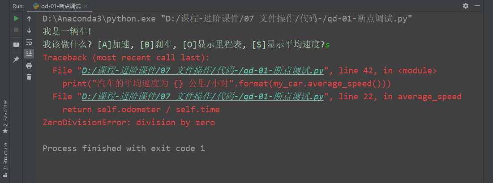

Pycharm 报告一个运行时错误: ZeroDivisionError。

让我们更深入地研究一下我们的代码，找出出了什么问题。 我们可以使用 PyCharm 调试器来查看代码中到底发生了什么。 要开始调试，必须首先设置一些断点。 要创建断点，只需单击 gutter 即可

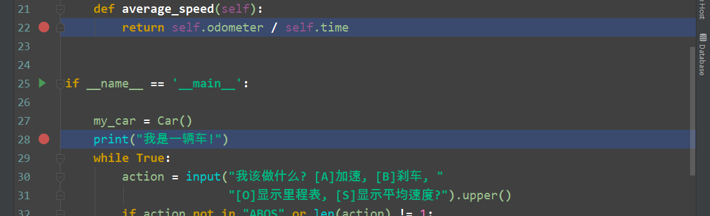

接下来，单击主子句旁边    中的图标，然后选择 Debug‘。 Pycharm 启动调试会话并显示“调试工具”窗口。

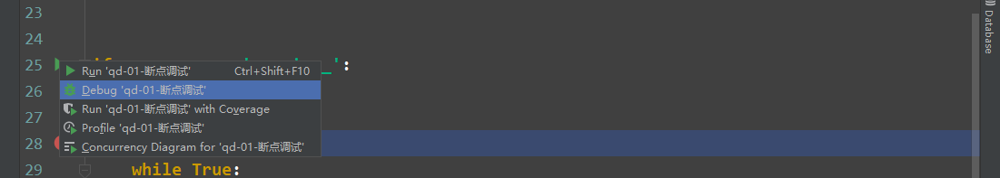


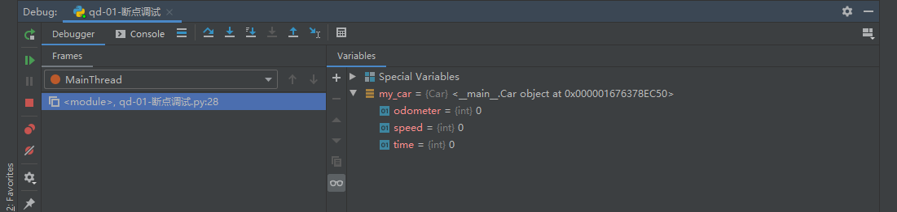

点击按钮继续脚本执行，在 Console 选项卡中输入 s:

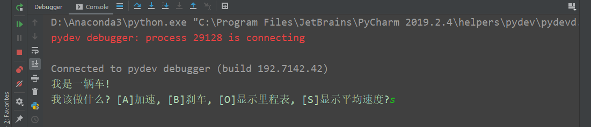


单击  按钮恢复脚本执行。 现在你瞧！ 这里是个例外。 另一个断点也出现了: 默认情况下，PyCharm 会暂停代码中未捕获的任何异常，并显示一个带有闪电的断点图标。

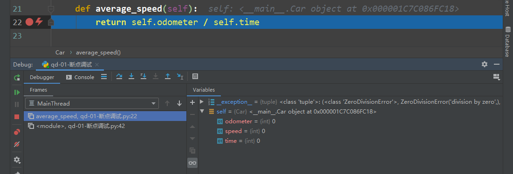

调试器还显示错误消息。 所以我们找到了问题所在。 在调试器中还可以看到 self.time 的值为零

**修改错误**

为了避免再次遇到同样的问题，我们添加一个 if 语句来检查时间是否等于零。 为此，在方法的平均速度中选择语句 return self.odometer / self.time，然后按 Ctrl + Alt + t (Code | round with) :

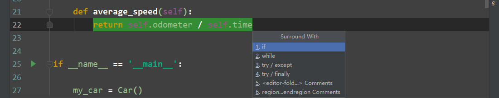

PyCharm创建弹出一个提示框，我们可以选择给选中的代码添加上去。

## 2. 详细调试

Debug 工具窗口显示框架（frames）、变量（variables）和监视器（watches）的专用窗格，以及显示所有输入和输出信息的控制台（console）。 如果希望控制台始终可见，可以将其拖动到 PyCharm 窗口的边缘。

### 2.1 单步调试

如果你希望逐行查看代码的内容，则不需要在每一行上设置断点，您可以逐步查看代码。


让我们来看看单步执行示例程序是什么样的: 单击 Resume 图标按钮，进入控制台以询问汽车的平均速度(类型为“ s”) ，我们可以看到我们按下了断点。


我们可以使用单步工具栏按钮来选择下一个要停止的行。


例如，单击“ **跳过”** 按钮，然后看到蓝色标记移至下一行代码：

如果单击“单**步执行”**按钮，您将在该行之后看到

```
action = input("我该做什么? [A]加速, [B]刹车, "
                       "[O]显示里程表, [S]显示平均速度?").upper()
```

调试器进入文件 `parse.py` ：

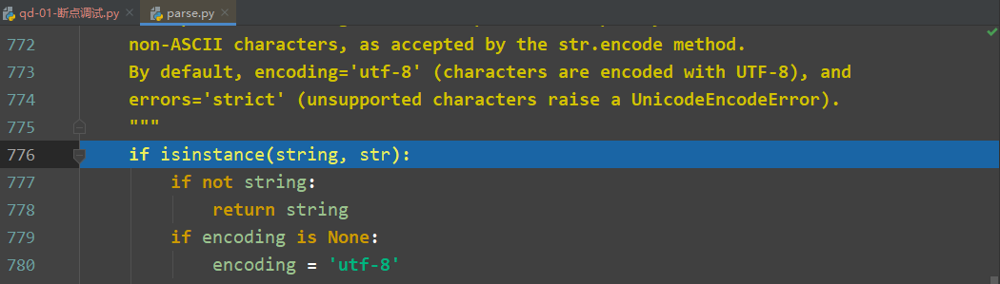

但是，如果继续使用，则会看到您的应用程序仅传递到下一个循环：

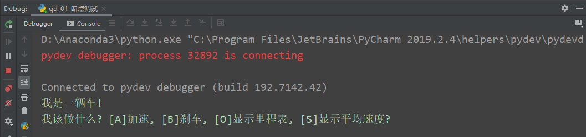

如果您想专注于自己的代码，请使用“ **进入我的代码”**按钮 -这样您就可以避免进入库类。

有关 详细信息，请参见[步进工具栏](https://www.jetbrains.com/help/pycharm/debug-tool-window.html#steptoolbar)和单 [步执行程序](https://www.jetbrains.com/help/pycharm/stepping-through-the-program.html)部分。

### 2.2 监视器

PyCharm允许您观看任何变量。只需单击该工具栏上的**手表**选项卡，然后输入你想要观看的变量的名称-`my_car.time`。请注意，此处提供代码完成功能：

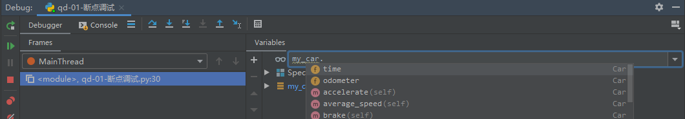

首先，您会看到时间等于 0 这意味着该变量尚未定义：

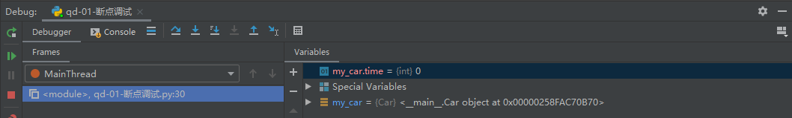

但是，当程序执行继续到定义变量的范围时，监视将获得以下视图：

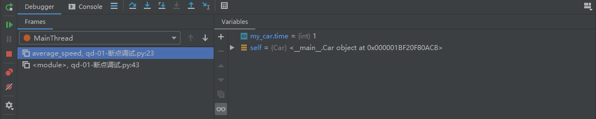

有关详细信息，请参见[添加，编辑和删除监视器](https://www.jetbrains.com/help/pycharm/adding-editing-and-removing-watches.html)部分。

### 2.3 内联调试

您可能已经注意到了另一个PyCharm功能，它可以很容易地查看您的代码在做什么： [内联调试器](https://www.jetbrains.com/help/pycharm/inline-debugging.html)。按下任何断点后，PyCharm就会在编辑器中立即向您显示许多变量的值：

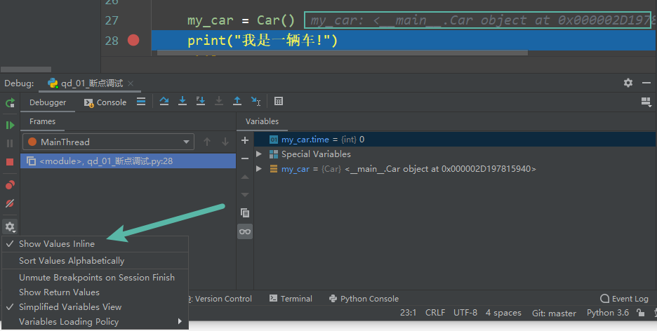

### 2.4 计算表达式

最后，您可以随时评估任何表达式。例如，如果要查看变量的值，请单击按钮。

然后在打开的对话框中，点击**Evaluate**：

例如，如果输入里程表的期望值（例如50），然后继续单步执行脚本，则会得到以下信息：

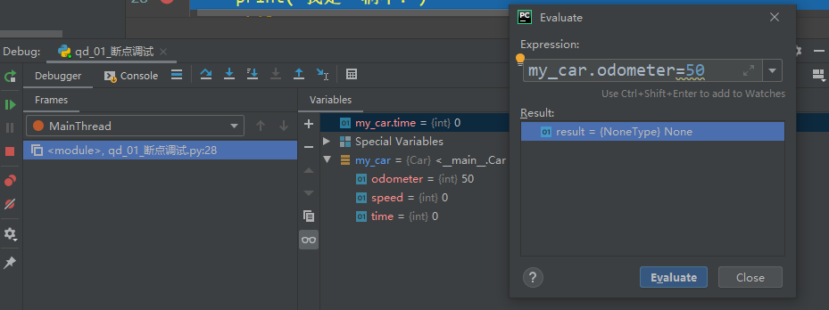

有关详细信息，请参见“ [评估表达式”](https://www.jetbrains.com/help/pycharm/evaluating-expressions.html)部分。

### 2.5 快捷键

step over（F8快捷键）：在单步执行时，在函数内遇到子函数时不会进入子函数内单步执行，而是将子函数整个执行完再停止，也就是把子函数整个作为一步。在不存在子函数的情况下是和step into效果一样的。简单的说就是，**程序代码越过子函数，但子函数会执行，且不进入。**

step into（F7快捷键）：在单步执行时，遇到子函数就进入并且继续单步执行，有的会跳到源代码里面去执行。

step into my code（Alt+Shift+F7快捷键）：在单步执行时，遇到子函数就进入并且继续单步执行，不会进入到源码中。

step out（Shift+F8快捷键）：假如进入了一个函数体中，你看了两行代码，不想看了，跳出当前函数体内，返回到调用此函数的地方，即使用此功能即可。

Resume program(F9快捷键)：继续恢复程序，直接运行到下一断点处。

以上四个功能，就是最常用的功能，一般操作步骤就是，**设置好断点，debug运行，然后 F8 单步调试，遇到想进入的函数 F7 进去，想出来在 shift + F8，跳过不想看的地方，直接设置下一个断点，然后 F9 过去。**