## 什么是网络

网络就是一种辅助双方或者多方能够连接在一起的工具

如果没有网络可想 `单机` 的世界是多么的孤单

**单机游戏** 


**使用网络的目的** 


就是为了联通多方然后进行通信用的，即把数据从一方传递给另外一方

前面的学习编写的程序都是单机的，即不能和其他电脑上的程序进行通信

为了让在不同的电脑上运行的软件，之间能够互相传递数据，就需要借助网络的功能

**总结** 

使用网络能够把多方链接在一起，然后可以进行数据传递

所谓的网络编程就是，让在不同的电脑上的软件能够进行数据传递，即进程之间的通信

## 网络通信过程

如果两台电脑之间通过网线连接是可以直接通信的，但是需要提前设置好ip地址以及网络掩码

> 并且ip地址需要控制在同一网段内，例如 一台为`192.168.1.1`另一台为`192.168.1.2`则可以进行通信

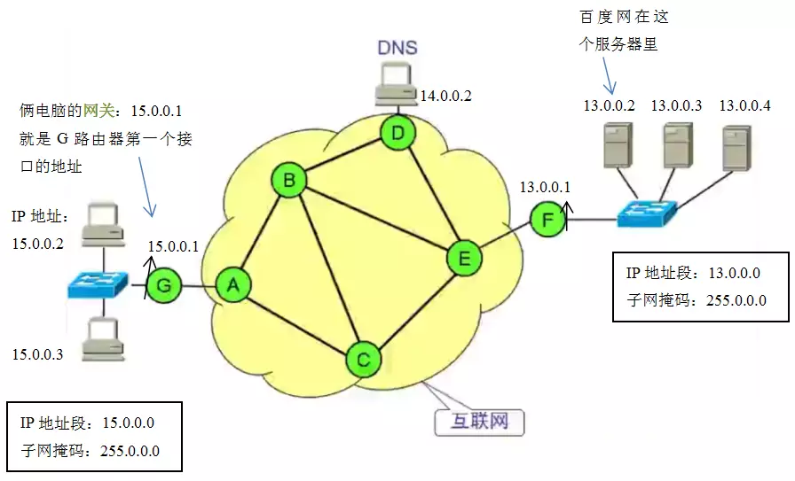

1. 在浏览器中输入一个网址时，需要将它先解析出 ip 地址来
2. 当得到 ip 地址之后，浏览器以 tcp 的方式3次握手链接服务器
3. 以 tcp 的方式发送 http 协议的请求数据 给 服务器
4. 服务器 tcp 的方式回应 http 协议的应答数据 给浏览器

总结

- MAC地址：在设备与设备之间数据通信时用来标记收发双方（网卡的序列号）
- IP地址：在逻辑上标记一台电脑，用来指引数据包的收发方向（相当于电脑的序列号）
- 网络掩码：用来区分ip地址的网络号和主机号
- 默认网关：当需要发送的数据包的目的ip不在本网段内时，就会发送给默认的一台电脑，成为网关
- 集线器：已过时，用来连接多态电脑，缺点：每次收发数据都进行广播，网络会变的拥堵
- 交换机：集线器的升级版，有学习功能知道需要发送给哪台设备，根据需要进行单播、广播
- 路由器：连接多个不同的网段，让他们之间可以进行收发数据，每次收到数据后，ip不变，但是MAC地址会变化
- DNS：用来解析出IP（类似电话簿）
- http 服务器：提供浏览器能够访问到的数据


### TCP/IP

网络通信是借助于 `TCP/IP` 协议族，`TCP/IP` （Transmission Control Protocol/Internet Protocol）即传输控制协议/网间协议，定义了主机如何连入因特网及数据如何再它们之间传输的标准，

从字面意思来看TCP/IP是TCP和IP协议的合称，但实际上TCP/IP协议是指因特网整个TCP/IP协议族。不同于ISO模型的七个分层，TCP/IP协议参考模型把所有的TCP/IP系列协议归类到四个抽象层中

应用层：TFTP，HTTP，SNMP，FTP，SMTP，DNS，Telnet 等等

传输层：TCP，UDP

网络层：IP，ICMP，OSPF，EIGRP，IGMP

数据链路层：SLIP，CSLIP，PPP，MTU

每一抽象层建立在低一层提供的服务上，并且为高一层提供服务，看起来大概是这样子的

                        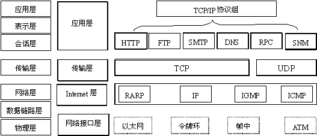


### 网络协议栈架构

提到网络协议栈结构，最著名的当属 OSI 七层模型，但是 TCP/IP 协议族的结构则稍有不同，它们之间的层次结构有如图对应关系：

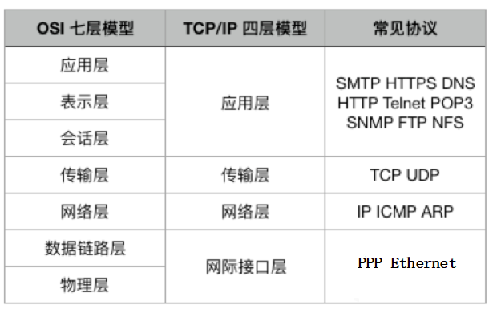

可见 TCP/IP 被分为 4 层，每层承担的任务不一样，各层的协议的工作方式也不一样，每层封装上层数据的方式也不一样：

- (1)应用层：应用程序通过这一层访问网络，常见 FTP、HTTP、DNS 和 TELNET 协议；
- (2)传输层：TCP 协议和 UDP 协议；
- (3)网络层：IP 协议，ARP、RARP 协议，ICMP 协议等；
- (4)网络接口层：是 TCP/IP 协议的基层，负责数据帧的发送和接收。


### TCP/IP 介绍

上世纪 70 年代，随着计算机技术的发展，计算机使用者意识到：要想发挥计算机更大的作用，就要将世界各地的计算机连接起来。但是简单的连接是远远不够的，因为计算机之间无法沟通。因此设计一种通用的“语言”来交流是必不可少的，这时 TCP/IP 协议就应运而生了。

TCP/IP（Transmission Control Protocol/Internet Protocol）是传输控制协议和网络协议的简称，它定义了电子设备如何连入因特网，以及数据如何在它们之间传输的标准。

TCP/IP 不是一个协议，而是一个协议族的统称，里面包括了 `IP` 协议、`ICMP` 协议、`TCP`协议、以及 `http`、`ftp`、`pop3` 协议等。网络中的计算机都采用这套协议族进行互联。

#### ip 地址

网络上每一个节点都必须有一个独立的 IP 地址，通常使用的 IP 地址是一个 32bit 的数字，被 `.` 分成 4 组，例如，`255.255.255.255` 就是一个 IP 地址。有了 IP 地址，用户的计算机就可以发现并连接互联网中的另外一台计算机。

在 Linux 系统中，可以用 `ifconfig -a` （`wimdows` 为 `ipconfig` ）命令查看自己的 IP 地址：

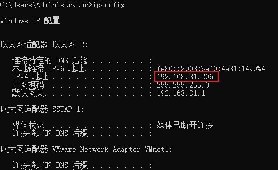

什么是地址

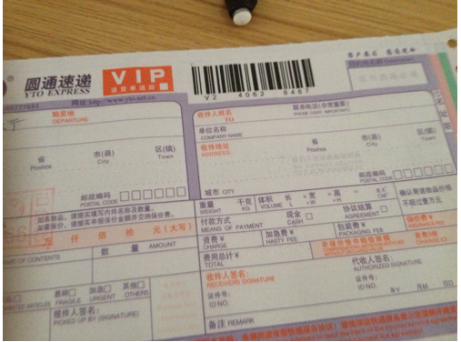


地址就是用来标记地点的

#### 端口号

IP 地址是用来发现和查找网络中的地址，但是不同程序如何互相通信呢？这就需要端口号来识别了。如果把 IP 地址比作一间房子 ，端口就是出入这间房子的门。真正的房子只有几个门，但是端口采用 16 比特的端口号标识，一个 IP 地址的端口可以有 65536（即：2^16）个之多！

服务器的默认程序一般都是通过人们所熟知的端口号来识别的。

例如，对于每个 TCP/IP 实现来说，

- SMTP（简单邮件传输协议）服务器的 TCP 端口号都是 `25`，
- FTP（文件传输协议）服务器的 TCP 端口号都是 `21`，
- TFTP（简单文件传输协议）服务器的 UDP 端口号都是 `69`。
- MySQL（mysql数据库）服务器的TCP端口默认为 3306 
- Redis（redis数据库）服务器默认TCP端口为 6379

任何 `TCP/IP` 实现所提供的服务都用众所周知的 `1－1023` 之间的端口号。这些人们所熟知的端口号由 Internet 端口号分配机构（`Internet Assigned Numbers Authority, IANA`）来管理。

> 知名端口（Well Known Ports）

端口就好一个房子的门，是出入这间房子的必经之路。

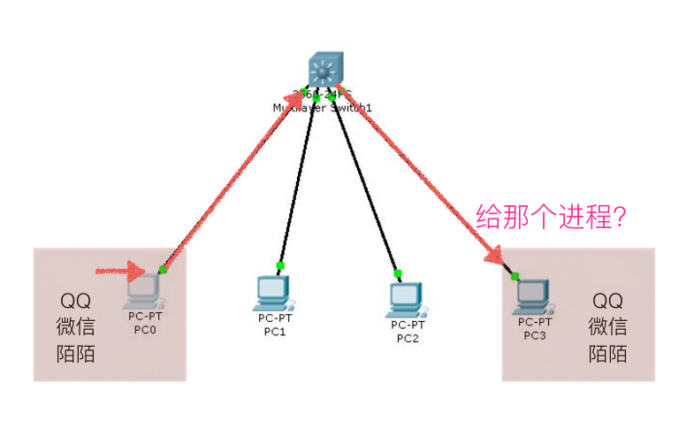


#### 域名

用 12 位数字组成的 IP 地址很难记忆，在实际应用时，用户一般不需要记住 IP 地址，互联网给每个 IP 地址起了一个别名，习惯上称作域名。

域名与计算机的 IP 地址相对应，并把这种对应关系存储在域名服务系统 DNS(Domain Name System) 中，这样用户只需记住域名就可以与指定的计算机进行通信了。

常见的域名包括 com、net 和 org 三种顶级域名后缀，除此之外每个国家还有自己国家专属的域名后缀（比如我国的域名后缀为 cn）。目前经常使用的域名诸如百度（[www.baidu.com](https://www.baidu.com/)）、Linux 组织（[www.lwn.net](https://lwn.net/)）等等。

我们可以使用命令 `nslookup` 或者 `ping` 来查看与域名相对应的 IP 地址。

例如：

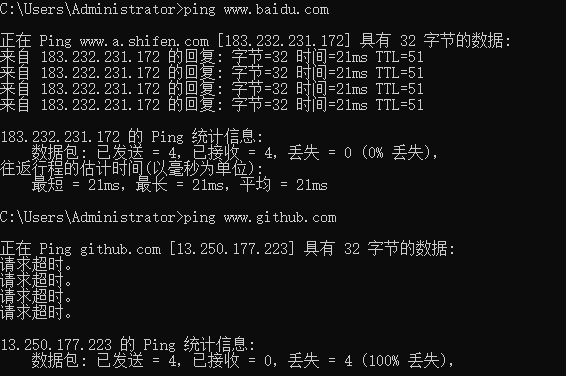

关于域名与 IP 地址的映射关系，以及 IP 地址的路由和发现机制，暂时不详细介绍。


#### IP 地址分类

为了便于寻址以及层次化构造网络，每个 IP 地址可被看作是分为两部分，即 **网络号** 和 **主机号** 。同一个区域的所有主机有相同的网络号(即 IP 地址的前半部分相同)，区域内的每个主机（包括路由器）都有一个主机号与其对应。

IP 地址被分为 A、B、C、D、E 五类：

- A 类给大型网络或政府机构等
- B 类分配给中型网络、跨国企业等
- C 类分配给小型网络
- D 类用于多播
- E 类用于实验

各类可容纳的地址数目不同，其中我们最常见的为 A、B、C 这三类。

IP 地址用 32 位二进制数字表示的时候，A、B、C 类 IP 的网络号长度分别为 8 位、16 位、24 位：

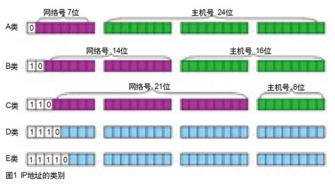

A 类地址

- A 类地址网络号范围：1.0.0.0---127.0.0.0
- A 类 IP 地址范围：1.0.0.0---127.255.255.255
- A 类 IP 的私有地址范围：10.0.0.0---10.255.255.255 （所谓的私有地址就是在互联网上不使用，而被用在局域网络中的地址）
- 127.X.X.X 是保留地址，用做循环测试用的
- 因为主机号有 24 位，所以一个 A 类网络号可以容纳 2^24-2=16777214 个主机号

B 类地址

- B 类地址网络号范围：128.0.0.0---191.255.0.0
- B 类 IP 地址范围：128.0.0.0---191.255.255.255
- B 类 IP 的私有地址范围：172.16.0.0---172.31.255.255
- 169.254.X.X 是保留地址；191.255.255.255 是广播地址
- 因为主机号有 16 位，所以一个 B 类网络号可以容纳 2^16-2=65534 个主机号

C 类地址

- C 类地址网络号范围：192.0.0.0---223.255.255.0
- C 类 IP 地址范围：192.0.0.0---223.255.255.255
- C 类 IP 的私有地址范围：192.168.0.0---192.168.255.255
- 因为主机号有 8 位，所以一个 C 类网络号可以容纳 2^8-2=254 个主机号

下面使用 `ipconfig` 命令来查看本机 ip：


思考：这是一个几类 ip 地址？

答案：C 类


#### ip 地址的作用

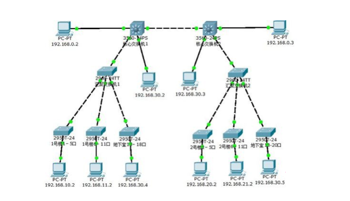

ip地址：用来在网络中标记一台电脑，比如192.168.1.1；在本地局域网上是唯一的。


#### 子网划分(了解)

IP 地址如果只使用 ABCDE 类来划分，会造成大量的浪费：一个有 500 台主机的网络，无法使用 C 类地址。但如果使用一个 B 类地址，6 万多个主机地址只有 500 个被使用，造成 IP 地址的大量浪费。

因此，可以在 ABC 类网络的基础上，进一步划分子网：**占用主机号的前几个位，用于表示子网号** 。

这样 IP 地址就可看作 IP = **网络号** + **子网号** + **主机号** 

子网号的位数没有硬性规定，于是我们用 **子网掩码** 来确定一个 IP 地址中哪几位是主机号，具体使用方法如图：

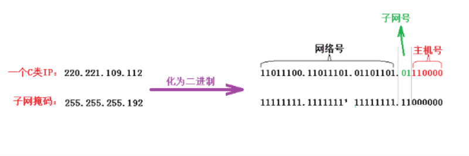

子网掩码中的 1 标识了 IP 地址中相应的网络号和子网号，0 标识了主机号。将 IP 地址和子网掩码进行 **逻辑与运算** ，结果就能区分网络号和子网号。

使用 `ifconfig` 命令也可以查看到子网掩码：


思考：根据上面所学知识表示出您本机的网络号，子网号，主机号。

互联网的服务：ip + port 去进行访问的


##  Python 网络编程

Python 提供了两个级别访问的网络服务。：

- 低级别的网络服务支持基本的 Socket，它提供了标准的 `BSD Sockets API`，可以访问底层操作系统Socket接口的全部方法。
- 高级别的网络服务模块 `SocketServer`， 它提供了服务器中心类，可以简化网络服务器的开发。


socket 是基于 C/S 架构的，也就是说进行 socket 网络编程，通常需要编写两个 py 文件，一个服务端，一个客户端。

> c/s  客户端（手机应用、电脑应用、需要服务器提供服务的应用） 服务器
>
> b/s  浏览器 （浏览器） 服务器 
>
> 服务器（提供服务）	 web服务器（专门返回网页） 	腾讯云服务器（部署写好的服务程序 物理设备）


### socket简介

**什么是 socket ?**

socket(简称 `套接字`) 是进程间通信的一种方式，它与其他进程间通信的一个主要不同是：

它能实现不同主机间的进程间通信，我们网络上各种各样的服务大多都是基于 Socket 来完成通信的

例如我们每天浏览网页、QQ 聊天、收发 email 等等


### Socket 类型

套接字格式：`socket(family, type[,protocal])` 使用给定的套接族，套接字类型，协议编号（默认为0）来创建套接字

| socket 类型             | 描述                                                         |
| :---------------------- | :----------------------------------------------------------- |
| `socket.AF_UNIX`        | 用于同一台机器上的进程通信（既本机通信）                     |
| `socket.AF_INET`        | 用于服务器与服务器之间的网络通信                             |
| `socket.AF_INET6`       | 基于 `IPV6` 方式的服务器与服务器之间的网络通信               |
| `socket.SOCK_STREAM`    | 基于TCP的流式socket通信                                      |
| `socket.SOCK_DGRAM`     | 基于 `UDP` 的数据报式 socket 通信                            |
| `socket.SOCK_RAW`       | 原始套接字，普通的套接字无法处理 `ICMP`、`IGMP` 等网络报文，而SOCK_RAW可以；其次SOCK_RAW也可以处理特殊的 `IPV4` 报文；此外，利用原始套接字，可以通过 `IP_HDRINCL` 套接字选项由用户构造 `IP` 头 |
| `socket.SOCK_SEQPACKET` | 可靠的连续数据包服务                                         |

创建 `TCP Socket` ：

```Python
sock = socket.socket(socket.AF_INET, socket.SOCK_STREAM)
```

创建 `UDP Socket` ：

```Python
sock = socket.socket(socket.AF_INET, socket.SOCK_DGRAM)
```


### Socket 函数

- TCP发送数据时，已建立好TCP链接，所以不需要指定地址，而 `UDP` 是面向无连接的，每次发送都需要指定发送给谁。
- 服务器与客户端不能直接发送列表，元素，字典等带有数据类型的格式，发送的内容必须是字符串数据。

**服务器端 Socket 函数** 

| Socket 函数         | 描述                                                         |
| :------------------ | :----------------------------------------------------------- |
| `s.bind(address)`   | 将套接字绑定到地址，在 `AF_INET` 下，以 `tuple(host, port)` 的方式传入，如`s.bind((host, port))` |
| `s.listen(backlog)` | 开始监听TCP传入连接，backlog指定在拒绝链接前，操作系统可以挂起的最大连接数，该值最少为1，大部分应用程序设为5就够用了 |
| `s.accept()`        | 接受TCP链接并返回（conn, address），其中conn是新的套接字对象，可以用来接收和发送数据，address是链接客户端的地址。 |

**客户端 Socket 函数** 

| Socket 函数             | 描述                                                         |
| :---------------------- | :----------------------------------------------------------- |
| `s.connect(address)`    | 链接到address处的套接字，一般address的格式为tuple(host, port)，如果链接出错，则返回 `socket.error` 错误 |
| `s.connect_ex(address)` | 功能与 `s.connect(address)` 相同，但成功返回0，失败返回 `errno` 的值 |

**公共 Socket 函数**

| Socket 函数                              | 描述                                                         |
| :--------------------------------------- | :----------------------------------------------------------- |
| `s.recv(bufsize[, flag])`                | 接受TCP套接字的数据，数据以字符串形式返回，`buffsize` 指定要接受的最大数据量，flag提供有关消息的其他信息，通常可以忽略 |
| `s.send(string[, flag])`                 | 发送TCP数据，将字符串中的数据发送到链接的套接字，返回值是要发送的字节数量，该数量可能小于string的字节大小 |
| `s.sendall(string[, flag])`              | 完整发送TCP数据，将字符串中的数据发送到链接的套接字，但在返回之前尝试发送所有数据。成功返回None，失败则抛出异常 |
| `s.recvfrom(bufsize[, flag])`            | 接受 `UDP` 套接字的数据u，与 `recv()` 类似，但返回值是tuple(data, address)。其中data是包含接受数据的字符串，address是发送数据的套接字地址 |
| `s.sendto(string[, flag], address)`      | 发送 `UDP` 数据，将数据发送到套接字，address形式为 `tuple(ipaddr, port)` ，指定远程地址发送，返回值是发送的字节数 |
| `s.close()`                              | 关闭套接字                                                   |
| `s.getpeername()`                        | 返回套接字的远程地址，返回值通常是一个 `tuple(ipaddr, port)` |
| `s.getsockname()`                        | 返回套接字自己的地址，返回值通常是一个 `tuple(ipaddr, port)` |
| `s.setsockopt(level, optname, value)`    | 设置给定套接字选项的值                                       |
| `s.getsockopt(level, optname[, buflen])` | 返回套接字选项的值                                           |
| `s.settimeout(timeout)`                  | 设置套接字操作的超时时间，timeout是一个浮点数，单位是秒，值为None则表示永远不会超时。一般超时期应在刚创建套接字时设置，因为他们可能用于连接的操作，如 `s.connect()` |
| `s.gettimeout()`                         | 返回当前超时值，单位是秒，如果没有设置超时则返回None         |
| `s.fileno()`                             | 返回套接字的文件描述                                         |
| `s.setblocking(flag)`                    | 如果flag为0，则将套接字设置为非阻塞模式，否则将套接字设置为阻塞模式（默认值）。非阻塞模式下，如果调用 `recv()` 没有发现任何数据，或send()调用无法立即发送数据，那么将引起 `socket.error` 异常。 |
| `s.makefile()`                           | 创建一个与该套接字相关的文件                                 |

### Socket 编程思想

**TCP 服务器**
1、创建套接字，绑定套接字到本地 `ip` 与端口

```Python
s = socket.socket(socket.AF_INET, socket.SOCK_STREAM)
s.bind()
```

2、开始监听链接

```Python
s.listen()
```

3、进入循环，不断接受客户端的链接请求

```Python
While True:
    conn, addr = s.accept()
```

4、接收客户端传来的数据，并且发送给对方发送数据

```Python
s.recv()
s.sendall()
```

5、传输完毕后，关闭套接字

```Python
s.close()
```

**TCP 客户端**
1、创建套接字并链接至远端地址

```Python
s = socket.socket(socket.AF_INET, socket.SOCK_STREAM)
s.connect()
```

2、链接后发送数据和接收数据

```Python
s.sendall()
s.recv()

```

3、传输完毕后，关闭套接字

### 创建socket

在 Python 中 使用socket 模块的函数 socket 就可以完成：

```python
import socket
socket.socket(AddressFamily, Type)

```

函数 `socket.socket` 创建一个 `socket`，该函数带有两个参数：

- Address Family：可以选择 `AF_INET`（用于 Internet 进程间通信） 或者 `AF_UNIX`（用于同一台机器进程间通信）,实际工作中常用 `AF_INET`
- Type：套接字类型，可以是 SOCK_STREAM（流式套接字，主要用于 TCP 协议）或者 `SOCK_DGRAM`（数据报套接字，主要用于 `UDP` 协议）

创建一个`tcp socket`（`tcp`套接字）

```python
import socket

# 创建tcp的套接字
s = socket.socket(socket.AF_INET, socket.SOCK_STREAM)

# ...这里是使用套接字的功能（省略）...

# 不用的时候，关闭套接字
s.close()


```

创建一个udp socket（udp套接字）

```python
import socket

# 创建udp的套接字
s = socket.socket(socket.AF_INET, socket.SOCK_DGRAM)

# ...这里是使用套接字的功能（省略）...

# 不用的时候，关闭套接字
s.close()


```

## 客户端与服务器

### tcp客户端

tcp客户端，并不是像之前一个段子：一个顾客去饭馆吃饭，这个顾客要点菜，就问服务员咱们饭店有客户端么，然后这个服务员非常客气的说道：先生我们饭店不用客户端，我们直接送到您的餐桌上

如果，不学习网络的知识是不是 说不定也会发生那样的笑话 ，哈哈

所谓的服务器端：就是提供服务的一方，而客户端，就是需要被服务的一方

#### tcp 客户端构建流程

tcp 的客户端要比服务器端简单很多，如果说服务器端是需要自己买手机、查手机卡、设置铃声、等待别人打电话流程的话，那么客户端就只需要找一个电话亭，拿起电话拨打即可，流程要少很多

示例代码：

```python
import socket

# 创建socket
tcp_client_socket = socket.socket(socket.AF_INET, socket.SOCK_STREAM)

# 目的信息
server_ip = input("请输入服务器ip:")
server_port = int(input("请输入服务器port:"))

# 链接服务器
tcp_client_socket.connect((server_ip, server_port))

# 提示用户输入数据
send_data = input("请输入要发送的数据：")

tcp_client_socket.send(send_data.encode("gbk"))

# 接收对方发送过来的数据，最大接收1024个字节
recvData = tcp_client_socket.recv(1024)
print('接收到的数据为:', recvData.decode('gbk'))

# 关闭套接字
tcp_client_socket.close()

```

运行之后

```python
请输入服务器ip:127.0.0.1
请输入服务器port:7788
请输入要发送的数据：你好啊
接收到的数据为: 我很好，你呢

```

#### 网络调试助手：


```python
# 客户端循环发送数据
import socket
HOST = '192.168.1.100'
PORT = 8001

s = socket.socket(socket.AF_INET, socket.SOCK_STREAM)
s.connect((HOST, PORT))

while True:
    cmd = raw_input("请输入需要发送的信息:")
    s.send(cmd)
    data = s.recv(1024)
    print(data)

    #s.close()

```


### tcp服务器

**生活中的电话机**

如果想让别人能更够打通咱们的电话获取相应服务的话，需要做以下几件事情：

1. 买个手机
2. 插上手机卡
3. 设计手机为正常接听状态（即能够响铃）
4. 静静的等着别人拨打

如同上面的电话机过程一样，在程序中，如果想要完成一个tcp服务器的功能，需要的流程如下：

1. `socket` 创建一个套接字
2. `bind` 绑定 `ip` 和 `port`
3. `listen` 使套接字变为可以被动链接
4. `accept` 等待客户端的链接
5. `recv/send` 接收发送数据

一个很简单的 `tcp` 服务器如下：

```python
from socket import *

# 创建socket
tcp_server_socket = socket(AF_INET, SOCK_STREAM)

# 本地信息
address = ('', 7788)

# 绑定
tcp_server_socket.bind(address)

# 使用socket创建的套接字默认的属性是主动的，使用listen将其变为被动的，这样就可以接收别人的链接了
tcp_server_socket.listen(128)

# 如果有新的客户端来链接服务器，那么就产生一个新的套接字专门为这个客户端服务
# client_socket用来为这个客户端服务
# tcp_server_socket就可以省下来专门等待其他新客户端的链接
client_socket, clientAddr = tcp_server_socket.accept()

# 接收对方发送过来的数据
recv_data = client_socket.recv(1024)  # 接收1024个字节
print('接收到的数据为:', recv_data.decode('gbk'))

# 发送一些数据到客户端
client_socket.send("thank you !".encode('gbk'))

# 关闭为这个客户端服务的套接字，只要关闭了，就意味着为不能再为这个客户端服务了，如果还需要服务，只能再次重新连接
client_socket.close()

```

#### 运行流程：

```python
接收到的数据为: 你在么？

```


```Python
# 服务器循环接收数据
import socket

HOST = '192.168.1.100'
PORT = 8001

s = socket.socket(socket.AF_INET, socket.SOCK_STREAM)
s.bind((HOST, PORT))
s.listen(5)

print('服务器已经开启在: %s:%s' %(HOST, PORT))
print('等待客户端连接...')

while True:
    conn, addr = s.accept()
    print('客户端已经连接： ', addr)

    while True:
        data = conn.recv(1024)
        print(data)

        conn.send("服务器已经收到你的信息")

# conn.close()


```


#### 网络调试助手：

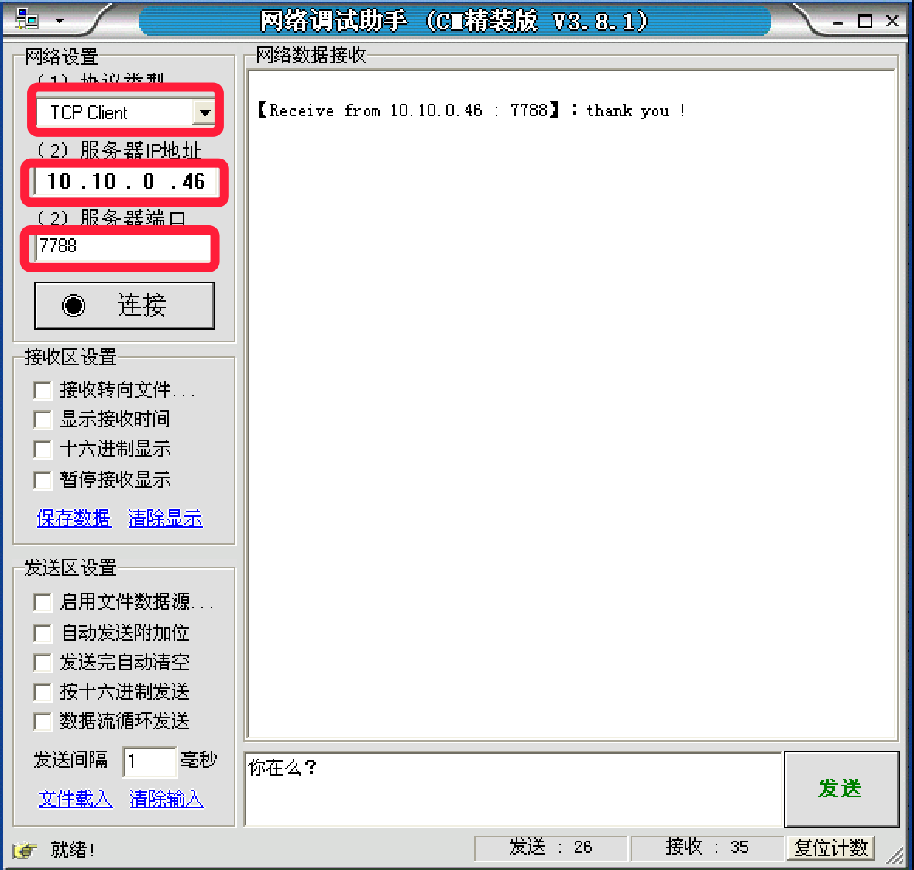

### tcp注意点

1. tcp服务器一般情况下都需要绑定，否则客户端找不到这个服务器
2. tcp客户端一般不绑定，因为是主动链接服务器，所以只要确定好服务器的ip、port等信息就好，本地客户端可以随机
3. tcp服务器中通过listen可以将socket创建出来的主动套接字变为被动的，这是做tcp服务器时必须要做的
4. 当客户端需要链接服务器时，就需要使用connect进行链接，udp是不需要链接的而是直接发送，但是tcp必须先链接，只有链接成功才能通信
5. 当一个tcp客户端连接服务器时，服务器端会有1个新的套接字，这个套接字用来标记这个客户端，单独为这个客户端服务
6. listen后的套接字是被动套接字，用来接收新的客户端的链接请求的，而accept返回的新套接字是标记这个新客户端的
7. 关闭listen后的套接字意味着被动套接字关闭了，会导致新的客户端不能够链接服务器，但是之前已经链接成功的客户端正常通信。
8. 关闭accept返回的套接字意味着这个客户端已经服务完毕
9. 当客户端的套接字调用close后，服务器端会recv解堵塞，并且返回的长度为0，因此服务器可以通过返回数据的长度来区别客户端是否已经下线


## TCP总结

**TCP协议，传输控制协议（英语：Transmission Control Protocol，缩写为 TCP）**是一种面向连接的、可靠的、基于字节流的传输层通信协议，由IETF的RFC 793定义。

TCP通信需要经过 **创建连接、数据传送、终止连接** 三个步骤。

TCP通信模型中，在通信开始之前，一定要先建立相关的链接，才能发送数据，类似于生活中，"打电话"


### TCP特点

#### 面向连接

- 通信双方必须先建立连接
- 双方间的数据传输都可以通过一个连接进行
- 完成数据交换后，双方必须断开此连接，以释放系统资源。

这种连接是一对一的，因此TCP不适用于广播的应用程序，基于广播的应用程序请使用UDP协议。

### socket通信流程

socket是 "打开—读/写—关闭" 模式的实现，以使用TCP协议通讯的socket为例，其交互流程大概是这样子的


1. 服务器根据地址类型（ipv4,ipv6）、socket类型、协议创建socket
2. 服务器为socket绑定ip地址和端口号
3. 服务器socket监听端口号请求，随时准备接收客户端发来的连接，这时候服务器的socket并没有被打开
4. 客户端创建socket
5. 客户端打开socket，根据服务器ip地址和端口号试图连接服务器socket
6. 服务器socket接收到客户端socket请求，被动打开，开始接收客户端请求，直到客户端返回连接信息。这时候socket进入**阻塞**状态，所谓阻塞即accept()方法一直到客户端返回连接信息后才返回，开始接收下一个客户端谅解请求
7. 客户端连接成功，向服务器发送连接状态信息
8. 服务器accept方法返回，连接成功
9. 客户端向socket写入信息
10. 服务器读取信息
11. 客户端关闭
12. 服务器端关闭


## 附录

### python3编码转换

```python
str->bytes:encode编码
bytes->str:decode解码


```

字符串通过编码成为字节码，字节码通过解码成为字符串。

```python
>>> text = '我是文本'
>>> text
'我是文本'
>>> print(text)
我是文本
>>> bytesText = text.encode()
>>> bytesText
b'\xe6\x88\x91\xe6\x98\xaf\xe6\x96\x87\xe6\x9c\xac'
>>> print(bytesText)
b'\xe6\x88\x91\xe6\x98\xaf\xe6\x96\x87\xe6\x9c\xac'
>>> type(text)
<class 'str'>
>>> type(bytesText)
<class 'bytes'>
>>> textDecode = bytesText.decode()
>>> textDecode
'我是文本'
>>> print(textDecode)
我是文本


```

其中decode()与encode()方法可以接受参数，其声明分别为:

```python
bytes.decode(encoding="utf-8", errors="strict")
str.encode(encoding="utf-8", errors="strict")

```

其中的encoding是指在解码编码过程中使用的编码(此处指“编码方案”是名词)，errors是指错误的处理方案。

详细的可以参照官方文档：

- [str.encode()](https://docs.python.org/3/library/stdtypes.html?highlight=decode#str.encode)
- [bytes.decode()](https://docs.python.org/3/library/stdtypes.html?highlight=decode#bytes.decode)


**想一想** 

以上的程序如果选择了接收数据功能，并且此时没有数据，程序会堵塞在这，那么怎样才能让这个程序收发数据一起进行呢 ？


### TCP/IP 七层协议

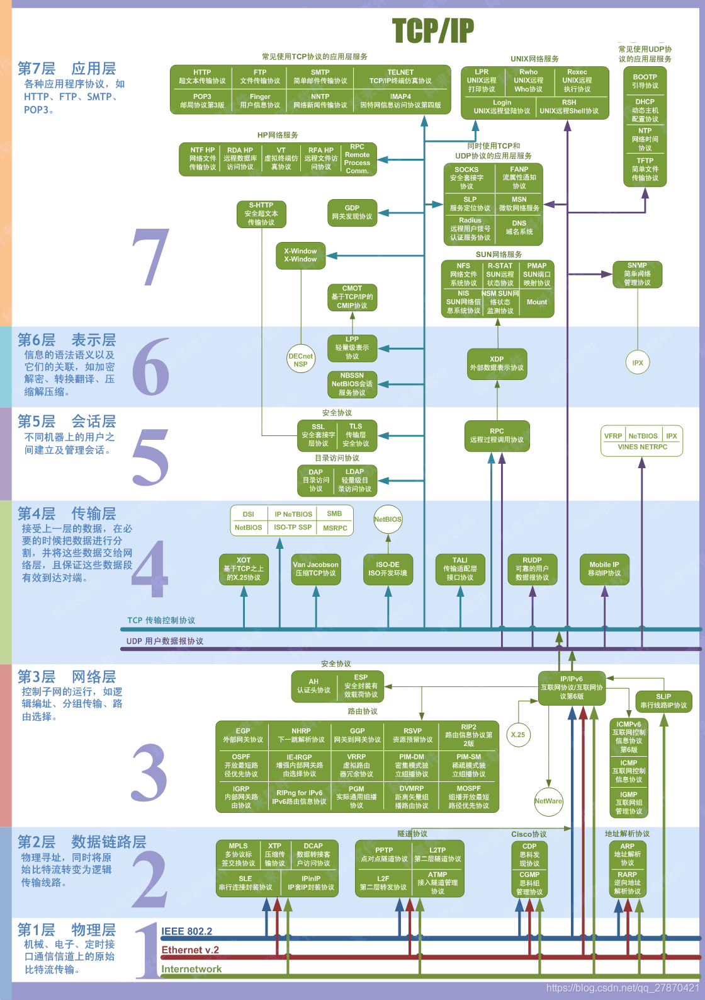

**1. 物理层** 

在OSI参考模型中，物理层（Physical Layer）是参考模型的最低层。物理层的作用是实现相邻计算机节点之间比特流的透明传送，尽可能屏蔽掉具体传输介质和物理设备的差异。“透明传送比特流”表示经实际电路传送后的比特流没有发生变化，对传送的比特流来说，这个电路好像是看不见的。

**2. 数据链路层** 

数据链路层（Data Link Layer）是OSI模型的第二层，负责建立和管理节点间的链路。该层的主要功能是：通过各种控制协议，将有差错的物理信道变为无差错的、能可靠传输数据帧的数据链路。在计算机网络中由于各种干扰的存在，物理链路是不可靠的。因此，这一层的主要功能是在物理层提供的比特流的基础上，通过差错控制、流量控制方法，使有差错的物理线路变为无差错的数据链路，即提供可靠的通过物理介质传输数据的方法。数据链路层的具体工作是接收来自物理层的位流形式的数据，并封装成帧，传送到上一层；同样，也将来自上层的数据帧，拆装为位流形式的数据转发到物理层；并且，还负责处理接收端发回的确认帧的信息，以便提供可靠的数据传输。

**3. 网络层** 

网络层（Network Layer）是OSI模型的第三层，它是OSI参考模型中最复杂的一层。它在下两层的基础上向资源子网提供服务。其主要任务是：通过路由选择算法，为报文或分组通过通信子网选择最适当的路径。具体地说，数据链路层的数据在这一层被转换为数据包，然后通过路径选择、分段组合、顺 序、进/出路由等控制，将信息从一个网络设备传送到另一个网络设备。一般地，数据链路层是解决同一网络内节点之间的通信，而网络层主要解决不同子网间的通信。例如在广域网之间通信时，必然会遇到路由（即两节点间可能有多条路径）选择问题。

**4.传输层** 

传输层（Transport Layer）是OSI模型的第4层。因此该层是通信子网和资源子网的接口和桥梁，起到承上启下的作用。该层的主要任务是：向用户提供可靠的端到端的差错和流量控制，保证报文的正确传输。传输层的作用是向高层屏蔽下层数据通信的细节，即向用户透明地传送报文。该层常见的协议：TCP/IP中的TCP协议和UDP协议。传输层提供会话层和网络层之间的传输服务，这种服务从会话层获得数据，并在必要时，对数据进行分割。然后，传输层将数据传递到网络层，并确保数据能正确无误地传送到网络层。因此，传输层负责提供两节点之间数据的可靠传送，当两节点的联系确定之后，传输层则负责监督工作。综上，传输层的主要功能如下：监控服务质量。

**5. 会话层** 

会话层（Session Layer）是OSI模型的第5层，是用户应用程序和网络之间的接口，主要任务是：向两个实体的表示层提供建立和使用连接的方法。将不同实体之间的表示层 的连接称为会话。因此会话层的任务就是组织和协调两个会话进程之间的通信，并对数据交换进行管理。 用户可以按照半双工、单工和全双工的方式建立会话。当建立会话时，用户必须提供他们想要连接的远程地址。而这些地址与MAC（介质访问控制子层）地址或网络层的逻辑地址不同，它们是为用户专门设计的，更便于用户记忆。

**6. 表示层** 

表示层（Presentation Layer）是OSI模型的第六层，它对来自应用层的命令和数据进行解释，对各种语法赋予相应的含义，并按照一定的格式传送给会话层。其主要功能是“处理用户信息的表示问题，如编码、数据格式转换和加密解密”等。

**7. 应用层** 

应用层（Application Layer）是OSI参考模型的最高层，它是计算机用户，以及各种应用程序和网络之间的接口，其功能是直接向用户提供服务，完成用户希望在网络上完成的各种工作。它在其他6层工作的基础上，负责完成网络中应用程序与网络操作系统之间的联系，建立与结束使用者之间的联系，并完成网络用户提出的各种网络服务及 应用所需的监督、管理和服务等各种协议。此外，该层还负责协调各个应用程序间的工作。
